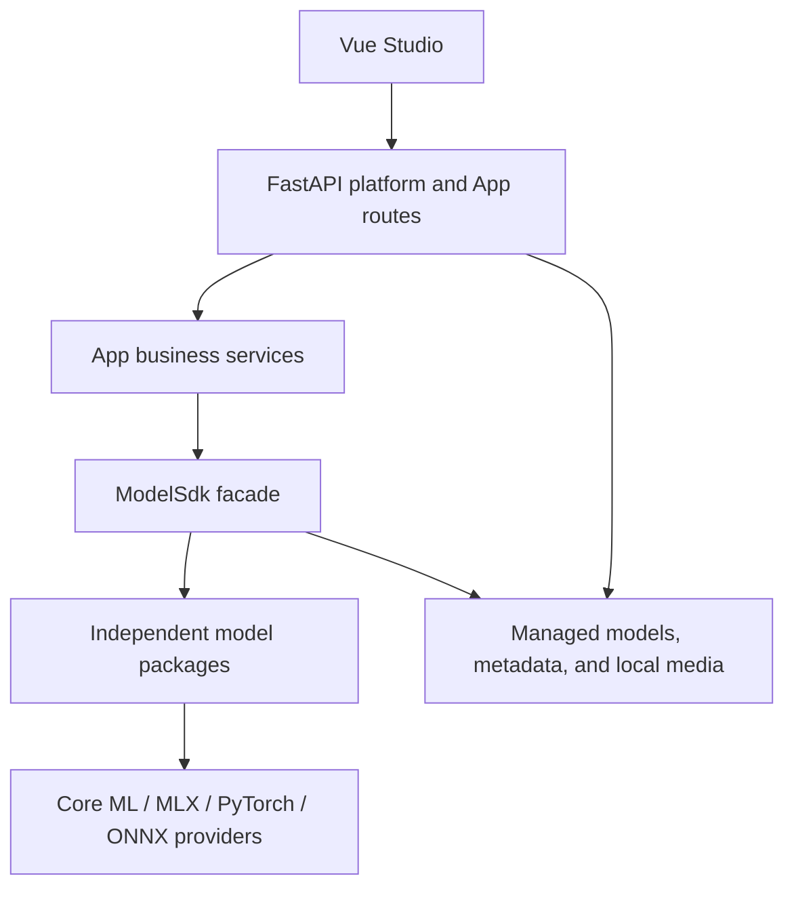

# Hugging Mac Architecture

This document records the technical boundaries implemented by the repository.
Product usage belongs in `docs/`; module internals belong in the README nearest
to the implementation.

## System shape

Dependencies point downward. The SDK never imports FastAPI, Vue, App storage, or
business services. Apps call capability protocols through `ModelSdk`; they do not
import model instances, engines, or private model configuration.

## Repository modules

- `packages/hugging_mac_sdk` is a standalone Python package. It owns public task
  schemas, capabilities, model definitions, lifecycle, resource operations,
  conversion infrastructure, and runtime providers.
- `apps/web/backend` owns HTTP transport, local platform composition, App
  business services, catalog APIs, error mapping, and local metadata/media
  storage.
- `apps/web/frontend` owns the Vue shell, navigation, model control surface, App
  pages, browser media capture, and API clients.
- `docs` owns user and public SDK documentation. It is not an implementation
  specification.

## Model boundary

Each model family is an independently registered package. Its instance exposes
one or more runtime-neutral capability protocols and composes exactly one selected
runtime engine. Tensor objects, sessions, tokenizers, processors, and model
intermediate values remain private to the package.

The package's `model.yaml` is the canonical declarative source for model identity,
variants, runtimes, artifact paths, required files, and download sources. Python
binds trusted factories and validates instance-level options; application code
selects models through the registry and catalog.

## Lifecycle and resources

Loading uses files already present in managed storage. Download and conversion
are explicit resource operations and publish complete results atomically. A
model handle retains an instance while it is in use and releases that reference
when closed. Equivalent shared requests may reuse an instance; dedicated handles
own an instance that is unloaded after its final reference closes.

Model files live outside the Python package under a configured model storage
root. The Web backend stores its metadata separately from binary media and model
files. APIs return logical IDs and summaries rather than exposing local absolute
paths.

## Web boundary

The frontend depends only on HTTP and streaming response contracts. Backend
routes validate transport input and delegate to App services. Services map App
requests to SDK schemas and map SDK errors to stable App errors. A route must not
load model internals directly.

Backend and frontend App directories use matching App identities but never share
source code. Cross-App reuse moves to a platform-level shared module only after
it serves more than one App.

## Trust and privacy

The local backend listens on loopback by default. Model sources are declarative,
archive extraction is restricted to safe paths, and model loading does not
silently access the network. Inputs and prompts are not logged by default, and
external telemetry is disabled unless a future feature explicitly introduces an
opt-in contract.
