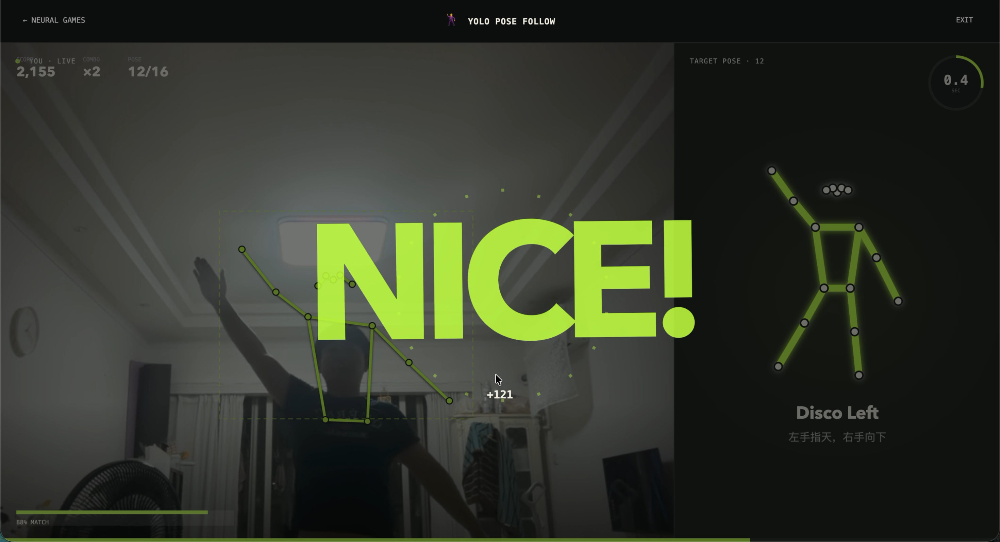

<p align="center">
  
</p>

<h1 align="center">Hugging Mac</h1>

<p align="center">
  <strong>Not Hugging Face. Hugging Mac. 🤗🍎</strong>
</p>

<p align="center">
  Give your Mac a hug. Give it AI.
</p>

> **Did you know? Your Mac is secretly an AI machine.** Hugging Mac brings deep
> learning models to Apple Silicon, puts every available core to work, and turns
> your Mac into a playground for learning, experimenting, and building with AI.

Hugging Mac is an open local AI studio for anyone who wants to understand and
experience neural networks on a Mac. Run a detector, trace a human pose, segment
objects, transcribe your voice, or build a game controlled by your body—all on
your own Apple Silicon machine.

The goal is simple: make deep neural network models approachable and fun to play
with, while keeping enough of the runtime, resource, and performance details
visible for developers to learn how AI really runs on Apple Silicon.

**Your data stays on your Mac. Your Mac does the work.**

> Hugging Mac is in active early development. YOLOv8 detection, pose estimation,
> instance segmentation, the Yolo Pose Follow game, and Audio8-ASR transcription
> are available today. More models, apps, and neural games are on the way.

## See it in action

### Yolo Pose Follow 🕺

Your body becomes the controller. A local YOLOv8 Pose model follows the camera,
draws your skeleton, and compares it with a target pose before the clock runs out.
No cloud inference and no video upload—just you, your Mac, and a neural network.



This is the first entry in the Hugging Mac showcase. More experiments will be
added here as the model, app, and game catalog grows.

## What can you explore?

- 🔎 **Object detection** — compare YOLOv8 weight variants and detect objects in
  images, videos, or a live camera.
- 🕺 **Pose estimation** — visualize COCO-17 body keypoints and build interactions
  driven by human movement.
- 🎨 **Instance segmentation** — separate objects from the scene with colorful
  masks and contours.
- 🎙️ **Live transcription** — use VAD and Audio8-ASR to turn ongoing speech into
  local, sentence-by-sentence text.
- 🕹️ **Neural games** — play Yolo Pose Follow and use model output as a real-time
  game input.
- 🧠 **Model engineering** — download weights, switch variants, manage instances,
  convert formats, and observe how different runtimes use your Mac.

## Built for learning and building

Hugging Mac is both a visual playground and an extensible development platform:

- A standalone Python model SDK with consistent lifecycle and capability APIs
- Multiple isolated instances and weight variants for the same model
- Pluggable capabilities such as `detect`, `estimate_pose`, `segment`, and
  `transcribe`
- Runtime selection for PyTorch MPS, Core ML, ONNX Runtime, MLX, and future
  Apple-friendly backends
- Explicit model download, resource management, and format conversion
- A FastAPI application layer and a responsive Vue 3 frontend
- A foundation for demos, neural games, evaluation, training, and benchmarking

## Requirements

- An Apple Silicon Mac
- Python 3.12 or newer
- [uv](https://docs.astral.sh/uv/)
- Node.js 20.19+ or 22.12+ for the web frontend

## Quick start

Install the Python workspace and current model dependencies:

```bash
uv python install 3.12
uv sync --all-packages
```

Start the API:

```bash
uv run hugging-mac-web
```

In another terminal, start the frontend:

```bash
cd apps/web/frontend
npm ci
npm run dev
```

Open <http://127.0.0.1:5173/>. The API documentation is available at
<http://127.0.0.1:8000/docs>.

Open the Studio, choose a Neural App or Neural Game, prepare its model weights,
and start experimenting. For example, download a YOLOv8 variant and run it with
MPS, convert it to Core ML, speak into Audio8-ASR, or step in front of the camera
and play Yolo Pose Follow.

## Documentation

The architecture and design documentation starts at
[doc/README.md](doc/README.md). The design documents are currently written in
Chinese.

Serve the documentation locally with Material for MkDocs and Mermaid support:

```bash
uv run --group docs mkdocs serve --dev-addr 127.0.0.1:8001
```

Then open <http://127.0.0.1:8001/>.

Key documents:

- [Architecture](doc/01-architecture.md)
- [Model SDK](doc/02-model-sdk.md)
- [Model catalog and capabilities](doc/03-model-catalog.md)
- [Model resource management](doc/04-resource-management.md)
- [Demo platform](doc/05-demo-platform.md)
- [Evaluation](doc/06-evaluation.md)
- [Training](doc/07-training.md)
- [Frontend, backend, and API](doc/08-frontend-backend.md)
- [Platform backend](doc/17-platform-backend.md)
- [Vue and object detection](doc/18-web-frontend-and-object-detection.md)
- [Audio8-ASR SDK](doc/20-audio8-asr-sdk.md)
- [Engineering conventions](doc/10-engineering.md)
- [Roadmap](doc/11-roadmap.md)

## Repository layout

```text
hugging-mac/
├── apps/
│   └── web/
│       ├── backend/              # FastAPI platform and app APIs
│       └── frontend/             # Vue platform and app pages
├── packages/
│   └── hugging_mac_sdk/          # Standalone model SDK
├── configs/                      # Versioned configuration
├── data/                         # Local datasets, ignored by default
├── artifacts/                    # Generated outputs, ignored by default
├── models/                       # Local model cache, ignored by default
├── tests/
├── doc/
├── imgs/                         # README showcase images
├── pyproject.toml
└── uv.lock
```

## Development

Install development and documentation dependencies:

```bash
uv sync --all-packages --group dev --group docs
```

Run the checks:

```bash
uv run ruff check .
uv run mypy packages apps/web/backend
uv run pytest
uv run --group docs mkdocs build --strict
cd apps/web/frontend && npm run build
```

See [CONTRIBUTING.md](CONTRIBUTING.md) before contributing.

## License

hugging-mac is released under the [MIT License](LICENSE).

Model weights, datasets, and third-party dependencies retain their own licenses.
Review their terms before use. Ultralytics YOLO software and models have separate
licensing requirements; Audio8-ASR 0.1B uses `CC-BY-NC-4.0`.
