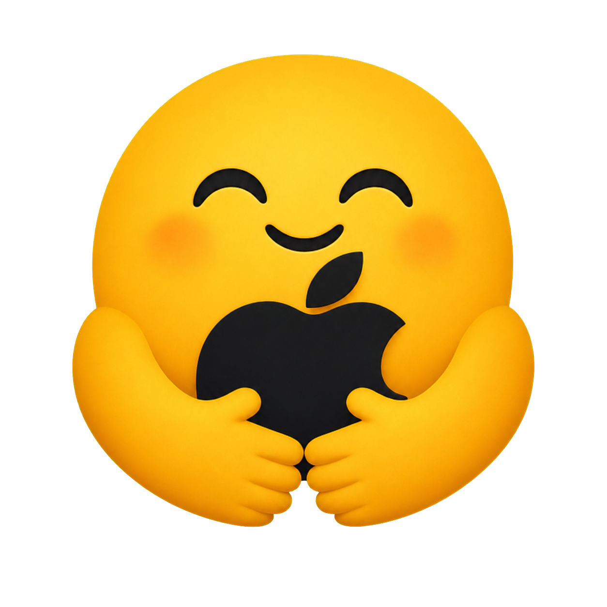
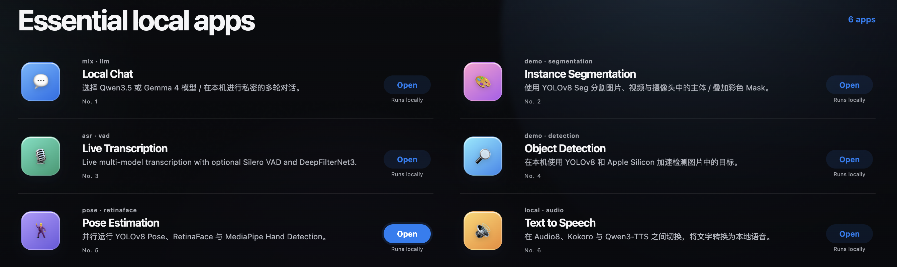
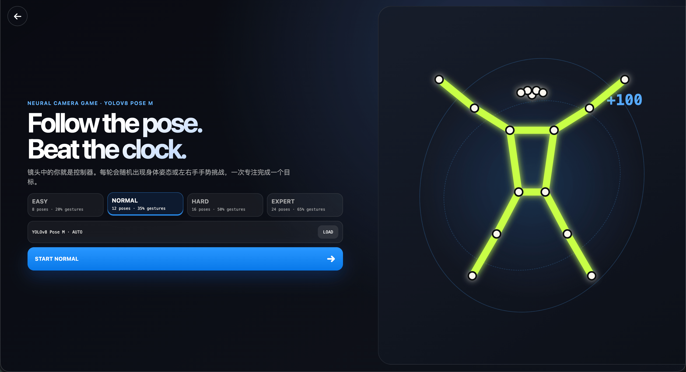
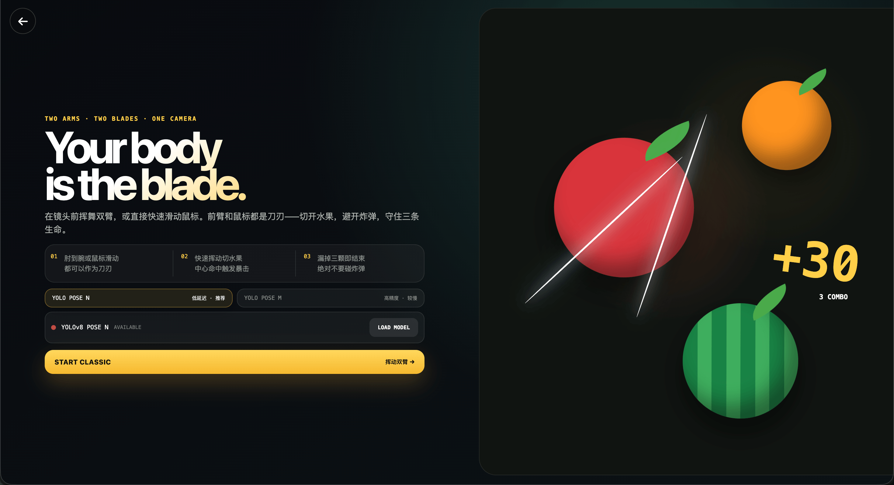
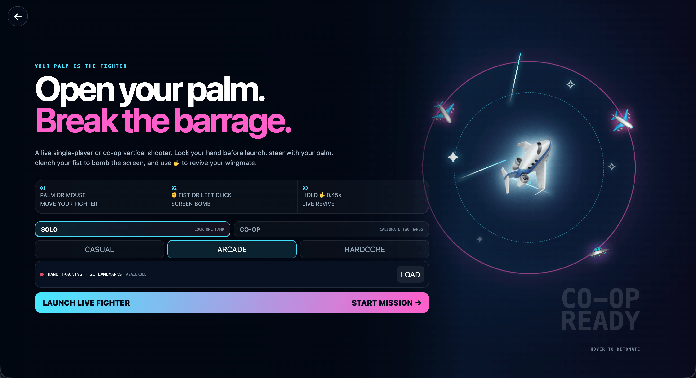
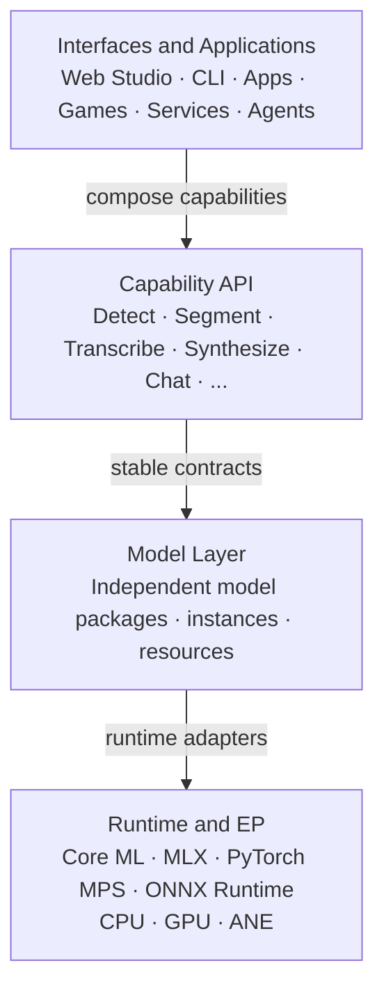

<p align="center">
  
</p>

<h1 align="center">Hugging Mac</h1>

<p align="center">
  <strong>Unleash the power of your Mac. Run AI models and build AI applications locally.</strong>
</p>

Hugging Mac is built to make full use of your Mac’s powerful computing resources—including its CPU, GPU, and Apple Neural Engine. It provides a unified local platform for running computer vision, speech and audio, large language, and multimodal models on Apple Silicon.

Use the capabilities of these models to create useful, creative, and playful **_applications_**, **_games_**, **_agents_**, **_services_**, and entirely new local AI experiences. Your Mac keeps your data private and does all the work.

## Models

Hugging Mac currently integrates 16 model families across vision, speech,
language, and multimodal intelligence. Each integration exposes a consistent
local lifecycle while retaining the runtime choices that make sense for that
model and Apple Silicon.

| Model                                            | Capability                             | Supported runtimes                 |
| ------------------------------------------------ | -------------------------------------- | ---------------------------------- |
| **Audio8-ASR 0.1B**                              | Speech transcription                   | PyTorch MPS, Core ML               |
| **Audio8 TTS Preview**                           | Speech synthesis                       | PyTorch, MLX                       |
| **DeepFilterNet3**                               | Speech enhancement                     | Core ML                            |
| **Gemma 4**                                      | Chat                                   | MLX                                |
| **Kokoro 82M v1.0**                              | Speech synthesis                       | PyTorch MPS, Core ML               |
| **MediaPipe Hand Detection**                     | Hand detection and tracking            | ONNX Runtime, Core ML              |
| **Nemotron 3.5 ASR Streaming Multilingual 0.6B** | Streaming speech transcription         | Core ML                            |
| **Qwen3.5**                                      | Chat and vision-language generation    | MLX                                |
| **Qwen3-ASR**                                    | Speech transcription                   | Core ML                            |
| **Qwen3-TTS**                                    | Speech synthesis                       | MLX, Core ML                       |
| **RetinaFace MobileNet0.25**                     | Face detection                         | PyTorch MPS, Core ML               |
| **SenseVoiceSmall**                              | Speech transcription and understanding | PyTorch MPS, Core ML               |
| **Silero VAD**                                   | Voice activity detection               | Core ML, ONNX Runtime              |
| **Ultralytics YOLOv8**                           | Object detection                       | PyTorch MPS, Core ML, ONNX Runtime |
| **Ultralytics YOLOv8 Pose**                      | Pose estimation                        | PyTorch MPS, Core ML, ONNX Runtime |
| **Ultralytics YOLOv8 Seg**                       | Instance segmentation                  | PyTorch MPS, Core ML, ONNX Runtime |

Visit the [Hugging Mac organization on Hugging Face](https://huggingface.co/hugging-mac)
to find converted weights and Apple-oriented model artifacts. Model contributions
are welcome—even if you only help convert an existing model to Core ML, add an
MLX variant, benchmark a runtime, reduce memory use, or improve performance on
Apple architectures.

## Applications



The Studio turns those model integrations into complete local workflows:

- **Object Detection** — detect and compare objects in images, videos, and live
  camera feeds with YOLOv8.
- **Pose Estimation** — run body pose, face, and hand landmark models together
  for real-time human understanding.
- **Instance Segmentation** — separate subjects from images, videos, or a camera
  feed with colored masks and contours.
- **Live Transcription** — compare multiple ASR models with optional voice
  activity detection and speech enhancement in one streaming pipeline.
- **Text to Speech** — synthesize and compare local voices across Audio8 TTS,
  Kokoro, and Qwen3-TTS.
- **Local Chat** — talk privately with Qwen3.5 or Gemma 4, with optional camera
  understanding, speech input, and spoken responses. Watch the
  [Digital Human demo](https://youtu.be/YPr6fYPnCMQ).

We welcome application contributions of every size: a focused demo, a polished
end-to-end experience, a new model pipeline, or an improvement to an existing
workflow. Combine the available models in ways we have not imagined yet.

## Neural games

Recreate classic games with AI models, allowing players to step into the action
and interact in real time.

Click a poster to watch the demo.

| Demo | Game | Description |
| :---: | --- | --- |
| <a href="https://hugging-mac-readme.static.hf.space/videos/pose-follow.mp4"></a> | **Yolo Pose Follow** | Match body poses and hand gestures before the clock runs out. YOLOv8 Pose tracks your skeleton locally and scores every target in real time. |
| <a href="https://hugging-mac-readme.static.hf.space/videos/fruit-slice.mp4"></a> | **Yolo Fruit Slice** | Turn both forearms into blades, slice fruit, avoid bombs, and build combos. Play with YOLOv8 Pose through the camera, or use the mouse for a quick test. |
| <a href="https://hugging-mac-readme.static.hf.space/videos/palm-thunder.mp4"></a> | **Palm Thunder** | Steer a vertical shooter with your palm, close your fist to trigger a screen bomb, and play solo or co-op with local MediaPipe hand tracking. |

Have an idea for an AI-native game? Contributions are welcome across game
concepts, visual and audio assets, code, interaction design, stories, characters,
levels, and scripts. Let us build playful games for the AI era together.

## Built for learning and building



Hugging Mac keeps **models and applications decoupled**. A model is packaged as
an independent capability provider: it owns its weights, preprocessing,
postprocessing, runtime adapters, and lifecycle, and exposes small, stable
interfaces instead of being built for a specific application.

Models are designed for composition. Applications register independently,
declare the model capabilities they need, and combine those capabilities into
pipelines through the Model SDK without needing to know how each model is
implemented. This enables the same model to be reused across Apps, Games,
services, and agents, while models and applications evolve independently.

## Requirements

- An Apple Silicon Mac
- Python 3.12 or newer
- [uv](https://docs.astral.sh/uv/)
- Node.js 20.19+ or 22.12+ for the web frontend

## Quick start

Install the Python workspace and current model dependencies:

```bash
uv python install 3.12
uv sync --all-packages
```

Start the API:

```bash
uv run hugging-mac-web
```

In another terminal, start the frontend:

```bash
cd apps/web/frontend
npm ci
npm run dev
```

Open <http://127.0.0.1:5173/>. The API documentation is available at
<http://127.0.0.1:8000/docs>.

Open the Studio, prepare a model from the Models page, then choose an App or Game.
For example, run YOLOv8 with MPS or Core ML, transcribe with one of four ASR
families, chat with a local LLM, synthesize speech, or step in front of the camera
and play one of the three neural games.

## Documentation

The architecture and design documentation starts at
[doc/README.md](doc/README.md). The design documents are currently written in
Chinese.

Serve the documentation locally with Material for MkDocs and Mermaid support:

```bash
uv run --group docs mkdocs serve --dev-addr 127.0.0.1:8001
```

Then open <http://127.0.0.1:8001/>.

Key documents:

- [Architecture](doc/01-architecture.md)
- [Model SDK](doc/02-model-sdk.md)
- [Model catalog and capabilities](doc/03-model-catalog.md)
- [Model resource management](doc/04-resource-management.md)
- [Demo platform](doc/05-demo-platform.md)
- [Evaluation](doc/06-evaluation.md)
- [Training](doc/07-training.md)
- [Frontend, backend, and API](doc/08-frontend-backend.md)
- [Platform backend](doc/17-platform-backend.md)
- [Vue and object detection](doc/18-web-frontend-and-object-detection.md)
- [Audio8-ASR SDK](doc/20-audio8-asr-sdk.md)
- [SenseVoiceSmall SDK](doc/21-sensevoice-small-sdk.md)
- [Text-to-Speech SDK and app](doc/22-text-to-speech-sdk.md)
- [Engineering conventions](doc/10-engineering.md)
- [Roadmap](doc/11-roadmap.md)

## Repository layout

```text
hugging-mac/
├── apps/
│   └── web/
│       ├── backend/              # FastAPI platform and app APIs
│       └── frontend/             # Vue platform and app pages
├── packages/
│   └── hugging_mac_sdk/          # Standalone model SDK
├── configs/                      # Versioned configuration
├── data/                         # Local datasets, ignored by default
├── artifacts/                    # Generated outputs, ignored by default
├── models/                       # Local model cache, ignored by default
├── tests/
├── doc/
├── imgs/                         # README showcase images
├── pyproject.toml
└── uv.lock
```

## Development

Install development and documentation dependencies:

```bash
uv sync --all-packages --group dev --group docs
```

Run the checks:

```bash
uv run ruff check .
uv run mypy packages apps/web/backend
uv run pytest
uv run --group docs mkdocs build --strict
cd apps/web/frontend && npm run build
```

See [CONTRIBUTING.md](CONTRIBUTING.md) before contributing.

## License

hugging-mac is released under the [MIT License](LICENSE).

Model weights, datasets, and third-party dependencies retain their own licenses.
Review their terms before use. Ultralytics YOLO software and models have separate
licensing requirements; Audio8-ASR 0.1B uses `CC-BY-NC-4.0`.
SenseVoiceSmall uses the `FunASR Model Open Source License Agreement 1.1`.
