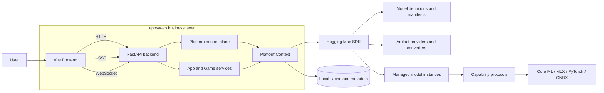
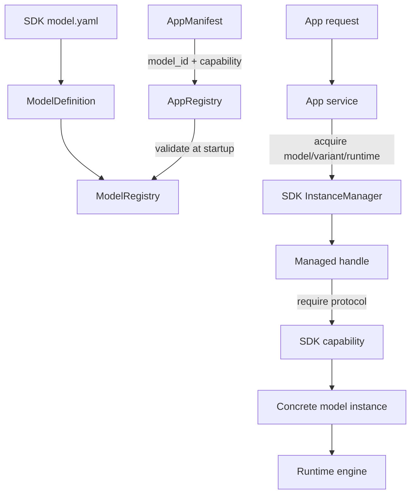
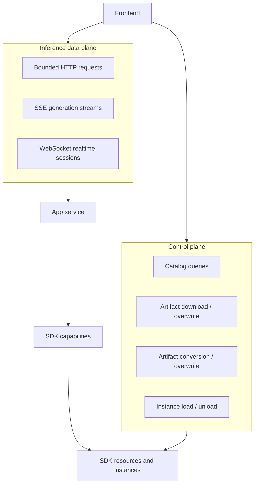
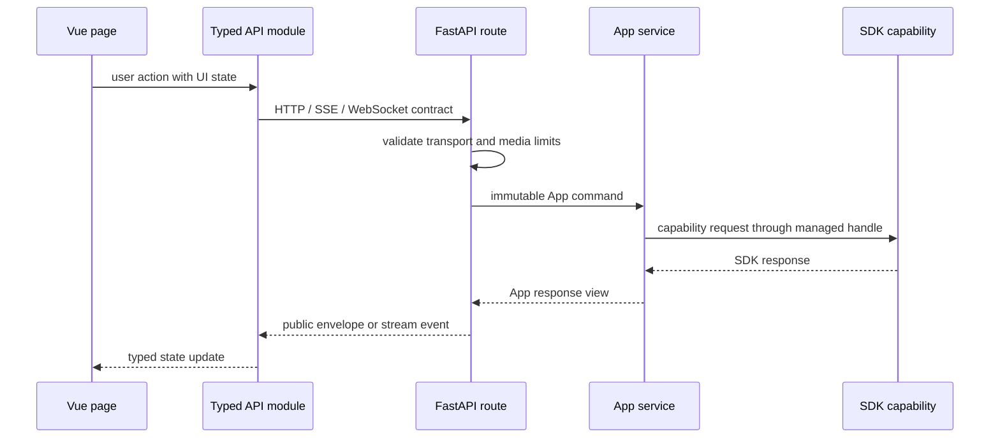
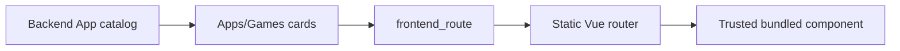
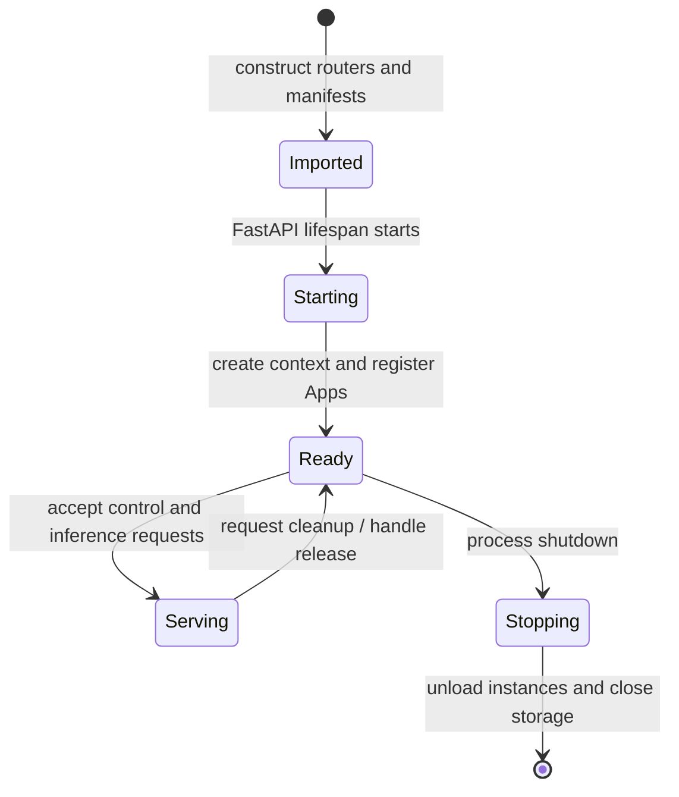

# Web Business Layer Technical Architecture

## Summary

`apps/web` is the business and presentation layer of Hugging Mac. It turns the
generic model lifecycle and capability contracts provided by
`hugging_mac_sdk` into user-facing model management, applications, and games.

The Web layer consists of two independently built runtime units:

- `backend` is a local FastAPI process. It composes the SDK, validates App
  dependencies, owns model/resource control APIs, maps business requests to SDK
  capabilities, and provides local storage and media boundaries.
- `frontend` is a Vue 3 browser application. It owns navigation, responsive
  presentation, browser camera/microphone lifecycle, interactive game loops,
  and typed clients for backend protocols.

They share versioned HTTP, SSE, and WebSocket contracts, not source code or
runtime objects. Public installation and usage documentation belongs in
[`docs`](../../docs/README.md). This document describes only implementation
architecture and dependency rules.



## Layer ownership

The central architectural rule is that each layer owns decisions at its own
abstraction level.

| Layer | Owns | Must not own |
| --- | --- | --- |
| Frontend | Interaction state, responsive UI, browser media, rendering, game loops, request cancellation | Model paths, SDK objects, runtime engines, server filesystem state |
| Backend platform | App catalog, model control APIs, request validation, error envelopes, trace IDs, process lifecycle, local media/cache boundaries | Model graph details, tokenizer logic, inference algorithms |
| Backend App module | Use-case protocol, App-specific validation, capability orchestration, SDK-to-API mapping | Artifact filenames, model revisions, runtime engine imports, frontend rendering |
| SDK core | Model registry, artifact/resource state, conversion, runtime policy, instance and handle lifecycle | App presentation, HTTP schemas, browser behavior |
| SDK model package | Model manifest, runtime adapters, preprocessing/postprocessing, capability implementation | App routes, App-specific profiles, user interaction state |

Dependency direction is one way:

```text
frontend -> backend API -> App service -> SDK capability -> model runtime
                         -> platform service -> SDK control plane
```

Neither the SDK nor a model package may import Web code. Frontend modules do not
import Python modules. Backend Apps depend on public SDK types and capability
protocols, never on a model package's private `config.py`, engine, instance,
converter, artifact IDs, or local path layout.

## App layer and SDK model relationship

An App is a use case; an SDK model is an execution provider. They are connected
through model identity and capability contracts rather than direct construction.

### Two manifests, two responsibilities

| Source | Describes | Example facts |
| --- | --- | --- |
| Backend `AppManifest` | What a business App needs and how the platform exposes it | App ID, category, frontend route, API prefix, required model IDs, required capabilities, preferred runtime |
| SDK model `model.yaml` | What a model package is and which artifacts/runtimes it supports | Model ID, variants, runtimes, artifact sources, required files/modules, shared artifact relations |

The App manifest does not duplicate model variants, artifact paths, filenames,
download patterns, or conversion metadata. The model manifest does not describe
App pages, game behavior, HTTP routes, or business-level request defaults.



At backend startup, all built-in SDK model definitions are registered in the
`ModelSdk` registry. Each App blueprint then registers its immutable
`AppManifest`. `AppRegistry` verifies that required model definitions,
capabilities, and preferred runtimes exist. This validation checks integration
compatibility, not downloaded files.

These states are intentionally separate:

| State | Meaning | Owner |
| --- | --- | --- |
| App available | Required model definitions and capability contracts are registered | `AppRegistry` |
| Artifact installed | Required files for a selected artifact exist locally | SDK resource manager |
| Runtime ready | All artifacts required by one model runtime are installed | SDK catalog/resource views |
| Instance ready | A concrete runtime/variant instance has loaded successfully | SDK instance manager |
| App request active | An App holds a managed handle and is invoking a capability | Backend App service |

Therefore an App may appear in the catalog while its models still need setup.
Catalog reads never download or load a model. Downloads, conversion, overwrite,
load, and unload are explicit control-plane operations.

### Capability-oriented business code

App services translate business requests to capability requests such as
`Chat`, `ObjectDetection`, `PoseEstimation`, `SpeechTranscription`, or
`SpeechSynthesis`. A service obtains a managed handle and calls
`handle.require(CapabilityProtocol)`. The concrete model package remains hidden
behind that protocol.

This permits multiple model families and runtimes to serve the same App without
branching on engine classes. Model-specific user constraints that genuinely
belong to an App may live in its service/profile configuration; model facts and
inference implementation remain in the SDK package.

## Control plane and inference data plane

The backend exposes two related but distinct protocol surfaces.



| Protocol | Primary use | Lifecycle characteristic |
| --- | --- | --- |
| HTTP | Catalog, artifact mutations, load/unload, bounded image/audio/text inference | One request owns validation and cleanup |
| SSE | Chat token/event generation and catalog heartbeat streams | Server-to-client stream; cancellation propagates from disconnect |
| WebSocket | Live transcription and Chat voice input | Connection-scoped session with explicit start/stop and bounded queues |

The model library is the control surface shared by all Apps. App pages do not
implement their own download or conversion paths. They inspect catalog/resource
state and request explicit model loading before inference. This keeps artifact
ownership and active-instance safety rules centralized.

## Backend and frontend relationship

### Contract boundary

The frontend consumes JSON success/error envelopes plus App-specific streaming
formats. Python Pydantic models and TypeScript interfaces are separate
representations of the wire contract; neither project imports the other's
source.



Backend routes own transport concerns: body type, multipart parsing, byte/pixel
limits, HTTP status, WebSocket message framing, and response envelopes. Services
own business orchestration and SDK mapping. Frontend API modules own encoding,
decoding, and browser-visible errors. Vue pages own presentation and user-flow
state.

### Trusted static frontend routing

The backend catalog supplies App name, description, category, tags, availability,
and `frontend_route`. The frontend uses these facts to render catalog cards, but
Vue components are still mapped by explicit lazy imports in `router.ts`.



Remote or persisted metadata cannot cause arbitrary JavaScript to load. Adding a
new App requires explicit backend blueprint registration and explicit frontend
route registration, making the integration reviewable in both processes.

### Browser-owned realtime work

Camera and microphone permission belongs to the frontend because only the
browser can obtain those tracks. The frontend samples or frames media and sends
bounded payloads; the backend validates them and runs inference. Tracks,
animation frames, timers, audio contexts, and reconnect controllers must be
released on stop, navigation, unmount, and failure.

Interactive games keep animation, collision, scoring, and ephemeral match state
in the browser when no authoritative server state is required. They reuse shared
Vision APIs instead of creating game-specific model lifecycles. Backend-light
game modules still provide manifest registration and a stable status contract.

## Directory architecture

```text
apps/web/
├── README.md                         # This cross-process business architecture
├── backend/
│   ├── README.md                     # Backend engineering index
│   ├── pyproject.toml                # FastAPI package and executable metadata
│   └── src/hugging_mac_web/
│       ├── README.md                 # Platform core implementation design
│       ├── main.py                   # App factory, router composition, lifespan
│       ├── context.py                # Process-scoped SDK and local services
│       ├── app_registry.py           # App manifests and dependency validation
│       ├── models.py / index.py      # Model and App control plane
│       ├── shared/                   # Cross-App cache/storage/utilities
│       └── <app_module>/             # One backend business module
└── frontend/
    ├── README.md                     # Frontend engineering overview
    ├── package.json / vite.config.ts # Build and toolchain
    └── src/
        ├── App.vue / router.ts       # Shell and trusted route table
        ├── api/                      # Platform catalog/model/system clients
        ├── components/               # Stable cross-page UI components
        ├── styles/                   # Global tokens and responsive rules
        ├── vision/                   # Shared frontend Vision protocol/UI pieces
        └── <app_module>/             # One frontend page and private logic
```

Python and TypeScript directories use matching `snake_case` names where a
feature exists on both sides. Public App IDs and routes use `kebab-case`.

### Backend module responsibilities

| Element | Responsibility |
| --- | --- |
| `manifest.py` | Immutable App identity and SDK model/capability requirements |
| `blueprint.py` | Side-effect-free adapter exposing the manifest and `APIRouter` |
| `routes.py` | HTTP/stream framing, transport validation, dependency injection |
| `schemas.py` | App-owned Pydantic commands and public response views |
| `service.py` | Business orchestration, SDK handle lifecycle, capability mapping |
| `config.py` | App-specific, instance-variable settings and user-facing profile constraints |
| Private helpers | Algorithms or protocol utilities owned only by that App |
| `README.md` | Current implementation architecture, flows, concurrency, limits, and review rules |

Simple games may contain only manifest, blueprint, and status routes. Modules
should not add empty layers to imitate a larger App. Complex streaming Apps may
add sessions, workers, state machines, or audio/media helpers, documented in
their local README.

### Frontend module responsibilities

| Element | Responsibility |
| --- | --- |
| `index.vue` | Route-level composition, user workflow, and visible state |
| `api.ts` | App-specific HTTP/SSE calls and request encoding |
| `*Socket.ts` | WebSocket connection state, messages, cancellation, reconnect policy |
| `types.ts` | TypeScript representation of public App contracts |
| Components | App-private visualization and controls |
| Engine/renderer helpers | Browser-owned game simulation and rendering |
| Tests | Pure game logic, geometry, mapping, and lifecycle regression coverage |

Platform-wide API types stay in `src/api`; cross-Vision contracts stay in
`src/vision`. Code is promoted to a shared directory only when its contract is
independent of the original App. Direct imports from one App directory into
another are avoided because they create hidden ownership and lifecycle coupling.

## App inventory and orchestration shape

| Category | Modules | Backend shape |
| --- | --- | --- |
| Language and audio | Chat, Live Transcription, Text to Speech | Stateful model orchestration; SSE or WebSocket where streaming is required |
| Vision | Object Detection, Pose Estimation, Instance Segmentation | Bounded upload/frame validation and shared capability handles |
| Backend-scored game | Yolo Pose Follow | Stateless pose/gesture algorithms over results produced by shared Vision APIs |
| Frontend-owned games | Yolo Fruit Slice, Palm Thunder, Palm Trace | Manifest and status only; inference and game loop are composed in the frontend |

Individual protocols and algorithms belong in the nearest module README. The
backend index links all module documents; this file maintains only the shared
business-layer structure.

## Key design patterns

| Pattern | Location | Purpose and consequence |
| --- | --- | --- |
| Application Factory | Backend `create_app()` | Produces an isolated FastAPI app and permits blueprint injection in tests |
| Composition Root | Backend `create_context()` | Constructs SDK, registries, cache, and storage once; keeps wiring out of business services |
| Explicit Registry | SDK models and backend Apps | Makes supported integrations auditable and prevents import-time filesystem/plugin side effects |
| Manifest-driven dependency declaration | `model.yaml` and `AppManifest` | Separates static model facts from business requirements while enabling startup validation |
| Ports and Adapters | SDK capability protocols and model instances | Lets Apps target a stable operation while runtimes/models remain replaceable adapters |
| Service/Façade | Backend App services | Presents one use-case operation over catalog, resource, handle, and capability APIs |
| Dependency Injection | `PlatformContext` through FastAPI dependencies | Gives routes shared process services without globals and enables test doubles |
| Managed Handle / RAII | SDK `acquire()` async context managers | Releases usage references on success, error, or cancellation and enables safe shared reuse |
| Control Plane / Data Plane | Model APIs versus App inference APIs | Keeps resource mutations explicit and inference endpoints focused on bounded execution |
| Backend for Frontend | FastAPI App schemas and response views | Hides SDK-private objects and presents browser-oriented contracts and errors |
| Content-addressed storage | Backend local cache | Deduplicates accepted media while returning opaque IDs instead of filesystem paths |
| Producer–Consumer and State Machine | Streaming App modules | Bounds realtime memory and makes connection/session transitions explicit |
| Static route-to-component mapping | Vue router | Uses catalog metadata for discovery without allowing metadata-driven code loading |

These patterns are constraints, not labels. For example, capability protocols
are useful only if an App service does not later inspect a concrete engine, and
managed handles are safe only when every exit path closes their context.

## Process and request lifecycle



Blueprint import and router construction must be side-effect free: no model
download/load, database open, user-media read, or background worker start.
Process-scoped services are created during lifespan startup. Request-scoped SDK
handles and temporary media are released in `finally` or async context managers.
Shutdown force-unloads managed instances before closing local document storage.

Long-running connections add a connection-scoped lifecycle inside `Serving`.
Their queues must be bounded, cancellation must propagate, and sender/worker
tasks must terminate before the connection object is discarded.

## Trust, privacy, and failure boundaries

- User media stays local, is size- and format-checked at the backend boundary,
  and is persisted only when the endpoint explicitly supports caching.
- Requests never provide arbitrary model repositories, artifact paths, output
  directories, or filesystem deletion targets.
- The backend returns cache IDs and stable model/runtime identity, not absolute
  local paths or runtime-private objects.
- SDK exceptions are converted to stable API errors with trace IDs; full
  tracebacks remain in local structured logs.
- Prompts, audio bytes, images, generated waveforms, tokens, and model remote-code
  details are not included in normal logs.
- A browser disconnect cancels stream/session work and must release model handles,
  temporary uploads, media tracks, queues, timers, and animation callbacks at
  their owning boundary.

## Adding or changing an App

The normal integration sequence preserves the dependency direction:

1. Register or extend an SDK model definition and capability implementation if
   the operation does not already exist.
2. Declare the backend App's model IDs and capability requirements in
   `AppManifest`; do not copy SDK artifact facts.
3. Add side-effect-free blueprint registration and an App-owned router.
4. Define transport schemas, then implement service mapping through public SDK
   catalog/resource/instance/capability APIs.
5. Add a statically imported frontend route, typed API module, and route page.
6. Document non-obvious architecture, algorithms, concurrency, and cleanup in
   the nearest module README.
7. Test manifest compatibility, route contracts, cleanup/error paths, and the
   frontend build without downloading models or accessing the network.

Review should reject cross-layer shortcuts such as frontend-computed model paths,
App imports of model-private configuration, route handlers that implement
inference algorithms, catalog reads with mutation side effects, or backend game
state that duplicates a browser-owned loop.

## Technical documentation map

| Area | Document |
| --- | --- |
| Backend engineering index and module links | [`backend/README.md`](backend/README.md) |
| Backend platform core and model control plane | [`backend/src/hugging_mac_web/README.md`](backend/src/hugging_mac_web/README.md) |
| Frontend architecture and responsive/browser rules | [`frontend/README.md`](frontend/README.md) |
| SDK architecture | [`packages/hugging_mac_sdk/README.md`](../../packages/hugging_mac_sdk/README.md) |
| SDK model integration and `model.yaml` standard | [`models/readme.md`](../../packages/hugging_mac_sdk/src/hugging_mac_sdk/models/readme.md) |

Implementation facts belong to the nearest owning README. Cross-process rules
belong here. Public tutorials and SDK usage examples remain under `docs` and are
not duplicated in this technical hierarchy.
