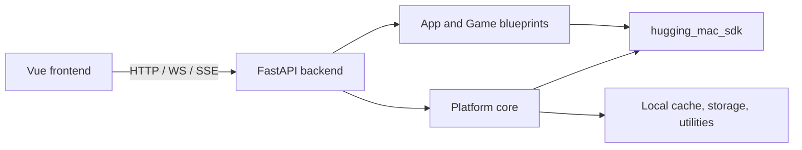

# Web Backend Engineering Index

The Web backend is the local control and inference plane for Hugging Mac Studio.
It is a FastAPI package that composes the model SDK, the App catalog, local
storage, media validation, and the HTTP/WebSocket/SSE protocols consumed by the
Vue frontend.

This file is the engineering entry point. Public installation and Studio usage
belong in [`docs/`](../../../docs/README.md); implementation details live beside
the source that owns them.

## Package boundaries



- The backend never renders Vue pages and does not import frontend modules.
- App routes depend on SDK capabilities, not concrete model instances or engine
  implementations.
- Model download, conversion, instance loading, and inference stay explicit;
  catalog reads do not mutate resources.
- Local absolute paths and exception tracebacks remain server-side.

## Technical documentation

| Area | Document |
|---|---|
| FastAPI composition, model control plane, errors, and lifecycle | [`hugging_mac_web`](src/hugging_mac_web/README.md) |
| Shared cache, storage, logging, uploads, SSE, and system probes | [`shared`](src/hugging_mac_web/shared/README.md) |
| Multimodal chat | [`chat`](src/hugging_mac_web/chat/README.md) |
| Live audio pipeline | [`live_transcription`](src/hugging_mac_web/live_transcription/README.md) |
| Speech synthesis | [`text_to_speech`](src/hugging_mac_web/text_to_speech/README.md) |
| Detection, pose, and segmentation | [`object_detection`](src/hugging_mac_web/object_detection/README.md), [`pose_estimation`](src/hugging_mac_web/pose_estimation/README.md), [`instance_segmentation`](src/hugging_mac_web/instance_segmentation/README.md) |
| Game backends | [`yolo_pose_follow`](src/hugging_mac_web/yolo_pose_follow/README.md), [`yolo_fruit_slice`](src/hugging_mac_web/yolo_fruit_slice/README.md), [`palm_thunder`](src/hugging_mac_web/palm_thunder/README.md), [`palm_trace`](src/hugging_mac_web/palm_trace/README.md) |

## Development checks

```bash
uv sync --all-packages
uv run pytest tests/web
uv run ruff check apps/web/backend/src tests/web
uv run mypy apps/web/backend/src packages/hugging_mac_sdk/src
uv run hugging-mac-web
```

The application factory is intentionally import-safe: importing blueprints does
not download models, open the document store, or create model instances. Those
operations begin at lifespan startup or within an explicit request.
