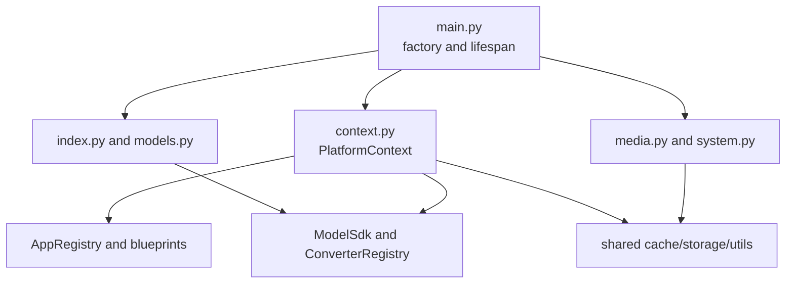
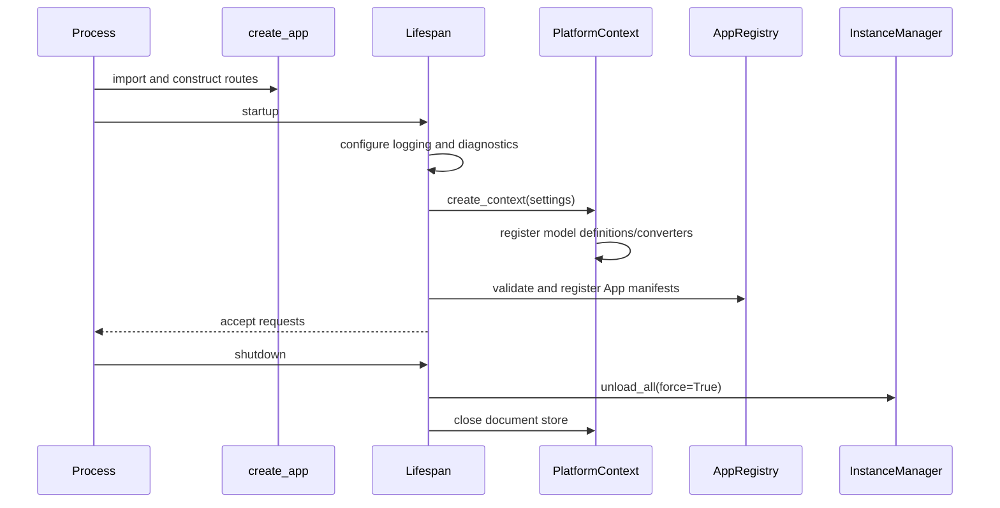
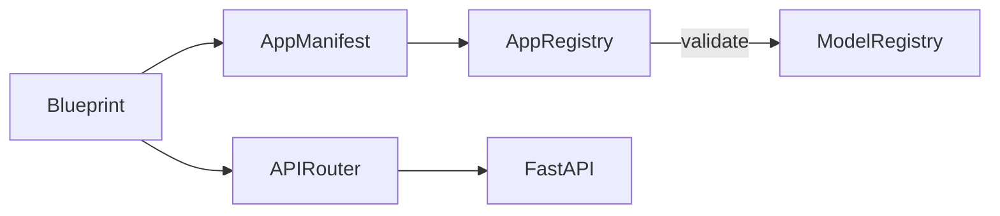

# Web Platform Core Technical Design

## Summary

`hugging_mac_web` is the composition root for the local FastAPI process. It owns
application startup, model and App registration, the platform control APIs,
stable error envelopes, request tracing, local persistence, and shutdown. App
packages own their business protocols and call the injected model SDK through
capabilities.

Core patterns:

- **Application Factory**: `create_app()` builds an isolated FastAPI application
  and accepts injected blueprints for tests.
- **Composition Root**: `create_context()` registers every model definition and
  constructs shared process services exactly once.
- **Explicit Registry**: App manifests and routes are registered from a fixed
  built-in list; no directory scanning or entry-point execution occurs.
- **Control Plane / Data Plane Split**: catalog and resource routes manage models;
  App routes perform inference.
- **Stable Error Boundary**: SDK and HTTP exceptions are mapped to one public
  envelope while full tracebacks remain in server logs.



## Module structure

| File | Responsibility |
|---|---|
| `main.py` | FastAPI factory, middleware/router composition, process diagnostics, lifespan cleanup |
| `context.py` | Process-scoped SDK, converters, App registry, document store, and cache |
| `app_blueprint.py` | Structural contract for manifest plus router construction |
| `app_registry.py` | App identity/route uniqueness and required model capability validation |
| `models.py` | Model catalog, artifact operations, structure inspection, instance load/unload |
| `index.py` | App/Game catalog and combined catalog SSE stream |
| `media.py` | Validated, content-addressed local media uploads |
| `system.py` | Health and machine information |
| `middleware.py` | Request trace ID creation and response propagation |
| `error_handlers.py` | SDK/HTTP exception mapping and safe detail filtering |
| `schemas.py` | Generic success and error envelopes |
| `config.py` | Process-level host, storage, CORS, logging, runtime policy, and limits |

Business packages are siblings of these platform files. Cross-App reusable
infrastructure belongs in [`shared`](shared/README.md), not in an arbitrary App.

## Startup and shutdown



Blueprint construction is side-effect free. The document database and cache
directories are created only by `create_context()` during lifespan startup.
Shutdown force-unloads managed instances before closing TinyDB. Cleanup errors
are suppressed so one failed model release cannot prevent process termination.

`faulthandler` and a process-level asyncio exception handler expose native fatal
signals and otherwise-unhandled task failures in the terminal log.

## Platform context and dependency direction

`PlatformContext` is stored on `app.state` and injected through FastAPI
dependencies. It contains:

```text
WebSettings
ModelSdk
ConverterRegistry
AppRegistry
TinyDocumentStore
LocalCache
```

All model packages are registered centrally. App services may inspect catalog
and resource views, acquire shared handles, or require capabilities; they do not
register definitions, import model-private configuration, or choose local paths
outside `settings.model_home`.

## App registration

At startup, each blueprint contributes one immutable `AppManifest` and one
`APIRouter`. `AppRegistry` rejects duplicate App IDs, frontend routes, and API
prefixes. It validates every required model and capability against the SDK
registry.

Missing model files do not make an App unavailable: the definition and
capability contract can exist before artifacts are downloaded. A missing
required definition, capability, or preferred runtime makes registration
`unavailable`. Optional missing dependencies do not block registration.



## Platform APIs

### Catalog and system

| Method | Path | Implementation contract |
|---|---|---|
| GET | `/api/v1/catalog/apps` | Registered application summaries |
| GET | `/api/v1/catalog/games` | Registered game summaries |
| GET | `/api/v1/catalog/events` | Initial combined catalog event followed by heartbeats |
| GET | `/api/v1/system/health` | Process liveness |
| GET | `/api/v1/system/info` | Local OS, CPU, memory, Python, and Apple hardware view |
| POST | `/api/v1/media/uploads` | Validated local upload stored by content digest |

The SSE stream sends a complete `catalog` event first. It then emits heartbeat
events at the configured interval until the request disconnects. It is not a
database changefeed.

### Model control plane

| Method | Path | Implementation contract |
|---|---|---|
| GET | `/api/v1/catalog/models` | Model/variant/runtime summaries and live instances |
| GET | `/api/v1/catalog/models/{model_id:path}/resources` | Variant resource status |
| GET | `/api/v1/catalog/models/{model_id:path}/inventory` | Every declared artifact and local availability |
| GET | `/api/v1/catalog/models/{model_id:path}/structure` | Read-only artifact structure inspection |
| POST | `/api/v1/catalog/models/{model_id:path}/resources/download-one` | Download or overwrite one declared artifact |
| POST | `/api/v1/catalog/models/{model_id:path}/download-operations` | Start or reuse a background artifact download |
| GET | `/api/v1/catalog/download-operations` | List active or recent background downloads |
| GET | `/api/v1/catalog/download-operations/{operation_id}/events` | Stream the latest download state and subsequent progress over SSE |
| DELETE | `/api/v1/catalog/models/{model_id:path}/artifacts` | Delete one declared artifact directory/file |
| POST | `/api/v1/catalog/models/{model_id:path}/resources/download` | Prepare all required source resources |
| DELETE | `/api/v1/catalog/models/{model_id:path}/resources` | Delete model resources through the provider |
| POST | `/api/v1/catalog/models/{model_id:path}/resources/convert` | Convert one declared target artifact |
| POST | `/api/v1/catalog/models/{model_id:path}/instances` | Load a selected runtime/variant instance |
| DELETE | `/api/v1/catalog/instances/{instance_id}` | Unload one managed instance |

Catalog reads do not download, convert, or load. Per-artifact download uses the
artifact's injected source; conversion is allowed only for a non-shared artifact
with `convert: true`. Required shared artifacts are prepared before their owner.
Overwrite is explicit for downloads and conversions.

Background downloads belong to the platform process rather than an SSE client.
Disconnecting or refreshing a page removes only that subscription; a later
subscriber receives the operation's latest snapshot before live updates. Progress
is tracked independently for the requested artifact and any shared artifacts it
installs first. Stopping the backend process still stops in-flight downloads.

Resource mutation is rejected while an affected runtime/variant has managed
instances. A shared artifact also checks every owner in its many-to-many
`required_shares` relationship. Deletion resolves and validates the owning
storage path before removing it and refuses targets outside `model_home`.

## Instance lifecycle

The load endpoint passes runtime, variant, optional device, warmup, and model
home to `InstanceManager`. Equivalent model configurations reuse one shared
instance. Loading returns only after the instance is
ready or raises an SDK error. Unload can be forced by the explicit API flag;
normal calls preserve active handles.

Instance snapshots contain observed process RSS and timing values. They are
process-level diagnostics, not exclusive model or GPU/ANE allocations.

## Media, storage, and trust boundaries

Uploads are bounded by `max_upload_bytes`. Media type is inferred from the safe
extension and declared content type; images are decoded for pixel-count and
dimension validation. Accepted bytes are stored in the content-addressed cache,
and API responses expose cache IDs and metadata rather than absolute paths.

Model remote code is trusted only inside model integrations that explicitly opt
into it. The Web layer never accepts an arbitrary model path or repository from
a request.

## Errors, trace IDs, and logging

`TraceIdMiddleware` accepts or creates a trace ID, binds it to the request, and
returns it as `x-trace-id`. API failures use:

```json
{
  "error": {
    "code": "model_load_error",
    "message": "...",
    "retryable": false,
    "trace_id": "...",
    "details": {}
  }
}
```

SDK exception types map to stable HTTP statuses. Only allow-listed detail keys
are returned; absolute paths, tokens, tracebacks, prompts, and backend exception
objects remain in structured logs. Uvicorn, stdlib logging, structlog, and SDK
records share the renderer described in [`shared/utils`](shared/utils/README.md).

## Tests and review points

Tests inject temporary settings and fake capabilities, so default tests neither
download models nor access the network. Review changes against these invariants:

1. Importing a blueprint must remain side-effect free.
2. Catalog reads must remain non-mutating.
3. Resource changes must account for active instances and shared owners.
4. App routes must depend on capability contracts, not engine classes.
5. Public errors and responses must never expose local absolute paths.
6. Shutdown must release instances and storage even after partial failures.
