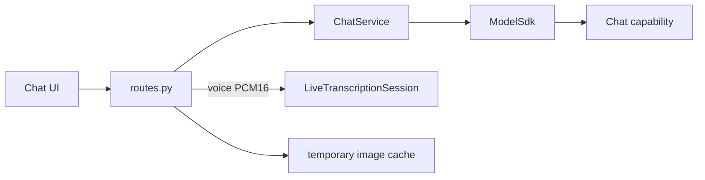
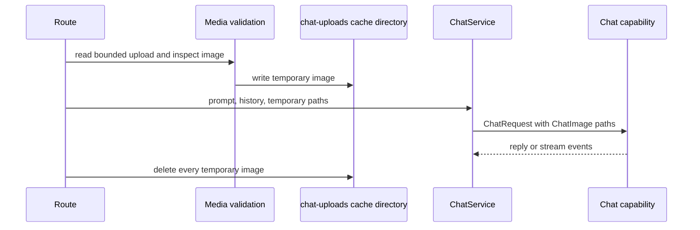
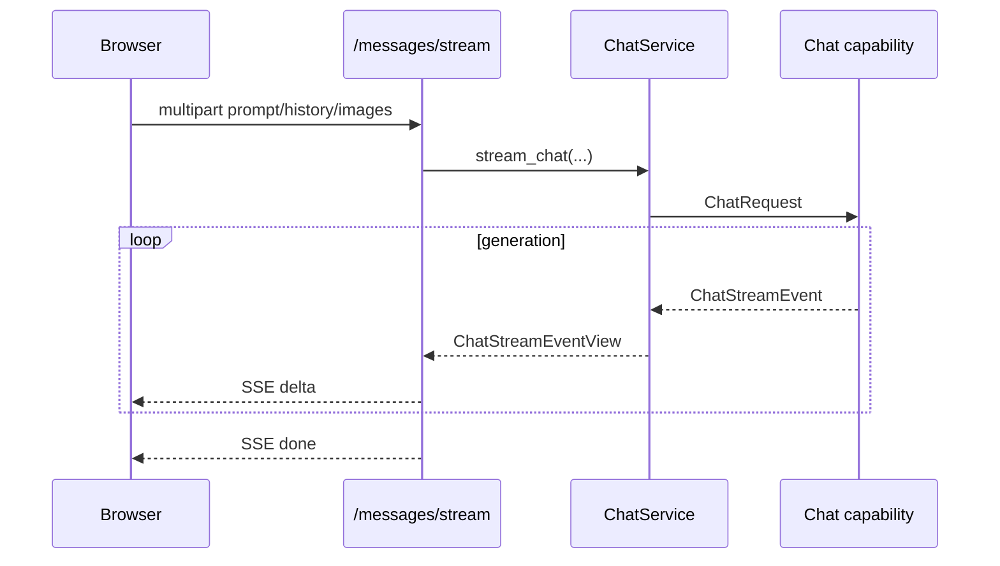

# Chat Backend Technical Design

## Summary

`chat` provides local text and multimodal conversation over synchronous HTTP or
SSE, plus a realtime voice-input WebSocket. It discovers chat variants from the
SDK registry, loads shared model instances explicitly, validates uploaded images,
and converts App schemas to the SDK `Chat` capability.

Core patterns are a service façade over SDK capabilities, temporary-file scope
for image inputs, shared instance reuse, and generator-based SSE streaming.

## Models and capability boundary

The App manifest declares these dependencies:

| Model ID | Capabilities | Role |
|---|---|---|
| `qwen/qwen3.5` | `chat`, `vision-language-generation` | Required multimodal chat family |
| `google/gemma-4` | `chat` | Required multimodal chat family |
| `nvidia/nemotron-3.5-asr-streaming-0.6b` | `streaming-speech-transcription` | Optional voice-input ASR |
| `hexgrad/kokoro` | `speech-synthesis` | Optional voice-output dependency |

Chat inference itself only requires the SDK `Chat` capability. The optional
dependencies do not introduce a second model lifecycle inside `ChatService`.

`ChatService` builds the visible profile list from every registered variant and
its manifest metadata. It does not duplicate the variant catalog. A profile
records the selected runtime artifact, disk estimate, and whether image inputs
are supported. Runtime selection prefers an installed Core ML, PyTorch, or MLX
artifact in that order, otherwise retaining the manifest-derived runtime.

## Module structure

| File | Responsibility |
|---|---|
| `routes.py` | Multipart validation, HTTP/SSE/WebSocket transport, temporary image lifetime |
| `service.py` | Profile discovery, shared load, instance validation, capability request/result mapping |
| `schemas.py` | App resource, model, request, reply, and stream-event views |
| `config.py` | Chat input limits, default profile selector, and ASR sensitivity |
| `manifest.py` | Required/optional model capabilities and catalog metadata |
| `blueprint.py` | Side-effect-free router registration |

## Interfaces

| Method | Path | Purpose |
|---|---|---|
| GET | `/api/v1/apps/chat/models` | All registered chat variant profiles and readiness |
| GET | `/api/v1/apps/chat/model` | Ready instance for one profile, if any |
| POST | `/api/v1/apps/chat/model/load` | Load/reuse one selected profile |
| WS | `/api/v1/apps/chat/asr/ws` | Streaming voice input using the shared live pipeline |
| POST | `/api/v1/apps/chat/messages` | Complete reply for text and optional images |
| POST | `/api/v1/apps/chat/messages/stream` | SSE delta stream for the same request shape |

Message endpoints use multipart form data so text/history and local images share
one request. History is JSON decoded into immutable `ChatHistoryMessage` values;
roles are restricted to system, user, and assistant. Prompt/history lengths,
image count, individual image bytes, MIME type, dimensions, and pixel count are
validated before inference.

## Image lifecycle and trust boundary

The SDK accepts controlled local paths for model preprocessing, but client paths
are never accepted. Temporary images are removed in `finally` for synchronous,
streaming, cancellation, and error paths. A selected text-only profile rejects
images before capability invocation.

## Synchronous and streaming inference

`ChatService.chat()` validates that the requested managed instance matches a
supported profile and is `READY`, maps history and the new user message to SDK
`ChatMessage` values, invokes `Chat.chat()`, and returns public model/runtime/token
and timing fields.

`stream_chat()` performs the same validation and request construction, then
forwards each SDK delta as `ChatStreamEventView`. The route encodes unfinished
items as SSE `delta` events and the terminal item as `done`. Inference failures
after response streaming starts become an SSE `error` event with a bounded
message. Client cancellation propagates instead of being converted to a normal
event.

## Voice-input reuse

`/asr/ws` supports one active session per connection. A `start` JSON message
selects a configured streaming ASR instance and microphone sample rate. The route
creates `LiveTranscriptionSession` with Silero and enhancement disabled,
`include_input_audio=False`, and the Chat sensitivity setting. Binary PCM16 then
uses the same bounded queues, energy endpoint detector, and Nemotron streaming
worker documented in [`live_transcription`](../live_transcription/README.md).

Only JSON results are emitted; binary replay WAV messages are intentionally
dropped. `stop` drains the session, while disconnect or failure cancels it.

## Lifecycle, failures, and observability

- Model loading requests `ReusePolicy.SHARED`; the temporary handle is closed
  after reading instance information while the shared managed instance remains.
- Message inference uses an explicit `instance_id`; it never auto-loads a model.
- Resource or capability mismatches use SDK errors and the platform error mapper.
- WebSocket logs bind a connection ID and later the shared transcription session
  ID. Logs contain byte/chunk counts and timings, not audio, prompt, or reply text.
- Stream and upload cleanup is idempotent under disconnect and cancellation.

## Tests and review points

Platform tests cover text/image chat, SSE deltas and cleanup, and streaming voice
input. Review changes against these constraints:

1. Sync and streaming paths must apply identical history/image validation.
2. Uploaded images must be deleted on every terminal path.
3. App schemas must remain separate from SDK schemas.
4. Voice input must continue reusing the single live-audio implementation.
5. Do not log prompt, reply, image bytes, or local temporary paths.
