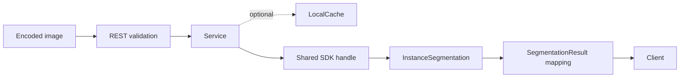
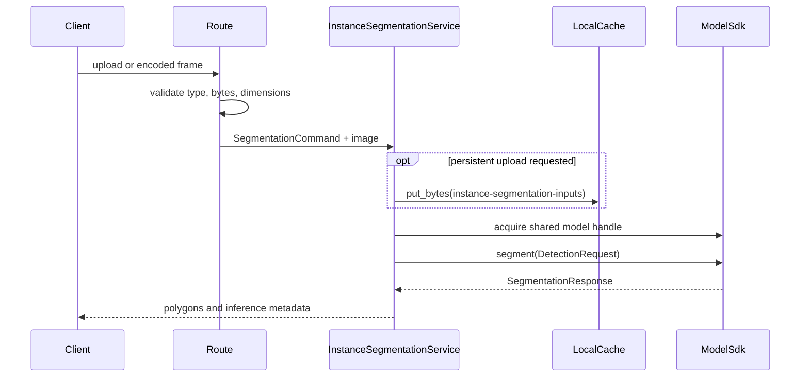

# Instance Segmentation Backend

## Summary

This module exposes YOLOv8 instance segmentation through the Web API. It uses the same bounded upload and shared-instance pattern as Object Detection, but requires model `ultralytics/yolov8-seg` and capability `instance-segmentation`, and returns per-object polygons in addition to boxes and labels.

## Module structure

| File | Responsibility |
| --- | --- |
| `manifest.py` | App identity and the `ultralytics/yolov8-seg` capability requirement. |
| `blueprint.py` | App registry adapter and router factory. |
| `routes.py` | Multipart and raw-frame validation and HTTP response construction. |
| `schemas.py` | Runtime choice, inference controls, polygons, boxes, timings, and resource views. |
| `service.py` | Variant resolution, resource lookup, optional input caching, SDK acquisition, and segmentation. |

## Platform and SDK boundaries

The Web module handles transport validation and response shaping. The SDK capability owns image preprocessing, model execution, masks-to-polygon conversion, class metadata, and runtime selection. The service obtains its model ID from `INSTANCE_SEGMENTATION_MANIFEST`, resolves variants from the SDK registry, and acquires instances with `ReusePolicy.SHARED`.

Optional inputs are stored through `PlatformContext.cache`; no route accepts a filesystem destination. Resource status is read through SDK resource and catalog APIs, so the Web layer does not infer installation state from paths.

## Interfaces

API prefix: `/api/v1/apps/instance-segmentation`

| Method | Route | Contract |
| --- | --- | --- |
| GET | `/api/v1/apps/instance-segmentation/resources` | Return resource state, variants, and default runtime metadata. |
| POST | `/api/v1/apps/instance-segmentation/segment` | Segment a multipart JPEG, PNG, or WebP upload. |
| POST | `/api/v1/apps/instance-segmentation/segment/frame` | Segment a raw encoded live frame without caching it. |

Inference controls are `runtime`, `variant`, `confidence`, `iou_threshold`, and `max_detections`. The upload endpoint additionally accepts `cache_input`. A successful result contains the canonical model, variant, instance, runtime and device identity; image dimensions; SDK timings; and zero or more segments. Each segment carries a box, confidence, class metadata, and one or more polygons of image-coordinate points.

## Processing flow

JPEG, PNG, and WebP are accepted. The upload route fully verifies the encoded image; the frame route uses the reduced verification mode and always sets `cache_input=False`. Both enforce `max_upload_bytes` and `max_image_pixels`. `runtime=auto` becomes `None`, leaving default resolution to the SDK.

## Concurrency, lifecycle, and memory

There are no module-owned workers or queues. Each request keeps one encoded input plus the decoded/runtime memory owned by the SDK. The async SDK handle encloses capability lookup and inference, guaranteeing release on success, cancellation, or exception. Shared reuse prevents redundant model instances across simultaneous segmentation requests.

Polygon responses may be materially larger than detection-only responses. The backend preserves SDK polygons rather than rasterizing masks, avoiding another full-size image allocation and keeping rendering policy in the client.

## Errors, security, and observability

The route maps unsupported media to `415`, excessive bodies to `413`, and invalid images to `422`. Pydantic constrains confidence and IoU to `[0, 1]` and detection count to `[1, 1000]`. SDK load/inference errors are handled by platform error middleware and include the request trace ID.

Cache writes use a fixed namespace and sanitized suffix. Clients cannot choose a path or cache ID. Response timing and execution identity support performance diagnosis without exposing internal artifact paths.

## Tests and review points

Tests should verify media guards, full-upload and frame behavior, cache policy, canonical variant and runtime forwarding, `InstanceSegmentation` capability enforcement, polygon mapping, empty results, shared handle release, and SDK error propagation.

Review changes for path-derived resource checks, live-frame persistence, mask rasterization in the backend, duplicated model facts, or preprocessing/postprocessing logic that belongs to the model SDK.
