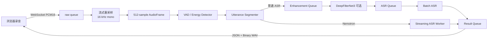
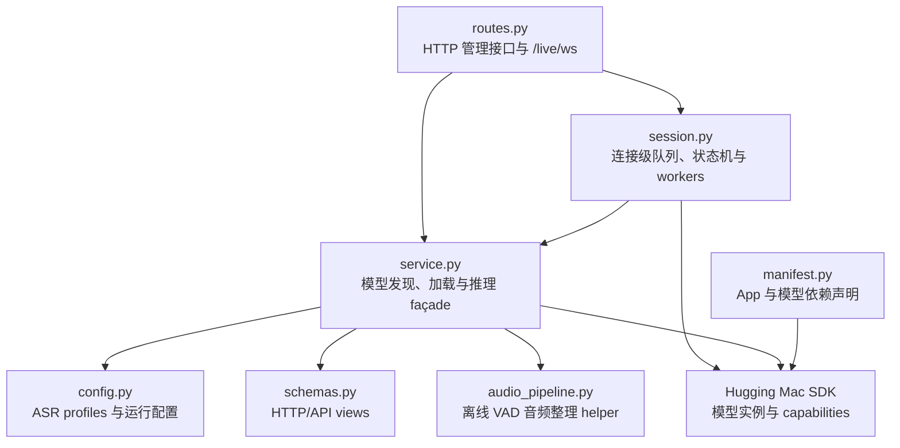
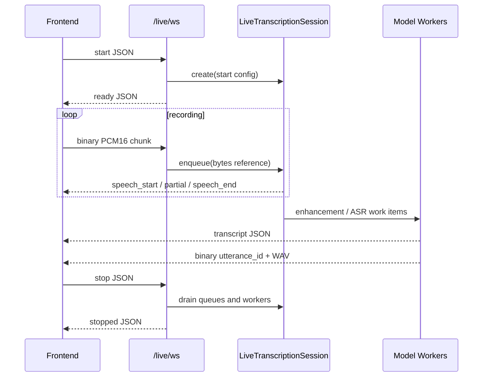
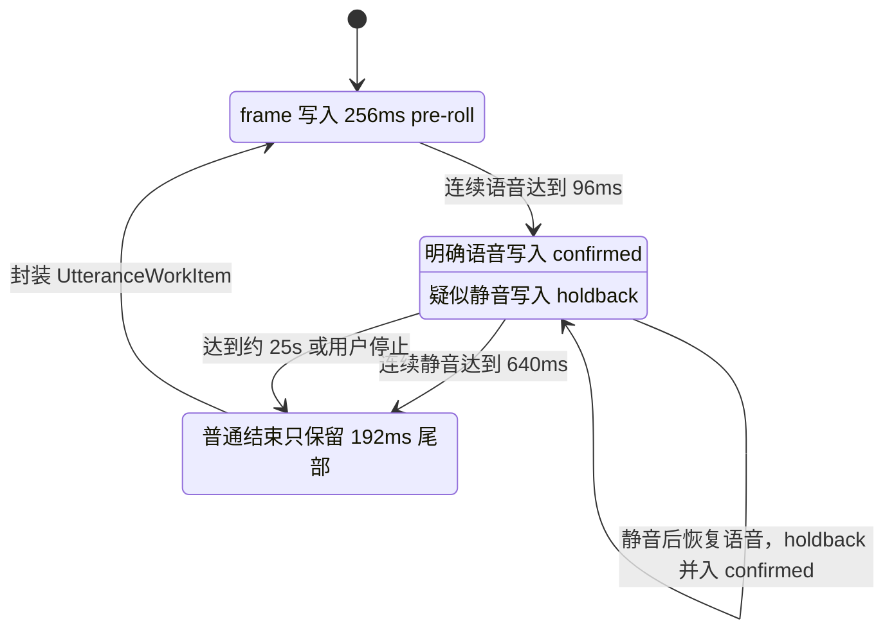
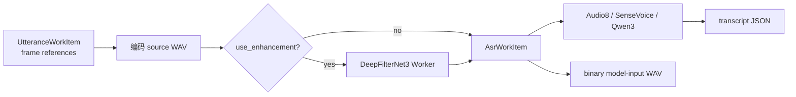
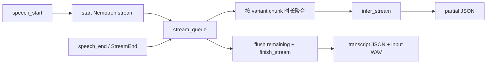

# Live Transcription 技术设计

## 摘要

`live_transcription` 为 Live Transcription 页面提供本地实时语音转写能力。页面在录音前通过 HTTP 查询、加载模型；录音开始后只使用一条 WebSocket，前端持续发送 PCM16 音频，后端统一负责重采样、VAD、切句、可选降噪、ASR 和模型输入音频回传。

核心设计模式：

- **Producer–Consumer**：有界 `asyncio.Queue` 连接音频接收、降噪、ASR 和结果发送阶段。
- **Pipeline**：音频按固定顺序经过重采样、切句、降噪和识别。
- **State Machine**：VAD 驱动 `IDLE → SPEAKING → IDLE` 的 utterance 生命周期。
- **Strategy**：Silero VAD 与后端 Energy Detector 实现相同的检测接口。
- **Immutable Work Item**：切句后使用不可变 `AudioFrame`、`UtteranceWorkItem` 和 `AsrWorkItem` 在 worker 间传递。
- **Service/Façade**：`LiveTranscriptionService` 统一封装模型发现、加载和能力调用。



## 功能与模型

| 模型 | 用途 | 当前实时路径 |
|---|---|---|
| Audio8-ASR 0.1B | 中英双语转写 | 完整 utterance 推理 |
| SenseVoiceSmall | 多语言、情绪和声音事件理解 | 完整 utterance 推理 |
| Qwen3-ASR 0.6B | 多语言转写 | 完整 utterance 推理 |
| Nemotron 3.5 ASR 0.6B | 有状态 RNN-T 流式转写 | VAD 切句内分块推理 |
| Silero VAD | 神经语音活动检测 | 可选；启用时负责开始和结束判定 |
| DeepFilterNet3 | 语音降噪 | 可选；仅用于非流式 ASR |

Silero 未启用时仍需要切句，后端会改用 RMS Energy Detector。也就是说，神经 VAD 可选，但实时流水线始终存在一种 endpoint detector。

## 模块结构



主要职责：

- `routes.py`：提供录音前的模型管理 HTTP 接口，并管理 `/api/v1/apps/live-transcription/live/ws` 生命周期。
- `session.py`：实时链路的核心实现，每条 WebSocket 创建一个独立 `LiveTranscriptionSession`。
- `service.py`：查询 variant/runtime、加载模型、校验实例并调用 ASR capability。
- `config.py`：声明受支持的 ASR 模型及默认 runtime、variant、chunk 时长。
- `manifest.py`：声明 App 依赖的必选 ASR 和可选 VAD/降噪模型。

## 接口边界

### 录音前 HTTP

HTTP 只负责模型管理：

- `GET /models`
- `GET /resources`
- `GET /pipeline/components`
- `POST /models/load`
- `POST /vad/model/load`
- `POST /enhancement/model/load`

旧的 `/vad/detect`、`/transcribe` 和 `/stream/*` 不属于当前 Live Transcription 录音链路。

### 录音期 WebSocket



`start` 包含模型实例、输入采样率、VAD/降噪开关、阈值和 Nemotron chunk 时长。之后前端只发送小端单声道 PCM16；不发送逐块 ACK，也不在前端维护 utterance buffer。

## 音频数据结构与内存

### 队列

| 队列 | 容量 | 内容 | 作用 |
|---|---:|---|---|
| `raw` | 32 | `bytes` PCM chunk | WebSocket 接收与音频 worker 之间的背压 |
| `utterances` | 8 | `UtteranceWorkItem` | 已封口语句进入可选降噪 |
| `asr` | 8 | `AsrWorkItem` | 实际模型输入进入普通 ASR |
| `results` | 64 | JSON 或 binary | 所有 worker 统一向 WebSocket sender 输出 |
| `stream_queue` | 128 | `AudioFrame` / `StreamEnd` | 单个 Nemotron utterance 的实时输入 |

`asyncio.Queue` 以 FIFO 方式消费，入队只保存 Python 对象引用，不复制音频正文。队列有界；下游变慢时 `put()` 等待，背压逐级传回 WebSocket，而不是静默丢帧。

### 固定音频帧

```python
AudioFrame(
    start_sample: int,
    pcm16: bytes,       # 512 samples / 1024 bytes
)
```

`FrameResampler` 将任意 8–192 kHz 输入线性重采样为 16 kHz，并直接生成 512 samples（32 ms）的不可变 frame。Pre-roll、holdback、utterance 和 streaming worker 都共享 frame 引用。

完整 utterance 只有在进入降噪/ASR或生成回放音频时才顺序写成 WAV。普通 ASR 的 `model_input_audio` 同一份 `bytes` 同时用于模型输入和 WebSocket 回放，避免再次编码或 Base64 拷贝。

## VAD 与切句算法

当前固定参数：

| 参数 | 数值 |
|---|---:|
| 标准采样率 | 16 kHz |
| VAD frame | 512 samples / 32 ms |
| Speech start | 1,536 samples / 96 ms |
| Speech end | 10,240 samples / 640 ms |
| Pre-roll | 8 frames / 256 ms |
| 保留尾部 | 6 frames / 192 ms |
| 最大 utterance | 约 25 秒 |



Silero 路径使用连接级 recurrent state；Energy Detector 使用灵敏度映射出的 RMS 阈值：

```text
energy_threshold = 0.035 - sensitivity × 0.029
```

两种 detector 都采用 96 ms speech-start 和 640 ms speech-end hysteresis。达到最大语句长度时强制封口并重置边界状态。

## 普通 ASR 流水线



降噪 worker 与 ASR worker 独立运行，因此录音/VAD 可以继续处理下一句话。`LiveTranscriptionService.transcribe()` 在该路径中明确使用：

```text
use_vad = false
use_enhancement = false
include_input_audio = false
```

原因是 VAD 和降噪已经由 session pipeline 完成，避免二次 VAD、二次降噪和 Base64 编码。worker 异常会产生 `error` 事件并关闭当前 session，不会静默回退到不同的模型输入。

## Nemotron 流式路径

Nemotron 不经过 DeepFilterNet3。检测到 `speech_start` 后立即创建独立 streaming session，并提交 Pre-roll 与后续确认帧。



疑似静音先保存在 `holdback`：

- 640 ms 内重新出现语音：holdback 全部补交给 Nemotron，仍属于同一句。
- 确认结束：只提交最前面的 192 ms，剩余确认静音不进入模型。

Nemotron 的实际输入 frame 同时保存在 streaming worker 中，结束后编码为回放 WAV，因此页面播放的内容与流式模型收到的内容一致。

## 返回协议

文本和音频使用两条有序 WebSocket 消息：

1. `transcript` JSON：包含 `utterance_id`、文本、模型信息和各阶段耗时。
2. Binary：前 8 字节为 big-endian `utterance_id`，后续为 WAV 正文。

```text
┌──────────────────────┬──────────────────────────┐
│ utterance_id: uint64 │ RIFF/WAVE bytes          │
│ big endian, 8 bytes  │ exact ASR model input    │
└──────────────────────┴──────────────────────────┘
```

二进制返回避免 Base64 的额外复制和约 33% 体积膨胀。前端以 `utterance_id` 将 transcript item 与播放音频配对。

## 生命周期与异常

- `stop`：停止接收新音频，封口当前语句，依次 drain audio、enhancement、ASR、streaming 和 result workers，最后返回 `stopped`。
- WebSocket 断开：取消所有 session workers 和 Nemotron stream tasks。
- worker 失败：guard worker 写入 `error`，后续 `enqueue()` 拒绝继续处理。
- 单个输入消息必须非空且不超过 64 KiB；队列容量防止无限内存增长。

## 可观测性

应用与 SDK 日志使用 `时间 LEVEL logger [filename:line function] event fields` 紧凑格式，并保留异步 task；HTTP 请求还会自动带 `trace_id`。异常日志保留完整 traceback，WebSocket 会话通过 `connection_id` 和 `session_id` 串起整个生命周期。Uvicorn lifecycle/access 日志进一步省略框架内部调用位置。

Live Transcription 的主要 INFO 节点为：

```text
live_websocket_connected
  → live_session_started
  → speech_started
  → speech_ended(reason=vad_endpoint|max_duration|client_stop)
  → speech_enhancement_started/completed（可选）
  → utterance_asr_started/completed 或 streaming_asr_started/completed
  → live_session_stopped
  → live_websocket_closed
```

音频 chunk 只累计数量和字节，不逐块打印 INFO；只有 `raw_audio_queue_backpressure` 会在入队等待超过 5 ms 时以最多每秒一次的频率告警。日志只记录转写文本长度，不记录正文或音频内容。

## Review 关注点

当前实现已经保证后端拥有唯一的 16 kHz sample timeline、切句权和模型输入音频。后续优化时应重点检查：

1. `FrameResampler` 当前为线性插值；若音质要求提高，可替换为流式带限重采样器，但不能破坏累计 sample offset。
2. VAD 输入目前将每帧 PCM16 转为 Python float tuple；可进一步改为预分配的 float32/NumPy buffer。
3. 每类普通 worker 当前各一个，符合模型实例通常串行推理的约束；提高并发前必须确认底层模型线程安全。
4. 参数调整需要同时验证短词起始、句中停顿、噪声灰区、连续多句和 WebSocket 拥塞场景。
5. 任何回退策略都必须保证返回的 WAV 仍然是实际 ASR 输入，不能静默改变处理链。
