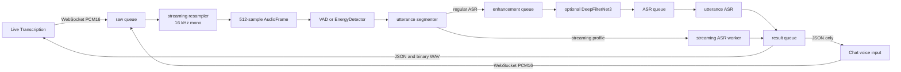
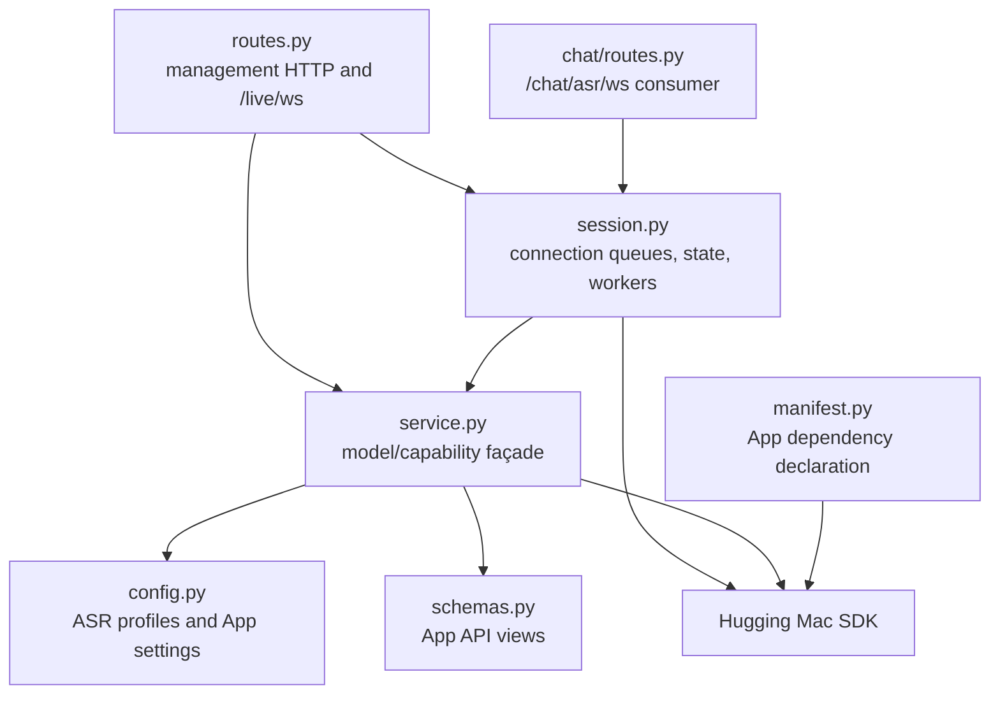
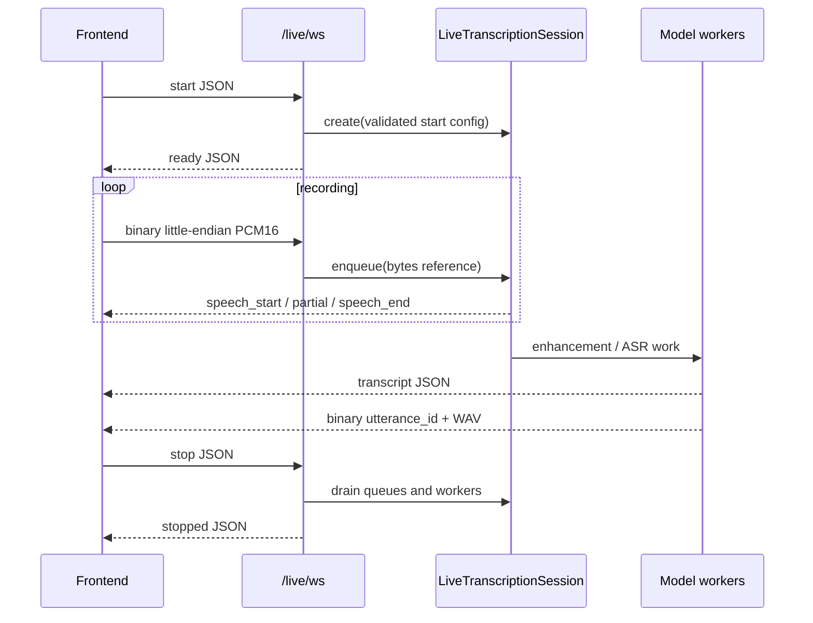
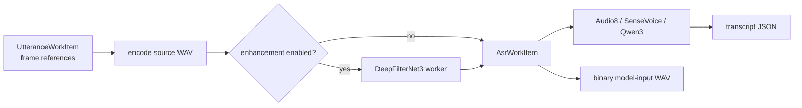
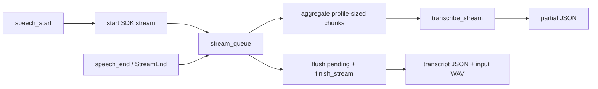

# Live Transcription Technical Design

## Summary

`live_transcription` implements one reusable local realtime speech pipeline for
the Live Transcription App and Chat voice input. Before recording, HTTP endpoints
inspect resources and load explicit model instances. During recording, one
WebSocket carries PCM16 chunks and ordered results. The backend owns resampling,
endpoint detection, utterance segmentation, optional enhancement, and ASR.

Core patterns:

- **Producer–Consumer**: bounded `asyncio.Queue` instances connect audio,
  enhancement, ASR, streaming, and result workers.
- **Pipeline**: audio is resampled and segmented before optional enhancement and
  transcription.
- **State Machine**: VAD drives the `IDLE → SPEAKING → IDLE` utterance lifecycle.
- **Strategy**: Silero VAD and the local energy detector implement one detector
  protocol.
- **Immutable Work Items**: `AudioFrame`, `UtteranceWorkItem`, and `AsrWorkItem`
  move between workers without mutable shared audio buffers.
- **Service/Façade**: `LiveTranscriptionService` owns model discovery, loading,
  capability validation, and result mapping.



## Models and capabilities

The App manifest declares the model dependencies; `config.py` supplies App-level
profiles for the supported inference paths.

| Model ID | Manifest capabilities | Session path |
|---|---|---|
| `audio8/audio8-asr` | `speech-transcription` | Completed utterance |
| `funaudiollm/sensevoice` | `speech-transcription`, `speech-understanding` | Completed utterance with understanding fields |
| `qwen/qwen3-asr` | `speech-transcription` | Completed utterance |
| `nvidia/nemotron-3.5-asr-streaming-0.6b` | `speech-transcription`, `streaming-speech-transcription` | Stateful chunks inside one VAD utterance |
| `snakers4/silero-vad` | `voice-activity-detection` | Optional speech start/end detector |
| `deepfilternet/deepfilternet3` | `speech-enhancement` | Optional, regular ASR only |

When Silero is disabled, `EnergyDetector` still segments speech. Neural VAD is
optional; endpoint detection is not.

## Module structure



| File | Responsibility |
|---|---|
| `routes.py` | HTTP management, WebSocket framing, connection lifetime, ordered sends |
| `session.py` | Resampling, VAD state, queues, worker orchestration, binary audio framing |
| `service.py` | Resource/runtime selection, shared model loads, ASR capability calls |
| `config.py` | Supported App profiles and inference settings |
| `schemas.py` | Stable HTTP and result views, separate from SDK schemas |
| `manifest.py` | Required and optional model capabilities |
| `blueprint.py` | Side-effect-free App registration |

Chat does not maintain a second segmentation implementation. It creates the same
`LiveTranscriptionSession`, disables returned model-input audio and enhancement,
and uses the energy detector with a streaming ASR profile.

## Interface boundary

### Management HTTP

| Method | Path | Purpose |
|---|---|---|
| GET | `/api/v1/apps/live-transcription/models` | Supported profiles, resources, and ready instances |
| GET | `/api/v1/apps/live-transcription/resources` | Resource view for one model/variant |
| GET | `/api/v1/apps/live-transcription/pipeline/components` | Optional VAD/enhancement readiness |
| POST | `/api/v1/apps/live-transcription/models/load` | Load one selected ASR profile |
| POST | `/api/v1/apps/live-transcription/vad/model/load` | Load the configured Silero instance |
| POST | `/api/v1/apps/live-transcription/enhancement/model/load` | Load DeepFilterNet3 |
| WS | `/api/v1/apps/live-transcription/live/ws` | Realtime recording protocol |

HTTP manages models only. Recording-time VAD, enhancement, and transcription are
scheduled exclusively by the WebSocket session pipeline.

### Recording WebSocket



The `start` message includes the selected model/instance, microphone sample rate,
VAD and enhancement instance choices, thresholds, and streaming chunk duration.
The accepted input range is 8–192 kHz. After `ready`, the client sends non-empty
little-endian mono PCM16 messages of at most 64 KiB. There is no per-chunk ACK and
the client does not own the utterance buffer.

## Audio data structures and memory

### Bounded queues

| Queue | Capacity | Item | Purpose |
|---|---:|---|---|
| `raw` | 32 | PCM `bytes` or sentinel | WebSocket receiver to audio worker |
| `utterances` | 8 | `UtteranceWorkItem` or sentinel | Sealed speech to enhancement |
| `asr` | 8 | `AsrWorkItem` or sentinel | Actual model input to regular ASR |
| `results` | 64 | JSON/binary result or sentinel | Workers to ordered sender |
| `stream_queue` | 128 | `AudioFrame` or `StreamEnd` | One streaming utterance |

Streaming profiles do not allocate idle enhancement and regular-ASR workers.
Queue insertion stores object references rather than copying payload bodies.
When downstream work is slower, `put()` propagates backpressure to the WebSocket
instead of silently dropping frames or growing memory without limit.

### Fixed frames

```python
AudioFrame(
    start_sample: int,
    pcm16: bytes,  # 512 samples / 1024 bytes
)
```

`FrameResampler` linearly converts the connection sample rate directly into
16 kHz, 512-sample immutable frames. `start_sample` is a monotonic output sample
offset. Pre-roll, confirmed speech, holdback, work items, and the streaming worker
share frame references.

A complete WAV is encoded only when a sealed utterance enters enhancement/ASR or
when the streaming path returns replay audio. For regular ASR, the same encoded
`bytes` object is used as model input and WebSocket replay payload.

## VAD and segmentation state machine

| Parameter | Current value |
|---|---:|
| Pipeline sample rate | 16 kHz |
| Frame | 512 samples / 32 ms |
| Speech start hysteresis | 1,536 samples / 96 ms |
| Speech end hysteresis | 10,240 samples / 640 ms |
| Pre-roll | 8 frames / 256 ms |
| Retained endpoint tail | 6 frames / 192 ms |
| Maximum utterance | 782 frames / about 25 seconds |

```mermaid
stateDiagram-v2
    [*] --> IDLE
    IDLE: keep 256 ms pre-roll
    IDLE --> SPEAKING: 96 ms confirmed speech
    SPEAKING: voiced frames enter confirmed
    SPEAKING: uncertain silence enters holdback
    SPEAKING --> SPEAKING: speech resumes; commit holdback
    SPEAKING --> FINALIZE: 640 ms endpoint silence
    SPEAKING --> FINALIZE: maximum duration or client stop
    FINALIZE: keep 192 ms endpoint tail
    FINALIZE --> IDLE: emit UtteranceWorkItem
```



Silero owns connection-level recurrent state. The fallback detector uses RMS:

```text
energy_threshold = 0.035 - sensitivity × 0.029
```

Both detectors use the same 96 ms start and 640 ms end hysteresis. Maximum
duration forces a seal and resets the detector boundary. On a VAD endpoint,
silence after the retained tail is reused as the next utterance's pre-roll.

## Regular ASR pipeline



The enhancement and ASR workers are independent, allowing the audio/VAD worker
to continue processing the next utterance. `LiveTranscriptionService.transcribe()`
accepts audio that is already segmented and optionally enhanced; it does not
expose a second preprocessing toggle. Worker failures publish an error and stop
the session instead of silently changing the model input.

SenseVoice results map language, emotion, and audio-event metadata into the App
view. Other profiles return the common transcription fields.

## Streaming ASR pipeline

Nemotron does not pass through DeepFilterNet3. At `speech_start`, the session
creates an SDK streaming session and submits pre-roll plus subsequent committed
frames.



Potential silence remains in `holdback`. If speech resumes within the endpoint
window, every held frame is committed to the stream. At a confirmed endpoint,
only the configured 192 ms tail is committed. The worker preserves every frame
actually sent to the model and uses that exact sequence for replay WAV output.

Cancellation calls `cancel_stream()`; normal completion flushes pending frames
and calls `finish_stream()` exactly once.

## Result protocol

JSON events include `ready`, `speech_start`, `partial`, `speech_end`, `transcript`,
`error`, and `stopped`. Transcript and model-input audio are two ordered messages:

1. A `transcript` JSON object with `utterance_id`, text, model metadata, and stage
   timings.
2. A binary message with an 8-byte big-endian unsigned utterance ID followed by WAV.

```text
┌──────────────────────┬──────────────────────────┐
│ utterance_id: uint64 │ RIFF/WAVE bytes          │
│ big endian, 8 bytes  │ exact ASR model input    │
└──────────────────────┴──────────────────────────┘
```

Binary transport avoids Base64 expansion and an additional encoded-text copy.
Chat's emitter intentionally drops binary events because Chat consumes text only.

## Lifecycle and failures

- `stop` rejects new input, seals active speech, drains audio, enhancement, ASR,
  streaming, and result workers in dependency order, then emits `stopped`.
- Disconnect and cancellation cancel all connection and streaming tasks.
- A guarded worker publishes one error and marks the session closed.
- `enqueue()` refuses closed sessions, empty messages, oversized chunks, and a
  pipeline whose worker has already terminated.
- One send lock preserves ordering between concurrent worker results.

## Observability

The connection binds `connection_id`; the session adds `session_id`, model ID,
and instance ID. Logs record counts, sizes, queue waits, timings, runtime, and
text length, never raw audio or transcript text.

```text
live_websocket_connected
  → live_session_started
  → speech_started
  → speech_ended(reason=vad_endpoint|max_duration|client_stop)
  → speech_enhancement_started/completed (optional)
  → utterance_asr_started/completed or streaming_asr_started/completed
  → live_session_stopped
  → live_websocket_closed
```

Audio chunks do not produce per-chunk INFO logs. If raw queue insertion waits at
least 5 ms, `raw_audio_queue_backpressure` is rate-limited to once per second.

## Tests and review points

Session tests cover monotonic resampling frames, detector hysteresis, and reuse of
the same WAV bytes for model input and binary output. Platform tests cover model
loading, optional component views, WebSocket validation, and Chat reuse.

Review changes against these constraints:

1. Preserve one backend-owned 16 kHz sample timeline and utterance boundary.
2. A higher-quality resampler must retain monotonic sample offsets and streaming
   behavior.
3. Parallelizing model workers requires proof that the underlying instance is
   concurrency-safe.
4. Threshold changes need short-word, in-sentence pause, noise, multi-utterance,
   maximum-duration, and congested-WebSocket tests.
5. Replay WAV must remain the exact audio sent to ASR; fallback must never change
   that input silently.
