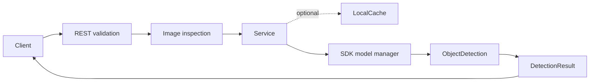
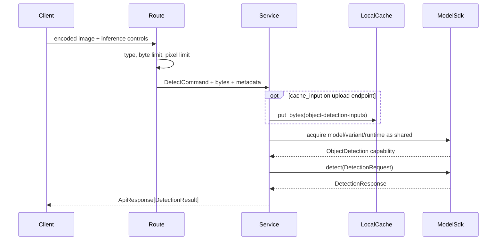

# Object Detection Backend

## Summary

This module is the HTTP adapter for local object detection. It validates an encoded image, optionally records the input in the local content cache, acquires a shared SDK model instance, invokes the `ObjectDetection` capability, and maps the SDK response to the Web API contract.

The App manifest requires model `ultralytics/yolov8` with capability `object-detection`. Runtime and variant selection remain SDK concerns; the service forwards an explicit selection or lets the SDK choose the manifest default.

## Module structure

| File | Responsibility |
| --- | --- |
| `manifest.py` | App identity, UI route, API prefix, model ID, and capability requirement. |
| `blueprint.py` | Exposes the manifest and creates the FastAPI router. |
| `routes.py` | Defines upload/frame endpoints and validates media type, size, and decoded dimensions. |
| `schemas.py` | Owns HTTP commands and response views; converts SDK responses without leaking SDK models. |
| `service.py` | Resolves variants, reports resources, manages input caching, acquires the model, and invokes inference. |

## Platform and SDK boundaries

The module receives `PlatformContext` through FastAPI dependency injection. It may use only:

- `context.models.catalog` and `context.models.resources` for model metadata and resource state;
- `context.models.acquire(..., reuse=ReusePolicy.SHARED)` for instance lifetime;
- `context.cache` for optional uploaded-input retention;
- platform upload and media helpers for bounded reads and image inspection.

The model ID is derived from `OBJECT_DETECTION_MANIFEST`; it is not separately configured in the service. The model package owns preprocessing, inference, non-maximum suppression, labels, and runtime-specific behavior.

## Interfaces

API prefix: `/api/v1/apps/object-detection`

| Method | Route | Contract |
| --- | --- | --- |
| GET | `/api/v1/apps/object-detection/resources` | Return resource state, variants, and the catalog default runtime. |
| POST | `/api/v1/apps/object-detection/detect` | Accept a multipart JPEG, PNG, or WebP image and return detections. |
| POST | `/api/v1/apps/object-detection/detect/frame` | Accept a raw encoded frame for low-overhead live clients. |

The multipart endpoint accepts `runtime`, `variant`, `confidence`, `iou_threshold`, `max_detections`, and `cache_input`. The frame endpoint carries the same inference controls as query parameters and deliberately never caches the frame.

Both inference responses include model/instance/runtime identity, source image dimensions, bounding boxes, class IDs and labels, confidence values, SDK timing fields, and an optional `input_cache_id`.

## Request flow and validation

The route rejects unsupported content types with `415`, over-limit bodies with `413`, and malformed or over-dimension images with `422`. Full uploads use complete image verification; live frames use the cheaper metadata path after enforcing the same byte and pixel limits.

`runtime=auto` is translated to `None`, allowing the SDK manifest to select its default runtime. Variant names are resolved through the SDK registry before cache or inference output is produced, so the response always carries the canonical variant.

## Concurrency, lifecycle, and memory

Each request owns only its encoded image bytes and response objects. The SDK handle is an async context manager: acquisition happens immediately before inference and release happens even when capability lookup or inference fails. `ReusePolicy.SHARED` allows concurrent requests and other apps to reuse the same loaded instance according to SDK manager rules.

The module has no background tasks or process-global mutable state. Persisting an upload is explicit through `cache_input`; live frames do not create unbounded cache entries.

## Errors, security, and observability

HTTP validation errors are raised by the route. SDK errors propagate to the platform error handlers, which attach trace metadata and map them to stable API error responses. The service never trusts a client-provided filesystem path: cache names and suffixes pass through shared cache/path helpers.

Inference identity and timing fields are returned to the client. Request correlation, structured SDK failures, and access logs are owned by the platform middleware and error handlers.

## Tests and review points

Tests should cover supported and rejected media types, upload and pixel limits, canonical variant resolution, automatic versus explicit runtime selection, cache-on-upload versus no-cache frame behavior, capability invocation, response mapping, and handle release after exceptions.

Review changes for duplicated model IDs, bypassed upload inspection, accidentally cached live frames, non-shared acquisition, SDK schema leakage, or model/runtime logic moved into the Web layer.
