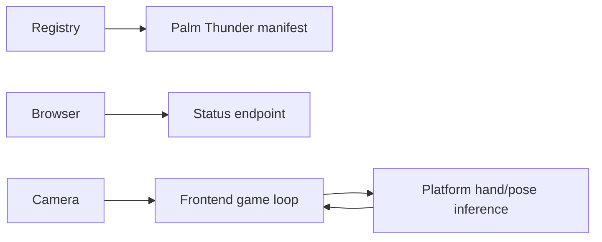

# Palm Thunder Backend

## Summary

Palm Thunder's backend is a registration and status module. The browser owns the camera pipeline, fighter simulation, gesture-to-control mapping, score, and cooperative game state. Hand inference is shared through the platform Pose Estimation API rather than implemented by a game-specific service.

The App manifest requires `qualcomm/mediapipe-hand-detection` with capability `hand-detection`. This dependency lets the registry mark the game unavailable when the required model package or capability is missing.

## Module structure

| File | Responsibility |
| --- | --- |
| `manifest.py` | Game identity, category, tags, routes, and hand-detection dependency. |
| `blueprint.py` | Registers the manifest and builds the router. |
| `routes.py` | Publishes the static readiness/control contract. |

The absence of `service.py` is deliberate: there is no server-owned game loop, model handle, queue, or persisted match state.

## Interfaces

API prefix: `/api/v1/games/palm-thunder`

| Method | Route | Contract |
| --- | --- | --- |
| GET | `/api/v1/games/palm-thunder/status` | Return `status=ready` and `control=mediapipe-hand-landmarks`. |

`ready` describes route availability, not artifact installation or a loaded instance. Clients use the App/catalog APIs for dependency state and the shared Vision endpoint for inference.

## Runtime and ownership boundaries

The frontend determines player motion and action gestures from hand results, runs animation and collision updates, and controls revive/co-op behavior. The backend contributes only discoverable metadata and a stable status response. It neither receives camera frames nor validates or stores landmarks.

The route is stateless and allocation-bounded. Cancellation has no external cleanup, and process shutdown has no game-owned resources to release.

## Errors, observability, and security

The endpoint accepts no input. Standard platform middleware provides tracing and response error handling. Camera permission, frame validation, model loading, and inference errors belong to the browser or shared Vision API and must not be remapped here.

## Tests and review points

Tests should cover manifest registration, `qualcomm/mediapipe-hand-detection`, `hand-detection`, the API prefix, and the exact status payload.

Review changes for game state or inference introduced in this module, status coupled to a transient loaded instance, duplicated MediaPipe logic, or frame/landmark logging.
