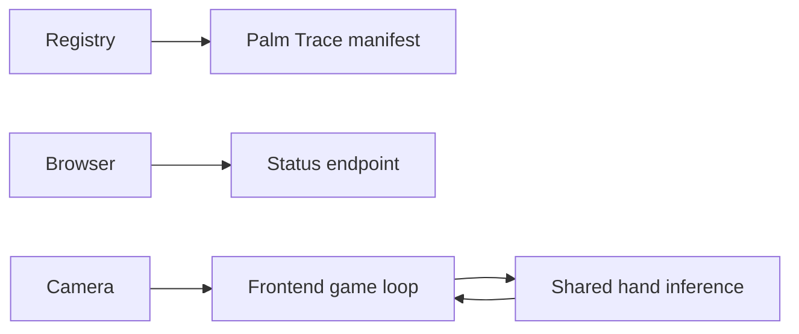

# Palm Trace Backend

## Summary

Palm Trace is backend-light by design. This module registers the game and exposes its control contract; the frontend owns camera capture, palm tracking requests, trail generation, collision testing, score, and the countdown.

The manifest requires `qualcomm/mediapipe-hand-detection` with capability `hand-detection`. The backend status currently declares palm control with landmarks disabled, matching the game's use of detected palm regions rather than a server-side landmark algorithm.

## Module structure

| File | Responsibility |
| --- | --- |
| `manifest.py` | Game metadata, routing, and required hand capability. |
| `blueprint.py` | Platform registration and router creation. |
| `routes.py` | Returns the stable control-mode status payload. |

No backend service or session exists. Geometric trail state and game timing remain browser-local.

## Interfaces

API prefix: `/api/v1/games/palm-trace`

| Method | Route | Contract |
| --- | --- | --- |
| GET | `/api/v1/games/palm-trace/status` | Return `status=ready`, `control=mediapipe-palm-detection`, and `landmarks=disabled`. |

Route readiness is independent from artifact installation and model-instance state. Those facts are supplied by the registry/catalog and model APIs.

## Runtime and ownership boundaries

The frontend submits selected camera frames to the shared Vision API, translates detected palms into game coordinates, and runs trail erasure and countdown logic. The backend does not ingest frames, keep player state, arbitrate scores, or acquire SDK handles.

The status route is stateless, has no background work, and requires no special cancellation or shutdown handling.

## Errors, observability, and security

The endpoint has no client-controlled payload or path. Platform middleware provides trace and access logs. Browser permission, upload validation, and model errors remain at their actual owning boundaries rather than being hidden behind the game status route.

## Tests and review points

Tests should verify blueprint registration, the MediaPipe model/capability requirement, API prefix, response envelope, control mode, and landmark setting.

Review changes for inference duplication, server-side game state, camera input accepted by this module, status conflated with model readiness, or unbounded per-frame logging.
