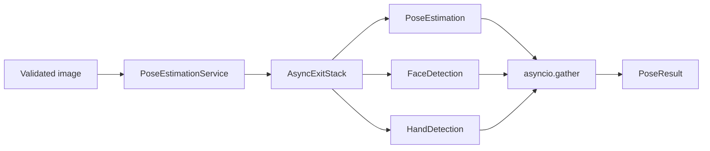
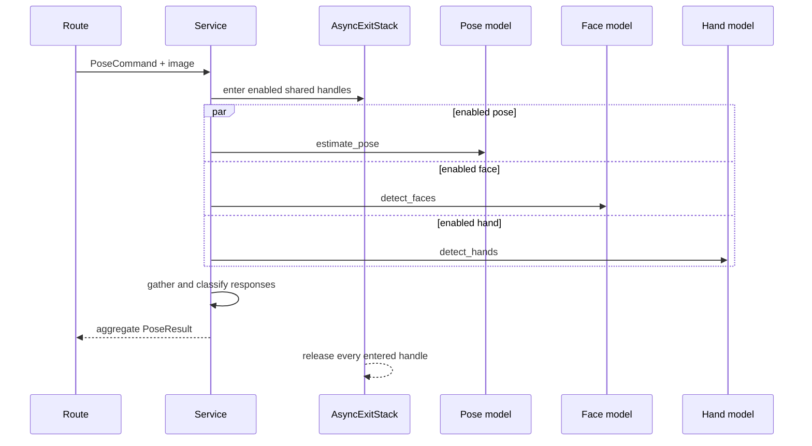

# Pose Estimation Backend

## Summary

Pose Estimation is an aggregate vision backend. One request can run body pose, face detection, and hand detection concurrently, then return a single normalized response. The App manifest declares one required dependency and two optional dependencies:

| Role | Model ID | Capability | Required |
| --- | --- | --- | --- |
| Body pose | `ultralytics/yolov8-pose` | `pose-estimation` | yes |
| Face | `py-feat/retinaface` | `face-detection` | no |
| Hands | `qualcomm/mediapipe-hand-detection` | `hand-detection` | no |

The aggregate endpoint is intentionally transport orchestration. Each SDK model retains ownership of its preprocessing, inference, postprocessing, and runtime-specific implementation.

## Module structure

| File | Responsibility |
| --- | --- |
| `manifest.py` | App identity plus required and optional model/capability declarations. |
| `blueprint.py` | Registry integration and router construction. |
| `routes.py` | Upload/frame validation and switches for pose, face, hand, and hand landmarks. |
| `schemas.py` | Commands, aggregate result types, SDK-to-Web mappings, and parallel timing views. |
| `service.py` | Resource reporting, multi-handle acquisition, parallel invocation, timing, and result selection. |

## Interfaces

API prefix: `/api/v1/apps/pose-estimation`

| Method | Route | Contract |
| --- | --- | --- |
| GET | `/api/v1/apps/pose-estimation/resources` | Report YOLOv8 Pose resource state and variants. |
| GET | `/api/v1/apps/pose-estimation/resources/face` | Report RetinaFace resource state for `mobilenet0.25`. |
| GET | `/api/v1/apps/pose-estimation/resources/hand` | Report MediaPipe Hand resource state for `float`. |
| POST | `/api/v1/apps/pose-estimation/estimate` | Run selected capabilities for a multipart image, optionally caching the input. |
| POST | `/api/v1/apps/pose-estimation/estimate/frame` | Run selected capabilities for a raw encoded frame without caching. |

All inference requests support `pose_enabled`, `face_enabled`, and `hand_enabled`; at least one must be true. Pose controls include runtime, variant, confidence, IoU, and maximum detections. Face and hand have independent confidence controls. Hand requests may enable 21-point landmarks and declare whether the input is mirrored.

The `variant` and `runtime` controls apply to the pose model. Face uses variant `mobilenet0.25`; hand uses variant `float`; their runtimes are selected by their own manifests. When pose inference is disabled, the service does not validate a client variant against YOLOv8 Pose.

## Validation and input policy

Both inference routes accept JPEG, PNG, and WebP. They enforce the configured byte and pixel limits before model acquisition. The upload route performs full image verification and may write to `pose-estimation-inputs`; the frame route performs reduced verification suitable for repeated frames and never persists them.

Pydantic validates all confidences and IoU values in `[0, 1]`, and constrains `max_detections` to `[1, 1000]`. Disabling all three capabilities produces `422` before any model handle is acquired.

## Parallel inference and ownership

`AsyncExitStack` is required because the acquired handle set depends on request switches. Every entered handle remains alive until all enabled jobs finish and is released in reverse order on success, cancellation, or failure. `asyncio.gather` fails the aggregate request if any enabled capability fails; partial inference results are not emitted.

All acquisitions use `ReusePolicy.SHARED`, allowing other requests and apps to share already-loaded instances under SDK manager rules.

## Result selection and timing semantics

`PoseResult` always has one top-level execution identity. The primary response is selected in pose, then face, then hand order:

- if pose ran, its identity, image size, and SDK timings become the top-level values;
- otherwise face supplies them;
- otherwise hand supplies them.

Outputs from every enabled capability are still included in `poses`, `faces`, and `hands`.

`parallel_timings` has two distinct views:

- `pose_ms`, `face_ms`, and `hand_ms` measure wall time around each individual awaited SDK operation;
- `sum_ms` is their arithmetic sum and represents total per-model work, not request latency;
- `round_ms` measures the `asyncio.gather` round and is the closest measure of parallel inference wall time.

Because acquisition happens before the timed jobs, these values exclude model-handle acquisition and input validation. The top-level `timings` field remains the primary SDK model's preprocessing/inference/postprocessing breakdown.

## Memory, cancellation, and failures

The service shares one immutable encoded byte buffer among enabled request objects. It does not decode separate copies in the Web layer. Each SDK runtime may allocate its own tensors. Enabling more capabilities increases peak runtime memory even though their executions overlap.

Cancellation propagates through `gather`, exits the `AsyncExitStack`, and releases all handles. HTTP media errors remain route-level; model/resource/capability failures flow to platform error mapping. Optional manifest status means the App can register without those model definitions, but a request that enables an unavailable optional capability still fails normally.

## Observability

The aggregate response exposes primary model identity, SDK timing, and the parallel timing breakdown. Platform middleware supplies trace IDs and structured request/error logs. The module does not emit per-frame logs because camera clients may call the frame endpoint at high frequency.

## Tests and review points

Tests should cover all capability combinations, the all-disabled rejection, fixed face/hand variants, pose-only variant validation, shared acquisition, acquisition release when a later job fails, result precedence, face landmark and hand landmark mapping, cache behavior, frame limits, and the distinction between `sum_ms` and `round_ms`.

Review changes for sequentialized inference, handles acquired outside `AsyncExitStack`, partial results after a failed job, a client variant incorrectly applied to face or hand, cached live frames, duplicated model IDs, or timing labels whose measured scope has changed.
