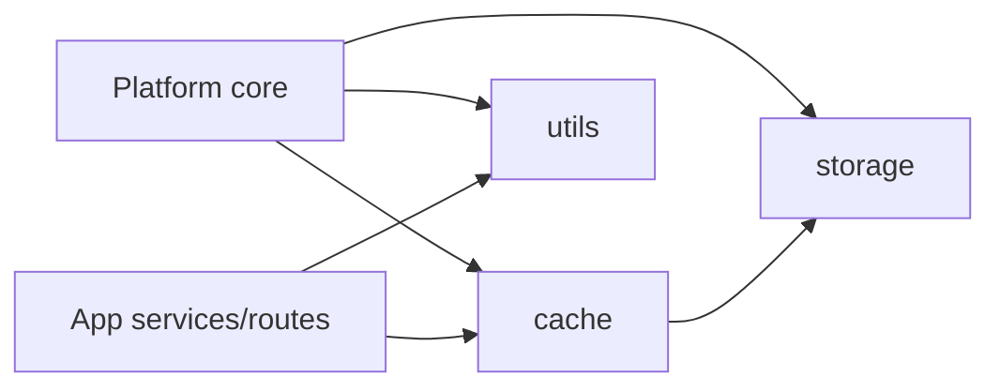

# Shared Backend Infrastructure

## Summary

`shared` contains backend facilities used by more than one platform or App
module. Code moves here only after it has a genuine cross-module owner; App-only
logic remains in the App package.

## Submodules

| Module | Responsibility | Detailed design |
|---|---|---|
| `cache` | Content-addressed binary storage and cache metadata | [`cache/README.md`](cache/README.md) |
| `storage` | Thread-safe TinyDB document collections | [`storage/README.md`](storage/README.md) |
| `utils` | Logging, upload/media checks, SSE, time, and system information | [`utils/README.md`](utils/README.md) |

## Boundary rules

- Shared code must not import an App package.
- Cache and storage return logical IDs and metadata; API schemas decide what is
  publicly exposed.
- Utilities are deterministic or explicitly receive their I/O boundary.
- Filesystem writes stay below configured data/cache roots.
- Model artifact storage remains owned by the SDK and is not placed in this
  cache.

## Lifecycle and failures

`PlatformContext` owns shared service construction and shutdown. Cache writes
are synchronous local operations guarded by the document store. The TinyDB
connection is closed during application lifespan shutdown. Validation failures
are raised before data is persisted.

Shared utilities do not translate exceptions into API responses; that boundary
belongs to routes and the platform error handlers.

## Review points

1. Do not turn `shared` into a catch-all for single-App helpers.
2. Preserve path and namespace validation before filesystem access.
3. Keep binary payloads out of TinyDB and large payloads out of structured logs.
4. Avoid returning implementation paths from any shared API-facing value.
