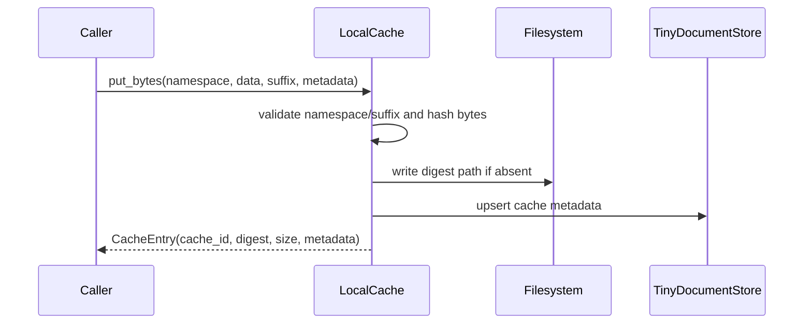

# Local Cache Technical Design

## Summary

`LocalCache` stores immutable binary payloads by SHA-256 digest while keeping
searchable metadata in `TinyDocumentStore`. Repeated content in the same
namespace resolves to the same logical cache ID and physical file.



## Data model and layout

`CacheEntry` is an immutable Pydantic value containing the logical cache ID,
namespace, digest, suffix, byte size, creation time, physical path, and metadata.
The physical layout is:

```text
<cache_root>/<namespace>/<sha256-prefix>/<sha256><suffix>
```

The prefix distributes files across directories without weakening identity.
Binary bytes are never copied into TinyDB; the document contains metadata and
the path required to reconstruct the entry.

## Operations

| Operation | Behavior |
|---|---|
| `put_bytes` | Validate names, hash data, create missing parent directories/file, upsert metadata |
| `get` | Resolve one logical cache ID from the metadata collection |
| `list` | Return namespace entries from the document store |
| `remove` | Remove metadata and the referenced local file when present |

Namespace and suffix validation reject traversal tokens and unsafe characters.
Callers choose semantic namespaces such as uploads or App inputs; the cache does
not infer business ownership from the filename.

## Concurrency and consistency

Digest identity makes duplicate writes idempotent. Metadata writes use the
document store lock. The file is written only when absent, so identical content
does not produce additional payload copies. A process crash can leave an orphan
file after the filesystem write and before metadata upsert; callers cannot
address it without a cache entry, and later identical writes repair metadata.

## Security boundary

- The root is injected from `WebSettings`; callers cannot choose it per request.
- Namespace and suffix are validated before path construction.
- API responses use `cache_id`, digest, size, and sanitized metadata, not `path`.
- This cache is for application media and derived data, not model artifacts or
  executable remote code.

## Tests and review points

Storage tests cover deduplication, retrieval, removal, and unsafe names. Changes
must preserve digest stability, root containment, and the split between binary
files and TinyDB metadata.
