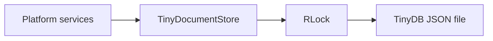

# Document Store Technical Design

## Summary

`TinyDocumentStore` is the process-local JSON metadata store used by backend
infrastructure. It wraps one TinyDB connection with a re-entrant lock and exposes
a small collection-oriented API rather than leaking TinyDB objects.

## Contract

Documents are dictionaries identified by a stable string `id`. The wrapper
supports upsert, get, list, remove, and close. Upsert replaces an existing
document with the same ID; collections map directly to TinyDB tables.

The store owns metadata only. Binary uploads, model artifacts, and generated
media remain on disk and are referenced by logical IDs or controlled paths.

## Concurrency and lifecycle

Every TinyDB operation is protected by one `RLock`, making the wrapper safe for
the backend's thread-pool calls within a single process. It is not a multi-process
coordination mechanism and does not provide distributed transactions.

`PlatformContext` creates the database after ensuring its parent data directory
exists and closes it during FastAPI lifespan shutdown. Callers must not retain
TinyDB table or query objects beyond one wrapper call.

## Failure semantics

Filesystem and JSON failures propagate to the platform boundary; the store does
not silently recreate corrupt data or discard failed writes. Removal is
idempotent at the API level and reports whether a matching document existed.

## Review points

1. Keep the public wrapper independent of TinyDB-specific document types.
2. Do not store large binary values or secrets in metadata collections.
3. Treat a move to multiple worker processes as a storage design change, not a
   deployment-only switch.
4. Preserve explicit close semantics during application shutdown.
