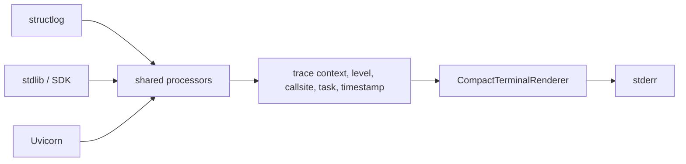

# Shared Utilities Technical Design

## Summary

`shared.utils` contains narrow cross-module adapters for logging, media and
upload validation, SSE encoding, time formatting, and local system inspection.
These helpers do not own business decisions or model selection.

## Utility map

| File | Responsibility |
|---|---|
| `log_util.py` | One structured terminal pipeline for structlog, stdlib, Uvicorn, and SDK logs |
| `upload_util.py` | Bounded asynchronous `UploadFile` reads |
| `media_util.py` | Media classification, safe suffixes, image dimension/pixel validation |
| `sse_util.py` | Deterministic Server-Sent Event serialization |
| `system_util.py` | OS/CPU/memory/Python and Apple hardware probes |
| `time_util.py` | UTC timestamps and ISO-8601 formatting |

## Logging pipeline



`configure_logging()` installs one root handler and routes Uvicorn records
through it to prevent duplicated or inconsistent output. Application records
include local time with milliseconds and timezone, level, logger, source
location, event, the active asyncio task, and sorted structured fields.
Framework lifecycle/access records omit their internal callsite. Exception
records retain the complete traceback.

`get_logger()` returns a lazy logger rather than eagerly binding during import;
this lets lifespan configuration replace development-server defaults.

## Upload and media validation

`read_upload_limited()` reads one chunk beyond the configured limit so oversized
requests fail without buffering an unbounded payload. It returns bytes only after
the limit check succeeds.

`classify_media()` combines filename suffix and content type. `safe_suffix()`
normalizes the stored suffix, and `inspect_image()` decodes an image to validate
format, dimensions, and maximum pixel count. Routes translate validation errors
to HTTP status codes; utilities return data or raise a focused exception.

## SSE encoding

`SseEvent` serializes one optional event name and JSON data payload using the SSE
line protocol, ending every event with a blank line. Callers own heartbeat cadence,
disconnect checks, and error-event policy.

```text
event: catalog
data: {"models":[],"apps":[]}

```

## System inspection

`system_snapshot()` combines portable platform and process information with
best-effort Apple Silicon data from `sysctl`. Missing commands or unknown chip
names produce `None` fields rather than failing health/system endpoints. Neural
Engine core counts are derived only for known chip families.

## Security and observability

- Upload helpers never trust client filenames as paths.
- Logs must contain sizes, IDs, counts, and timings rather than prompt, audio, or
  image bodies.
- System probes are read-only and have no network dependency.
- SSE data is JSON encoded; callers do not concatenate untrusted text into
  protocol lines.

## Tests and review points

Tests cover log formatting/tracebacks, log-level configuration, unsafe cache
names, upload/media persistence, and Apple processor parsing. New helpers belong
here only when at least two logical modules need the same behavior.
