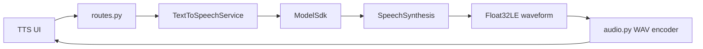
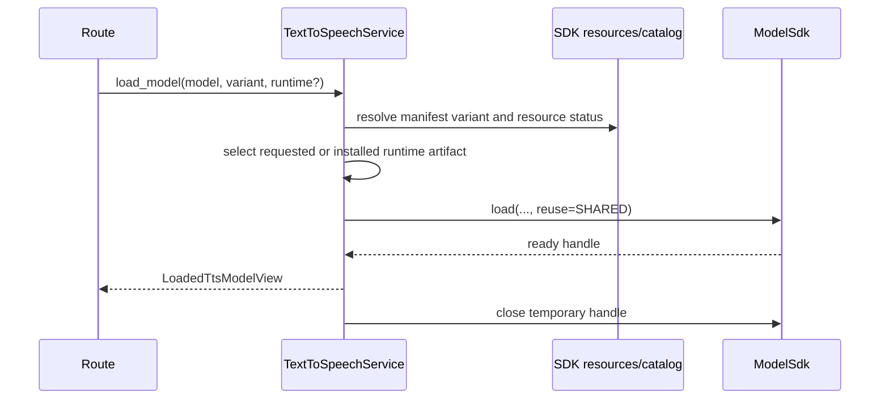

# Text to Speech Backend Technical Design

## Summary

`text_to_speech` exposes one App protocol over Audio8 TTS, Kokoro, Qwen3-TTS,
and MOSS-TTS-Nano.
It discovers variants/runtimes from the SDK, loads shared instances explicitly,
normalizes model-specific reference requirements, invokes `SpeechSynthesis`, and
returns playable WAV bytes with inference metadata in headers.



## Models and capability boundary

The App manifest requires these model integrations and the
`speech-synthesis` capability:

| Model ID | App behavior |
|---|---|
| `audio8/audio8-tts-preview` | PyTorch/MLX multilingual synthesis and voice-profile support |
| `hexgrad/kokoro` | Named voices and language selection |
| `qwen/qwen3-tts-12hz` | MLX direct generation with optional reference cloning, or a Core ML bundled voice |
| `openmoss-team/moss-tts-nano-100m` | MLX direct generation with optional reference-audio voice cloning |

Profiles in `config.py` contain App presentation and request constraints. Variant
and runtime support is resolved against the current SDK manifest before every
resource/load operation. A runtime artifact must be uniquely declared after
excluding tokenizer artifacts.

## Module structure

| File | Responsibility |
|---|---|
| `routes.py` | JSON/multipart validation and WAV HTTP responses |
| `service.py` | Profile/runtime selection, shared loads, instance validation, SDK request mapping |
| `audio.py` | Convert little-endian Float32 samples to a valid PCM WAV container |
| `schemas.py` | App resource/model/load/synthesis views |
| `config.py` | Supported App profiles, voice/language choices, text/audio limits |
| `manifest.py` | Required synthesis capability declarations |
| `blueprint.py` | Router registration without load-time side effects |

## Interfaces

| Method | Path | Purpose |
|---|---|---|
| GET | `/api/v1/apps/text-to-speech/models` | Profiles, variants, resources, and ready instances |
| GET | `/api/v1/apps/text-to-speech/resources` | Resource status for one model/variant |
| POST | `/api/v1/apps/text-to-speech/models/load` | Load/reuse a selected runtime |
| POST | `/api/v1/apps/text-to-speech/synthesize` | JSON synthesis without an uploaded reference |
| POST | `/api/v1/apps/text-to-speech/synthesize/reference` | Multipart synthesis with reference audio and an optional transcript |

The reference endpoint reads the upload with the App byte limit. Profiles declare
whether a transcript is required alongside reference audio.
Text is limited to 2,000 characters and speed to the public request range.

## Resource and load flow



If a runtime is explicitly requested, it must be declared and locally available.
Without an override, the profile runtime is preferred; the service may select an
available runtime exposed by resource status. Loading never triggers a download
or conversion.

## Synthesis flow and model-specific constraints

`synthesize()` first resolves the profile, then requires the caller-provided
instance and verifies model identity plus `READY` state. It requires the SDK
`SpeechSynthesis` capability and builds one `SpeechSynthesisRequest` containing
text, optional voice/language, speed, optional reference pair, and the profile's
generation limit.

- Audio8 MLX profiles that use persistent reference voices require a voice
  profile name.
- Qwen3-TTS on MLX generates directly without a reference; when reference audio
  is uploaded, its transcript is required for voice cloning. Core ML uses its
  bundled speaker and rejects reference inputs.
- MOSS-TTS-Nano generates directly without reference audio, or clones the
  uploaded reference voice without consuming a transcript.
- Kokoro uses the profile's named voice and language choices without reference
  audio.
- The service does not inspect codec tokens or runtime-private engine objects.

The capability returns raw little-endian Float32 audio and a sample rate.
`float32le_to_wav()` validates frame alignment, clips samples to `[-1, 1]`,
converts to signed PCM16, and writes a mono RIFF/WAVE container.

Response headers expose only stable inference metadata:

```text
x-model-id
x-runtime
x-device
x-sample-rate
x-duration-seconds
x-inference-ms
```

## Lifecycle, failures, and trust boundary

- Resource inspection and model listing are read-only.
- Model load uses shared reuse; inference requires a previously loaded instance.
- Uploaded reference bytes are held only for the request and passed as
  `AudioInput(data=...)`; the route does not persist them.
- Unsupported models/runtimes, incomplete reference pairs, missing voice names,
  and non-ready instances fail before synthesis.
- SDK errors retain their stable type and are mapped by the platform boundary.

## Tests and review points

Platform tests cover playable WAV output, actionable inference errors, Kokoro
Core ML selection, Audio8 canonical requirements, reference uploads, and Qwen3
language/reference mapping.

1. Resource/runtime selection must stay manifest-driven.
2. Every synthesis path must return a valid WAV, never raw framework arrays.
3. Reference audio and profile-specific transcript requirements must be validated before capability calls.
4. Model-specific rules belong in the App profile/service boundary, not routes.
5. Do not log text, reference audio, generated waveform bytes, or local paths.
