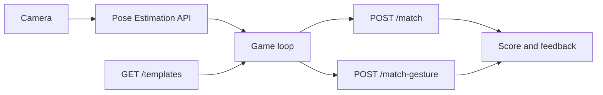
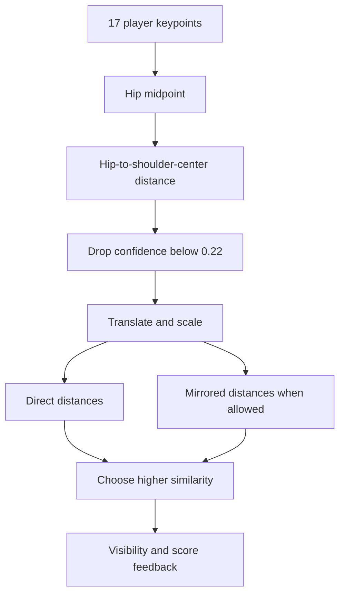

# Yolo Pose Follow Backend

## Summary

The Yolo Pose Follow backend owns deterministic pose-template and hand-gesture matching. It does not run camera inference itself. The frontend obtains body poses and hand landmarks through the platform Pose Estimation API, then submits those normalized inference results to this module for game-specific scoring.

The App manifest requires model `ultralytics/yolov8-pose` with capability `pose-estimation`. That requirement controls App availability in the registry; model acquisition remains in the shared Vision API rather than in the game routes.

## Module structure

| File | Responsibility |
| --- | --- |
| `manifest.py` | Game identity, routes, tags, and pose model/capability requirement. |
| `blueprint.py` | Registers the manifest and creates the game router. |
| `routes.py` | Serves templates and dispatches stateless matching requests. |
| `schemas.py` | Frozen request/response contracts for COCO keypoints, templates, hands, and gestures. |
| `templates.py` | Immutable front-facing COCO-17 target poses and their required keypoint sets. |
| `matching.py` | Translation/scale-independent pose similarity with optional horizontal mirroring. |
| `gestures.py` | Handedness-aware classification of four gestures from MediaPipe 21-point landmarks. |

## Interfaces

API prefix: `/api/v1/games/yolo-pose-follow`

| Method | Route | Contract |
| --- | --- | --- |
| GET | `/api/v1/games/yolo-pose-follow/templates` | Return immutable pose templates, cues, difficulty, and required keypoints. |
| POST | `/api/v1/games/yolo-pose-follow/match` | Score exactly 17 player keypoints against one template. |
| POST | `/api/v1/games/yolo-pose-follow/match-gesture` | Match a requested physical hand and gesture against up to four detected hands. |

Unknown template IDs return `404`. Pydantic rejects pose arrays that are not exactly 17 keypoints, hands with more than 21 landmarks, and requests with more than four hands.

## Pose representation and templates

Templates use COCO-17 ordering: nose, eyes, ears, shoulders, elbows, wrists, hips, knees, and ankles. Points are stored in a normalized front-facing coordinate space. Every template declares a subset of `required_keypoints`; face keypoints are usually excluded from scoring so partial facial visibility does not dominate a body-pose game.

The server returns template coordinates so the frontend can draw the same target skeleton that the matcher evaluates. Template data is immutable and constructed at module import; requests never mutate it.

## Pose matching algorithm

For each comparison, the matcher:

1. uses the midpoint of keypoints 11 and 12 as the player origin;
2. uses the distance from that hip midpoint to the shoulder midpoint as scale;
3. ignores keypoints whose supplied confidence is below `0.22`;
4. normalizes visible points, optionally negating normalized X for a mirror candidate;
5. normalizes the template with the same hip/shoulder convention;
6. computes Euclidean distance only for visible required keypoints, clipping each distance to `2.0`;
7. converts mean distance to `max(0, 1 - mean_distance / 1.05)`.

If mirroring is allowed, direct and mirrored scores are compared and the better candidate is returned. A score of at least `0.72` is a match. Feedback also considers visibility: fewer than `max(6, required_keypoint_count / 2)` visible points requests a fuller body view; scores from `0.56` to the match threshold receive a near-match hint.

Degenerate pose scale or a complete absence of usable required points yields zero similarity instead of dividing by a near-zero body scale.

## Gesture matching algorithm

Supported gestures are `open-palm`, `fist`, `victory`, and `point`. The requested `target_hand` is physical `left` or `right`; callers must preserve the handedness produced by the hand capability and separately state whether the camera input was mirrored during inference.

A candidate hand must:

- match the requested handedness;
- have handedness confidence at least `0.65`;
- have landmark confidence at least `0.55`;
- contain exactly 21 landmarks.

If several hands qualify, the lexicographically highest handedness/landmark confidence pair wins. The classifier evaluates index, middle, ring, and little fingers. A finger is extended when the vectors around its PIP joint are nearly opposite (`cosine <= -0.72`) and its tip is at least `1.04` times as far from the wrist as the PIP joint. The four booleans are matched against a fixed gesture mask. The thumb is deliberately excluded, which keeps classification stable across palm orientation but limits the gesture vocabulary.

## Concurrency, lifecycle, and memory

All routes are stateless CPU calculations over bounded Pydantic objects. There are no SDK handles, database writes, sessions, queues, or background tasks. Immutable templates are shared safely across requests. Cancellation ends the request without cleanup work.

The frontend owns the timer, combo, progression, camera loop, and selection of which frame to submit. Consequently, the backend does not provide authoritative anti-cheat state or multiplayer synchronization.

## Errors and observability

Schema errors become standard `422` responses and unknown templates become `404`. Successful responses use the platform `ApiResponse` envelope and UTC metadata. Platform middleware supplies request tracing; the pure matching functions do not log every frame.

## Tests and review points

Tests should cover template lookup, exact COCO length, translation and scale invariance, mirror selection, confidence filtering, degenerate scale, visibility feedback, score thresholds, physical handedness, candidate confidence gates, each gesture mask, malformed landmarks, and ambiguous hand candidates.

Review changes for mixed coordinate systems, changed thresholds without fixture updates, left/right semantics tied to display mirroring, inference added to game routes, mutable global templates, or frame-level logging that can flood production logs.
