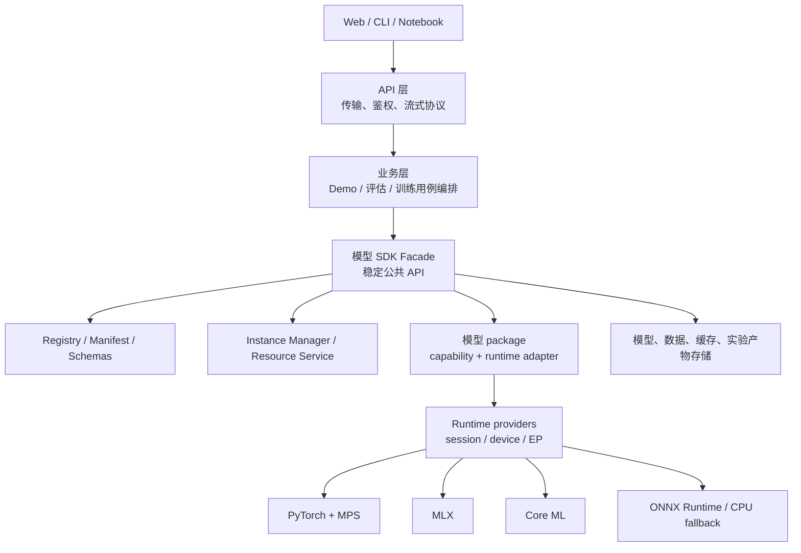

# 总体架构

状态：`模型/runtime 分层已落地；worker 与租约仍在规划`

## 分层



依赖只能向下。SDK 不导入业务、API 或前端包；业务层不能把框架 tensor 或 runtime session 暴露给 API。

模型层与神经网络框架层也遵循单向依赖：

- `runtime/` 提供 Core ML、PyTorch、ONNX Runtime 等通用 provider，管理 session、设备、compute unit
  与 execution provider，不知道 YOLO、CLIP 或 LLM 的任务语义；
- `models/<model>/` 是完整 model pack，拥有自己的配置、中间类型、资源、转换、checkpoint loader、
  前后处理、runtime adapter 和 capability 组合；
- `models/<model>/torch.py`、`coreml.py`、`onnx.py` 引入对应 provider，负责该模型在该 runtime 下的
  engine 与输入/输出适配；
- `models/<model>/utils/` 是模型私有实现库，可按模型需要包含 `types.py`、`preprocess.py`、
  `postprocess.py`、`checkpoint.py`、tokenizer、processor 或 pipeline；
- `instance.py` 只组合生命周期、并发控制、capability 和模型私有 engine Protocol，对业务维持稳定接口；
- 同一模型的所有 runtime factory 都创建同一种 instance，仅组合不同 runtime engine，不建立
  runtime-specific instance 继承树。

除 Python package 必需的 `models/__init__.py` 外，`models/` 根目录不放实现模块；每个直接子目录必须
对应一个可独立注册的模型。模型包之间不直接导入：即使预处理、资源管理或 checkpoint 图结构相同，
也优先在各自目录保留实现，使一个模型的修改、测试和删除不影响另一个模型。公共层只保留真正稳定的
SDK 契约与基础设施，例如 capability schema、registry、resource downloader、converter 基类和
runtime provider。

## 逻辑模块

| 模块 | 责任 | 明确不负责 |
|---|---|---|
| Model SDK | 模型契约、实例、运行时适配 | 页面、HTTP、业务工作流 |
| Resource Service | 下载、校验、缓存、配额、租约 | 具体模型推理算法 |
| Demo Service | 会话、输入编排、流式输出 | 直接加载权重 |
| Evaluation Service | 数据集、指标、运行计划、报告 | 修改模型实现 |
| Training Service | 训练任务、checkpoint、恢复、导出 | 在线请求处理 |
| API Gateway | schema 转换、错误映射、流式传输 | 框架对象和权重管理 |
| Web App | 交互、可视化、任务状态 | 本地文件系统真相 |

## 部署拓扑

当前 Web 平台在单进程内调用 SDK；以下是面向大模型的目标部署拓扑：

- API/业务主进程保持轻量；
- 模型 worker 按 runtime 或实例隔离；
- 训练 worker 与在线 Demo worker 分开；
- 事件和任务状态先用进程内/本地持久化实现，接口预留替换空间。

小模型可以在受控条件下启用进程内模式用于测试，但不作为大型 LLM/VLM 的默认部署方式。

## 规划目录

```text
apps/
  web/
    platform/          # Web Shell、Index、公共 API 与 App Registry
      backend/
      frontend/
    modules/           # 各业务 App 共置目录
      <app-id>/
        backend/
        frontend/
        tests/
  cli/                 # 命令行业务入口
packages/
  hugging_mac_sdk/     # 可单独打包、测试、发布
  hugging_mac_core/    # 可选：跨业务共享的纯 Python schema/util
configs/
tests/
  contract/
  integration/
  performance/
```

若 `hugging_mac_core` 最终只被 SDK 使用，应合并进 SDK，避免无意义拆包。
Web 目录的详细边界见 [Web 应用层与 Index](15-web-application-architecture.md) 和
[App Blueprint 模块规范](16-app-blueprint-specification.md)。

## 关键控制流

一次推理：

1. API 校验传输 schema，交给 Demo 用例；
2. 业务层按 `model_id + revision + runtime + instance_options` 请求实例；
3. SDK registry 解析 manifest；业务若需要下载或转换，必须先显式调用 `sdk.resources`；
4. instance manager 依据 runtime policy 复用或新建实例并完成加载/可选预热；`auto` 模式在首选 runtime
   的本地产物不存在时按策略顺序尝试下一个可用 runtime，显式 runtime 不回退；
5. 模型 instance 调用所组合的 runtime engine，把标准输入转换为 runtime 输入；
6. 输出转换为标准事件流，业务层追加会话信息；
7. API 转换为 HTTP/SSE/WebSocket 响应；
8. handle 释放引用；`dedicated` 实例自动卸载，shared 实例由显式平台操作或进程关闭时卸载。

## 不变量

- model ID 不是文件路径；
- 模型实例 ID 全局唯一且不可复用；
- 模型输出跨层时只能使用 SDK schema；
- 下载完成前资源不可见，校验失败的资源不可加载；
- `unload` 必须幂等；
- 业务取消应向下传播到模型任务；跨进程 worker 的取消协议尚未实现。
