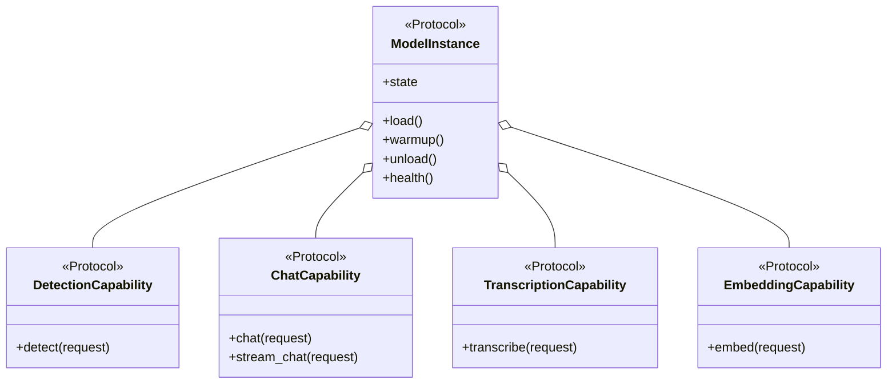
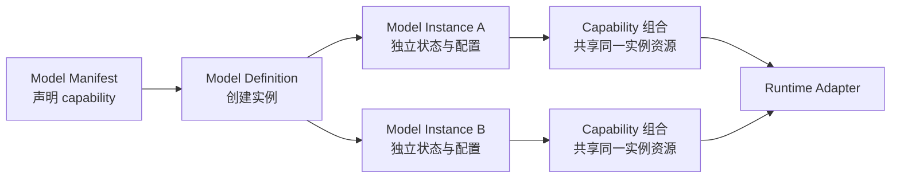
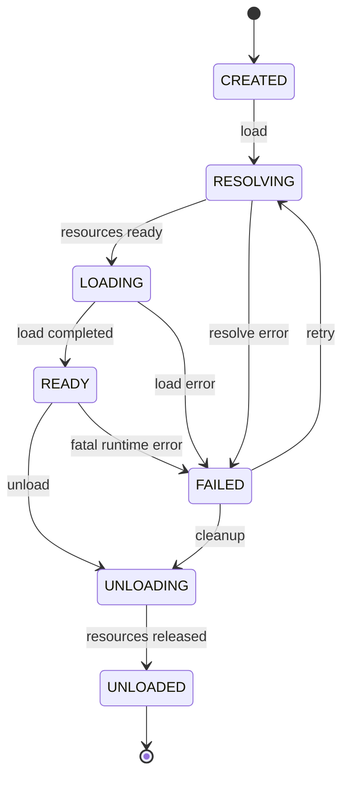

# 模型 SDK

状态：`Proposed`

模型 SDK 是仓库的核心，最终应能作为独立 Python 包被其他应用安装和导入。

## 概念拆分

- **Model Definition**：模型类型与能力的静态定义，无已加载权重。
- **Model Manifest**：资源、版本、许可证、runtime、任务和默认参数的声明。
- **Model Instance**：某个 definition 在特定配置下创建的独立运行实例。
- **Capability**：检测、对话、转录、embedding 等可独立组合的任务能力。
- **Runtime Adapter**：把统一协议映射到 PyTorch MPS、MLX、Core ML 等后端。
- **Instance Handle**：业务层持有的受控句柄，不暴露底层模型对象。

这使同一模型可以创建多个实例，例如相同 LLM 分别使用不同量化、system prompt、adapter 或生成参数。

## 组合优先

模型 SDK 采用：

> 用薄继承或 Protocol 定义稳定契约，用组合构建模型的实际能力。

`ModelInstance` 只抽象所有模型都具备的生命周期和实例状态。检测、对话、转录等任务不是它的公共方法，
而是独立的 capability interface。具体模型实例组合一个或多个 capability。



不建立如下深继承树：

```text
BaseModel → VisionModel → DetectionModel → YOLOModel
```

也不在 `BaseModel` 中预先声明 `detect`、`chat`、`transcribe` 等所有方法。否则多数模型只能抛出
`NotImplementedError`，多能力模型还会产生多继承和方法冲突。

继承或 Protocol 适合表达：

- 最小生命周期契约；
- capability 的强类型契约；
- runtime adapter 契约；
- 状态机、并发锁、幂等卸载等少量基础设施模板。

组合适合表达模型实际具备的能力。模型家族与 capability 是多对多关系，不是树状关系。

## 生命周期协议草案

以下仅表示接口形状，不是待实现代码：

```python
class ModelInstance:
    @property
    def state(self) -> ModelState: ...

    async def load(self) -> None: ...
    async def warmup(self) -> None: ...
    async def unload(self) -> None: ...
    async def health(self) -> HealthReport: ...
```

`ModelInstance` 不提供通用 `infer(**kwargs)`。任务特有能力通过 capability protocol 表达：

- `ImageClassification`
- `ObjectDetection`
- `TextGeneration`
- `Embedding`
- `ImageTextSimilarity`
- `VisionLanguageGeneration`

不应把所有任务参数塞进一个无限扩张的 `infer(**kwargs)`。

## Capability 访问

SDK 内核使用强类型的查询接口：

```python
instance.supports(ObjectDetection)
detector = instance.require(ObjectDetection)
result = await detector.detect(request)
```

`require` 在能力不存在时抛出 `UnsupportedCapabilityError`。业务层也可以先通过 manifest 或
`instance.capabilities` 枚举能力，而不是根据模型类名进行判断。

为了改善交互式使用体验，可以在 facade 上提供命名空间，但它只是 capability 查询的语法糖：

```python
result = await instance.capabilities.detection.detect(request)
reply = await instance.capabilities.chat.chat(request)
```

公共 API 不要求所有模型都出现所有命名空间；静态 manifest 和运行时实例报告的 capability 必须一致。

## 典型模型组合

### YOLO

YOLO 不等同于“检测基类”。不同 revision 可以组合不同视觉能力：

```text
YOLO detection instance
├── ModelLifecycle
├── ObjectDetection
└── ImagePreprocessing

YOLO segmentation instance
├── ModelLifecycle
├── ObjectDetection
├── InstanceSegmentation
└── ImagePreprocessing
```

业务调用 `ObjectDetection.detect()`，不依赖 `YoloInstance` 类型。这允许以后用 Core ML 或其他检测模型
替换 YOLO，而不修改业务流程。

### Whisper

Whisper 可以同时具备多项语音能力：

```text
Whisper instance
├── ModelLifecycle
├── SpeechTranscription
├── SpeechTranslation
├── LanguageIdentification
└── AudioPreprocessing
```

`transcribe` 和 `translate` 使用不同 request/response schema，不用一个布尔参数改变通用 `infer` 的语义。
长音频切片、时间戳和流式进度可由相应 capability 或业务编排层处理。

### CLIP

CLIP 展示了为什么模型家族不能形成单继承树：

```text
CLIP instance
├── ModelLifecycle
├── ImageEmbedding
├── TextEmbedding
└── ImageTextSimilarity
```

图文相似度 capability 可以在内部复用两个 embedding capability，也可以由 runtime adapter 提供优化后的
联合实现。它们共享同一组已加载权重和实例资源。

### 对话 LLM

一个 LLM revision 不一定支持所有语言能力：

```text
Chat LLM instance
├── ModelLifecycle
├── TextCompletion
├── Chat
├── StreamingGeneration
└── ToolCalling（可选）
```

基础模型可能只有 `TextCompletion`，经过 chat template 对齐的模型才注册 `Chat`。只有通过工具调用
contract test 的模型才注册 `ToolCalling`，不能仅凭模型名称推断。

### VLM

VLM 通常跨越传统的视觉与语言分类：

```text
VLM instance
├── ModelLifecycle
├── VisionLanguageChat
├── ImageUnderstanding
├── StreamingGeneration
└── MultiImageInput（可选）
```

VLM 不继承 `VisionModel` 和 `LanguageModel`。它直接组合真实支持的 capability，从而避免多继承，
也能准确表达“支持单图但不支持多图”等约束。

## Definition、Instance 与 Capability 的关系



capability 对象属于某个 instance。它们可以共享该实例的权重、tokenizer、processor、锁和资源 lease，
但不能跨实例共享可变状态。两个使用相同模型 definition 创建的实例，生命周期和请求状态仍然彼此隔离。

## 生命周期状态机



要求：

- `load` 只解析已有本地资产，不下载、不转换；
- 下载和转换必须通过 `sdk.resources` 显式调用；
- `load` 并发调用合并为一次加载；
- READY 状态再次 `load` 不重复分配资源；
- `unload` 幂等，并等待或取消在途请求；
- FAILED 保留结构化错误，但不保留不可回收资源；
- 每次状态变化都产生事件和耗时指标。

## 多实例语义

实例键至少包含：

- model ID 与 revision；
- runtime 与 device；
- dtype/quantization；
- adapter 或 fine-tune revision；
- 影响权重布局的加载参数。

生成温度等请求级参数不进入实例键。业务可显式要求：

- `dedicated`：总是新建实例；
- `shared`：相同实例键允许共享；
- `reuse-if-ready`：仅复用已经 READY 的实例。

共享实例必须声明并发安全策略：串行、有限批处理或真正并行。

## 输入输出

公共 schema 只使用可序列化类型或受控资源引用：

- 文本、数值、枚举；
- image/audio tensor 的中立描述或资源引用；
- detection box、embedding、token event 等标准结果；
- trace ID、timing、runtime metadata。

框架 tensor 只能存在于 adapter 内部。大对象跨进程时优先使用文件、共享内存或流，避免 JSON/base64 复制。

## 错误分类

- `ManifestError`
- `ResourceNotFoundError`
- `ResourceIntegrityError`
- `UnsupportedCapabilityError`
- `UnsupportedRuntimeError`
- `InsufficientResourceError`
- `ModelLoadError`
- `InferenceError`
- `CancelledError`

错误包含稳定 code、可读 message、是否可重试以及底层 cause；API 层负责映射 HTTP 状态。

## 包边界

SDK 包允许依赖 schema、日志抽象和 runtime adapter；不允许依赖 FastAPI、页面组件、会话数据库或业务任务队列。
每个 runtime 依赖应延迟导入，缺少可选依赖时给出明确安装提示。

## Catalog 只读快照

Web Index 需要模型静态信息和动态实例数量，但不能直接读取 registry/manager 内部容器。SDK 计划提供只读
`ModelCatalogService.snapshot()`，聚合：

- manifest 的名称、简介、标签、capability 和 runtime；
- runtime 在当前机器上的轻量可用性；
- instance count、READY count；
- 按 state 和 runtime 分组的数量。

snapshot 不包含实例对象、底层模型、绝对资源路径或 runtime session，也不能触发下载、转换或加载。
详细响应契约见 [Web 应用层与 Index](15-web-application-architecture.md)。

## 设计约束摘要

- 业务按 capability 编程，不按 YOLO、Whisper、Llama 等具体模型类编程；
- 模型实例统一生命周期，但不统一所有任务方法；
- 一个实例可组合多个 capability，并共享同一份已加载资源；
- 同一 definition 可创建多个相互隔离的实例；
- capability 使用独立、强类型的 request/response schema；
- runtime 差异留在 adapter 内，不能泄漏到业务层；
- 优先组合；只有稳定契约和少量基础设施复用使用继承或 Protocol。

模型格式转换不属于 `ModelInstance` 生命周期。通用转换、模型专用转换和 definition 绑定规则见
[模型转换](13-model-conversion.md)。
