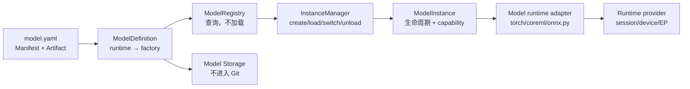
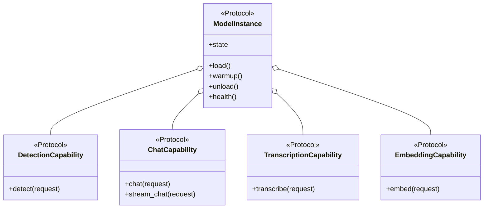
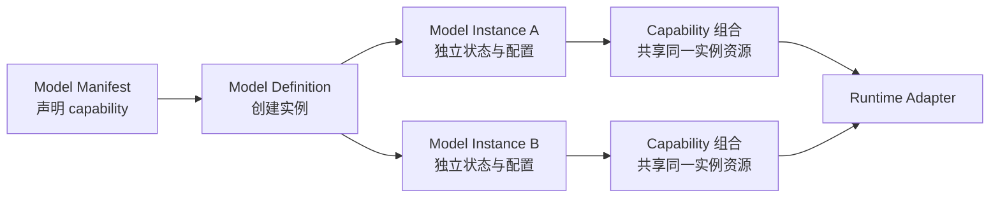
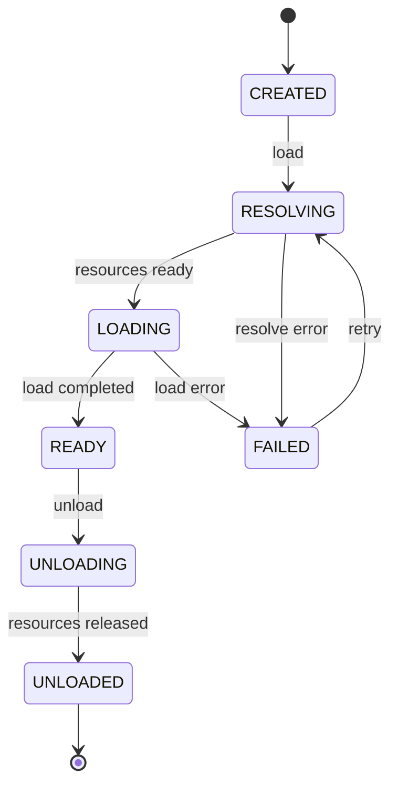

# 模型 SDK

状态：`已部分实现（以当前 SDK 代码为准）`

模型 SDK 是仓库的核心，最终应能作为独立 Python 包被其他应用安装和导入。

## 概念拆分

- **Model Definition**：模型类型与能力的静态定义，无已加载权重。
- **Model Manifest**：资源、版本、许可证、runtime、任务和默认参数的声明。
- **Model Instance**：某个 definition 在特定配置下创建的独立运行实例。
- **Capability**：检测、对话、转录、embedding 等可独立组合的任务能力。
- **Runtime Adapter**：把统一协议映射到 PyTorch MPS、MLX、Core ML 等后端。
- **Instance Handle**：业务层持有的受控句柄，不暴露底层模型对象。

这使同一模型可以创建多个实例，例如相同 LLM 分别使用不同量化、system prompt、adapter 或生成参数。

## 当前落地的分层

SDK 当前将“模型是什么”“文件在哪里”“如何创建某个 runtime”“实例是否已加载”拆成四个对象。实际
入口是 `ModelSdk`：它组合 `ModelRegistry`、`InstanceManager`、`RuntimePolicy`、`ModelResourceService`
和 `ModelCatalogService`。



- `ModelManifest` 描述模型、能力以及可用 runtime；
- `ModelArtifact` 描述各 runtime 所需的文件或目录，可表示 ONNX、Core ML、PyTorch、
  safetensors、GGUF、MLX、RKNN、TFLite 和 OpenVINO；
- `runtime_factories` 必须为 manifest 中每一个 runtime 绑定真实实现，没有实现的 runtime 不能注册；
- `ModelRegistry` 只发现和查询 definition、runtime 与 artifact，不下载、不转换、不加载；
- `RuntimeRegistry`、`RuntimeBackend` 和 `RuntimeSession` 定义可复用的框架层；当前已提供
  `TorchProvider`、`CoreMLProvider` 和 `OnnxRuntimeProvider`；
- 模型 runtime factory 创建的是 model adapter；adapter 使用 provider 加载底层 session，再把结果交给
  模型自己的前后处理，不把 provider 或 session 暴露给业务；
- `InstanceManager` 负责实例创建、自动 runtime 选择、显式 device、加载、切换和卸载。

模型代码与模型文件严格分离。`ModelArtifact.path` 默认相对于 registry 的 `storage_root`，其路径解析会
拒绝 `..` 逃逸。当前 YOLO resource provider 同时接受 `model_home` option，并在该目录内按
`model_id/revision/variant/{source,coreml,onnx}` 管理真实资产；模型权重、转换产物和 tokenizer 等均不进入
SDK package。
一个 runtime 可以声明多个 artifact，因此既支持单文件 YOLO，也支持包含权重分片、tokenizer 和配置的 LLM/VLM。

模型 package 可以使用 Python 构造 manifest，也可以使用数据化的 `model.yaml`：

```python
from pathlib import Path

from hugging_mac_sdk import load_model_config

config = load_model_config(Path(__file__).with_name("model.yaml"))
```

YAML 只承载 metadata，不允许声明可导入的任意 Python factory；runtime factory 必须在可信模型代码中显式绑定。

## 当前文件布局与职责

```text
hugging_mac_sdk/
├── capabilities/  # 任务 Protocol，例如 ObjectDetection、PoseEstimation、InstanceSegmentation
├── schemas/       # Pydantic 输入/输出、manifest、artifact、catalog 与资源状态
├── core/          # facade、registry、instance 生命周期、manager、runtime policy、资源服务、catalog
├── converters/    # ModelConverter 契约、选择注册表、原生 PyTorch 导出器
├── resources/     # HF/URL/归档下载、校验、hash 与安全解压
├── runtime/       # 通用 Core ML / PyTorch / ONNX provider、session、device/EP 选择
├── models/        # 一模型一目录；模型实现全部高内聚在自己的 package
├── errors.py      # 跨 SDK 边界的稳定异常类型
└── __init__.py    # 有意维护的公共导出面
```

`models/yolov8`、`models/yolov8_pose` 和 `models/yolov8_seg` 各自拥有独立 model ID、variant、资源目录、
converter 和 capability。每个目录均以 `instance.py` 保持 runtime 无关的 capability 编排，以
`torch.py`、`coreml.py`、`onnx.py` 实现可组合的 runtime engine，以 `utils/` 内聚自己的中间类型、
预处理、后处理和 checkpoint loader。三个包不建立 model-to-model 依赖。SDK 不依赖 Ultralytics
Python 包。

```text
models/<model>/
├── __init__.py     # 仅导出 definition、manifest 与 register_<model>
├── model.yaml      # model ID、revision、variant、runtime 和资源 metadata
├── definition.py   # definition、runtime factory 和 registry 绑定
├── config.py       # variant/runtime/conversion 的强类型配置
├── instance.py     # lifecycle + capability + engine composition
├── torch.py        # 可选：Torch engine → runtime.torch
├── coreml.py       # 可选：Core ML engine → runtime.coreml
├── onnx.py         # 可选：ONNX engine → runtime.onnx
├── mlx.py          # 可选：MLX engine → runtime.mlx
├── converter.py    # 可选：模型转换策略和私有 checkpoint 绑定
├── resources.py    # 可选：模型特殊资源 hook
└── utils/          # 模型私有实现库，内部文件按模型需要组织
    ├── __init__.py
    ├── types.py
    ├── preprocess.py
    ├── postprocess.py
    └── checkpoint.py
```

模型根目录是统一 SDK 接入边界；只创建模型真实支持的 runtime、converter 和 resource hook。
`utils/` 不规定固定文件集合，ASR/TTS/LLM/VLM 可以按需增加 audio、tokenizer、processor、generation
或 pipeline。模型 A 不允许导入模型 B 的内部文件。

`schemas/` 中的 `DetectionRequest/Response`、`PoseEstimationResponse`、`SegmentationResponse` 等不会
复制进模型包，因为它们是 capability 对业务公开的稳定契约。框架 tensor、letterbox 信息、原始输出
和 checkpoint 中间结构属于实现细节，必须留在模型包自己的 `utils/` 中。

## 组合优先

模型 SDK 采用：

> 用薄继承或 Protocol 定义稳定契约，用组合构建模型的实际能力。

`ModelInstance` 只抽象所有模型都具备的生命周期和实例状态。检测、对话、转录等任务不是它的公共方法，
而是独立的 capability interface。具体模型实例组合一个或多个 capability。



不建立如下深继承树：

```text
BaseModel → VisionModel → DetectionModel → YOLOModel
```

也不在 `BaseModel` 中预先声明 `detect`、`chat`、`transcribe` 等所有方法。否则多数模型只能抛出
`NotImplementedError`，多能力模型还会产生多继承和方法冲突。

继承或 Protocol 适合表达：

- 最小生命周期契约；
- capability 的强类型契约；
- runtime adapter 契约；
- 状态机、并发锁、幂等卸载等少量基础设施模板。

组合适合表达模型实际具备的能力。模型家族与 capability 是多对多关系，不是树状关系。

## 生命周期协议草案

以下仅表示接口形状，不是待实现代码：

```python
class ModelInstance:
    @property
    def state(self) -> ModelState: ...

    async def load(self) -> None: ...
    async def warmup(self) -> None: ...
    async def unload(self) -> None: ...
    async def health(self) -> HealthReport: ...
```

`ModelInstance` 不提供通用 `infer(**kwargs)`。任务特有能力通过 capability protocol 表达：

- `ImageClassification`
- `ObjectDetection`
- `TextGeneration`
- `Embedding`
- `ImageTextSimilarity`
- `VisionLanguageGeneration`

不应把所有任务参数塞进一个无限扩张的 `infer(**kwargs)`。

## Capability 访问

SDK 内核使用强类型的查询接口：

```python
instance.supports(ObjectDetection)
detector = instance.require(ObjectDetection)
result = await detector.detect(request)
```

`require` 在能力不存在时抛出 `UnsupportedCapabilityError`。业务层也可以先通过 manifest 或
`instance.capabilities` 枚举能力，而不是根据模型类名进行判断。

当前 `capabilities` 是只读映射（`capability Protocol type -> implementation`），公开且稳定的访问方式是
`supports()` 与 `require()`；尚未提供 `instance.capabilities.detection` 这类命名空间语法糖。静态
manifest 和运行时实例报告的 capability 必须一致。

## 典型模型组合

### YOLO

YOLO 不等同于“检测基类”。不同 revision 可以组合不同视觉能力：

```text
YOLO detection instance
├── ModelLifecycle
├── ObjectDetection
└── ImagePreprocessing

YOLO segmentation instance
├── ModelLifecycle
├── InstanceSegmentation
└── ImagePreprocessing
```

当前 `ultralytics/yolov8` 注册 `ObjectDetection`；`ultralytics/yolov8-seg` 注册
`InstanceSegmentation`，两个模型 ID 与 capability 有意分离。业务按所需 capability 调用，不依赖
`YoloInstance` 类型。这允许以后替换 YOLO 实现而不修改业务流程。

### Whisper

Whisper 可以同时具备多项语音能力：

```text
Whisper instance
├── ModelLifecycle
├── SpeechTranscription
├── SpeechTranslation
├── LanguageIdentification
└── AudioPreprocessing
```

`transcribe` 和 `translate` 使用不同 request/response schema，不用一个布尔参数改变通用 `infer` 的语义。
长音频切片、时间戳和流式进度可由相应 capability 或业务编排层处理。

### CLIP

CLIP 展示了为什么模型家族不能形成单继承树：

```text
CLIP instance
├── ModelLifecycle
├── ImageEmbedding
├── TextEmbedding
└── ImageTextSimilarity
```

图文相似度 capability 可以在内部复用两个 embedding capability，也可以由 runtime adapter 提供优化后的
联合实现。它们共享同一组已加载权重和实例资源。

### 对话 LLM

一个 LLM revision 不一定支持所有语言能力：

```text
Chat LLM instance
├── ModelLifecycle
├── TextCompletion
├── Chat
├── StreamingGeneration
└── ToolCalling（可选）
```

基础模型可能只有 `TextCompletion`，经过 chat template 对齐的模型才注册 `Chat`。只有通过工具调用
contract test 的模型才注册 `ToolCalling`，不能仅凭模型名称推断。

### VLM

VLM 通常跨越传统的视觉与语言分类：

```text
VLM instance
├── ModelLifecycle
├── VisionLanguageChat
├── ImageUnderstanding
├── StreamingGeneration
└── MultiImageInput（可选）
```

VLM 不继承 `VisionModel` 和 `LanguageModel`。它直接组合真实支持的 capability，从而避免多继承，
也能准确表达“支持单图但不支持多图”等约束。

## Definition、Instance 与 Capability 的关系



capability 对象属于某个 instance。它们可以共享该实例的权重、tokenizer、processor、锁和资源 lease，
但不能跨实例共享可变状态。两个使用相同模型 definition 创建的实例，生命周期和请求状态仍然彼此隔离。

## Model Variant

variant 表示同一模型结构、任务协议和输入输出契约下可互换的一组权重或规模，例如 YOLOv8 的
`n/s/m`。它不是 model ID，也不是 revision：

- model ID 标识稳定的模型结构与公共能力，例如 `ultralytics/yolov8`；
- revision 固定一版来源和实现；
- variant 选择该 revision 下的具体权重规模；
- runtime 决定用哪种执行后端加载所选 variant。

`ModelManifest.variants` 声明全部 variant 和各自资源，`default_variant` 提供兼容默认值。
artifact、下载、转换、删除、实例 snapshot 和 catalog 均携带 variant。实例复用键至少包含
`model_id + revision + variant + runtime + options`。

当 `runtime` 为 `None` 或 `auto` 时，manager 按机器 runtime policy 依次尝试兼容 runtime；只有
`ResourceNotFoundError`（对应 runtime 本地产物尚未下载或转换）会触发下一候选项。显式指定 runtime
时保持严格语义，不进行静默回退。

## Registry 与 Manager API

Registry 的查询不会产生副作用：

```python
registry.list_models()
registry.supported_runtimes("ultralytics/yolov8")
registry.get_artifact("ultralytics/yolov8", "coreml", variant="s")
registry.get_artifacts("example/llm", "mlx")
registry.resolve_artifact_path("ultralytics/yolov8", "coreml", variant="s")
```

每个 runtime 使用独立 factory，避免把所有 backend 分派堆在一个大型条件分支中：

```python
definition = ModelDefinition(
    manifest=manifest,
    runtime_factories={
        "onnx": create_onnx_instance,
        "coreml": create_coreml_instance,
        "mlx": create_mlx_instance,
    },
    artifacts=artifacts,
)
```

Manager 支持自动选择和显式控制：

```python
instance = await manager.load("example/model", runtime="auto")
small = await manager.load(
    "ultralytics/yolov8",
    variant="s",
    runtime="coreml",
)
cpu_instance = await manager.load(
    "example/model",
    runtime="onnx",
    device="cpu",
)

info = instance.info()
replacement = await manager.switch_runtime(
    str(instance.instance_id),
    "coreml",
    device="all",
)
await manager.unload_all()
```

`switch_runtime` 和 `switch_variant` 都只允许切换未被 handle retain 的实例，并先加载 replacement；新实例
加载失败时旧实例仍然可用。variant 是共享实例 identity 的一部分，因此不同 variant 永远不会错误复用同一个实例。

`info()` 返回 model ID、revision、variant、runtime、实际 device、artifact path、state 和 capability 名称，但不会泄露
PyTorch model、Core ML model、ONNX session 等底层对象。

Manager 的 `load()`、`ensure_loaded()` 与 `unload_with_metrics()` 会记录生命周期指标：

- 操作耗时，使用 monotonic high-resolution clock，单位为毫秒；
- 操作前后的进程 RSS；
- load 期间 RSS 正向差值和 unload 期间 RSS 释放差值；
- load 是否包含 warmup。

`ModelSdk.acquire()` 也统一经过 `ensure_loaded()`，因此业务请求触发的首次加载和手动加载使用相同计量。
这些数据是围绕操作采样的**进程级观测值**，不是模型独占内存。并发任务、Python/native allocator cache、
memory mapping 以及 GPU/ANE 的独立分配都会影响差值；即使模型已经卸载，进程 RSS 也可能因为 allocator
保留内存而暂时不下降。

## 资源大小与删除

`ModelResourceStatus` 同时返回：

- 每个 artifact 的存在状态、获取方式（下载或转换）和大小；
- 每个 runtime 所需 artifact 的大小合计；
- SDK 支持的转换目标、对应 runtime 及当前产物状态；
- 当前模型 revision 所有本地 artifact 的总大小。

目录型 artifact（例如 Core ML package、Hugging Face snapshot、MLX 或分片 LLM）递归统计目录中的文件；
多 artifact runtime 将各文件或目录相加。状态不返回本机绝对路径。

资源删除是显式且幂等的：

```python
# 删除一个 runtime 的本地 artifact
status = await sdk.resources.delete(
    "ultralytics/yolov8",
    variant="s",
    runtime="coreml",
)

# 删除该模型 revision 下 n variant 的完整受管权重目录
status = await sdk.resources.delete("ultralytics/yolov8", variant="n")
```

模型实现只能删除自身受管 storage root 内的路径。路径逃逸、指向外部目录的自定义 artifact 或不支持的
runtime 会被拒绝。Registry definition、manifest 和下载配置不会被删除，因此之后仍可重新下载。

## 生命周期状态机



要求：

- `load` 只解析已有本地资产，不下载、不转换；
- 下载和转换必须通过 `sdk.resources` 显式调用；
- `load` 并发调用合并为一次加载；
- READY 状态再次 `load` 不重复分配资源；
- `unload` 幂等；runtime adapter 负责在需要时处理自身的在途请求；
- FAILED 保留结构化错误，但不保留不可回收资源；
- `InstanceManager.ensure_loaded()` 与 `unload_with_metrics()` 记录 load/unload 指标；当前没有通用
  生命周期事件流。

## 多实例语义

实例键至少包含：

- model ID 与 revision；
- runtime 与 device；
- dtype/quantization；
- adapter 或 fine-tune revision；
- 影响权重布局的加载参数。

生成温度等请求级参数不进入实例键。业务可显式要求：

- `dedicated`：总是新建实例；
- `shared`：相同实例键允许共享；
- `reuse-if-ready`：仅复用已经 READY 的实例。

共享实例必须声明并发安全策略：串行、有限批处理或真正并行。

## 输入输出

公共 schema 只使用可序列化类型或受控资源引用：

- 文本、数值、枚举；
- image/audio tensor 的中立描述或资源引用；
- detection box、embedding、token event 等标准结果；
- trace ID、timing、runtime metadata。

框架 tensor 只能存在于 adapter 内部。大对象跨进程时优先使用文件、共享内存或流，避免 JSON/base64 复制。

## 错误分类

- `ManifestError`
- `DownloadError`
- `ResourceNotFoundError`
- `ResourceIntegrityError`
- `UnsupportedCapabilityError`
- `UnsupportedRuntimeError`
- `InsufficientResourceError`
- `ModelLoadError`
- `InferenceError`

`asyncio.CancelledError` 会原样向上取消，不属于 SDK 的稳定错误层级。

错误包含稳定 code、可读 message、是否可重试以及底层 cause；API 层负责映射 HTTP 状态。

## 包边界

SDK 包允许依赖 schema、日志抽象和 runtime adapter；不允许依赖 FastAPI、页面组件、会话数据库或业务任务队列。
每个 runtime 依赖应延迟导入，缺少可选依赖时给出明确安装提示。

## Catalog 只读快照

Web Index 需要模型静态信息和动态实例数量，但不能直接读取 registry/manager 内部容器。SDK 已提供只读
`ModelCatalogService.snapshot()`，聚合：

- manifest 的名称、简介、标签、capability 和 runtime；
- runtime 在当前机器上的轻量可用性；
- instance count、READY count；
- 按 state 和 runtime 分组的数量。

snapshot 不包含实例对象、底层模型、绝对资源路径或 runtime session，也不能触发下载、转换或加载。
详细响应契约见 [Web 应用层与 Index](15-web-application-architecture.md)。

## 设计约束摘要

- 业务按 capability 编程，不按 YOLO、Whisper、Llama 等具体模型类编程；
- 模型实例统一生命周期，但不统一所有任务方法；
- 一个实例可组合多个 capability，并共享同一份已加载资源；
- 同一 definition 可创建多个相互隔离的实例；
- capability 使用独立、强类型的 request/response schema；
- runtime 差异留在 adapter 内，不能泄漏到业务层；
- 优先组合；只有稳定契约和少量基础设施复用使用继承或 Protocol。

模型格式转换不属于 `ModelInstance` 生命周期。通用转换、模型专用转换和 definition 绑定规则见
[模型转换](13-model-conversion.md)。
