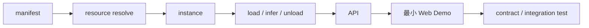

# 路线图

状态：`Proposed`

## Phase 0：确认设计

交付：

- 确认 SDK 公共协议、manifest 和标准 schema；
- 确认进程隔离与资源预算策略；
- 选定首批模型和最低 macOS；
- 决定开源许可证；
- 生成并验证首个 `uv.lock`。

退出条件：三个关键设计点进入 Accepted 或 ADR。

## Phase 1：最小纵向闭环

选择一个小型 CNN，完成：

退出条件：重复加载卸载无明显泄漏，业务层不直接依赖 runtime。

## Phase 2：经典模型矩阵

加入 RNN、YOLO、CLIP，验证有状态序列、结构化检测、多输入 embedding 和 Core ML 转换。

退出条件：新增模型主要通过 definition/adapter/manifest 完成，无需修改业务核心。

## Phase 3：LLM/VLM

加入 MLX 小型 LLM，再加入一个可在目标机器可靠运行的 VLM；实现 token 流、取消、上下文和量化配置。

退出条件：worker 崩溃不影响 API，内存预算能拒绝危险加载。

## Phase 4：评估与基准

完成 correctness/performance/resource runner、可恢复任务与报告页面。

退出条件：同一模型跨 runtime 的比较可复现且条件透明。

## Phase 5：训练与微调

先小模型训练，再参数高效微调；打通 checkpoint、恢复、评估、导出和候选 revision 注册。

退出条件：训练产物不能绕过验证直接成为 Demo 默认模型。

## Phase 6：生态与稳定化

插件式模型目录、文档站、兼容矩阵、迁移策略、发布 SDK，以及按真实需求扩展音频/扩散模型。

延后候选：[Supertonic 3 MLX 实现计划](plans/supertonic-3-mlx/README.md)。当前先完成 Phase 3 的 VLM
纵向闭环，再启动该 TTS 模型的实现与基准验证。

## 建议的首批验收模型

最终型号应在实现时结合许可证、体积和当前 runtime 兼容性确认，不在设计期锁死。优先选择体积小、
官方来源清晰、有稳定测试输入的模型。
