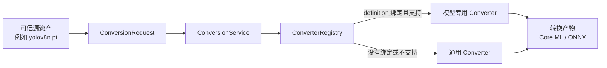

# 模型转换

状态：`Core ML 与 ONNX 转换链路已实现；provenance 持久化仍在规划。`

## 目标

转换是 SDK 的独立模型资产流程：

模型 adapter 不负责转换。转换结果返回 digest、大小、converter ID、源 digest 和最终参数；当前不会把
provenance 写入独立的持久化索引。后续由模型 runtime instance 加载转换产物。

## 核心契约

- `ConversionRequest`：源资源、source/target format、目标路径、模型 ID/revision、参数；
- `ModelConverter`：`supports(request)` 与 `convert(request)`；
- `ConverterRegistry`：注册、显式查找和自动选择；
- `ConversionService`：应用模型绑定、显式覆盖与通用回退；
- `ConversionResult`：路径、格式、摘要、大小、converter ID、源摘要和最终参数。

## 选择顺序

1. 调用方显式指定 `converter_id` 时只使用该 converter，不支持则报错；
2. 否则依次检查 `ModelDefinition.converter_ids`；
3. 没有可用模型专用 converter 时，从全部通用 converter 中按支持范围和 priority 选择；
4. 没有匹配项时返回 `UnsupportedRuntimeError`，不隐式改变目标格式。

专用 converter 适合补充固定 shape、特殊导出 op、NMS、tokenizer、模型拆分等逻辑。通用 converter
适合框架已经原生理解的标准模型，不应包含按模型 ID 分支的大量条件。

## YOLOv8 多 variant 配置

| 字段 | 值 |
|---|---|
| Model ID | `ultralytics/yolov8` |
| Variant | `n`、`s`、`m`，默认 `n` |
| Hugging Face repo | `Ultralytics/YOLOv8` |
| Revision | `8a9e1a5` |
| 文件 | `yolov8{variant}.pt` |
| SHA-256 | 每个 variant 在 manifest 中分别固定 |
| 许可证 | `AGPL-3.0` |
| 专用 converter | `ultralytics.yolov8` |
| 默认目标 | Core ML ML Program / FP16（`quantize=16`） |
| 输入 | 静态 `640×640`、batch 1 |
| NMS | 保留原始输出，由各模型 `utils/postprocess.py` 统一执行 |
| Core ML compute units | `CoreMLProvider` 直接传给 `coremltools.MLModel` |

`.pt` 是源资产和后续 PyTorch MPS 正确性基线，`.mlpackage` 是默认转换产物，Core ML 会在系统管理的位置
编译运行时缓存。`converters/yolov8.py` 只提供不理解具体模型 checkpoint 的格式导出机制；每个 model
pack 的 `converter.py` 绑定自己 `utils/` 内的 `checkpoint.py`，并拥有独立 converter ID。底层使用
`torch.jit.trace`、`coremltools.convert` 和 `torch.onnx.export`，不安装、不导入也不执行
Ultralytics Python 包。三个 YOLO resource provider 均把 Core ML 与 ONNX 暴露为受管转换目标。

## Audio8-ASR Core ML 混合转换

| 字段 | 值 |
|---|---|
| Model ID | `audio8/audio8-asr` |
| Variant | `base` |
| 源格式 | safetensors 目录 |
| 目标格式 | Core ML 混合 artifact |
| 专用 converter | `audio8.audio8-asr-0.1b` |
| Core ML 部分 | audio encoder + MLP tower |
| Functions | `tower_5s`、`tower_10s`、`tower_30s` |
| 音频塔权重 | 默认 INT8 |
| Decoder | PyTorch MPS + KV cache |
| 最低系统目标 | macOS 15 |

该模型必须使用专用 converter：它不仅转换图，还拆分 checkpoint、合并共享权重的 multifunction
ML Program、复制 tokenizer/processor 配置，并保存 projector 与 decoder 权重。runtime 根据输入长度
选择最小固定 bucket。Qwen2 decoder 当前不宣称运行在 Core ML/ANE 上；未来的 stateful Core ML decoder
应作为新的明确实现接入，而不是用无缓存的全序列重算替换现有生成逻辑。

## Kokoro-82M Core ML 产物

Kokoro 不再提供本地 Core ML 转换入口。Model SDK 从固定 revision 的
`aufklarer/Kokoro-82M-CoreML` 直接下载预编译端到端模型、G2P 模型、词表和 voice embeddings。
主模型支持最多 128 个 phoneme、单段最多 5 秒，并以固定长度分段处理长文本。该 artifact 要求
Apple Silicon 和 macOS 15+，默认允许 Core ML 在 ANE、GPU 与 CPU 间调度。

## 安全与复现

- 转换输入必须来自已经解析和校验的 `ResolvedResource`；
- 源 revision、源 digest、converter ID 和最终参数写入 `ConversionResult`；
- 输出在 staging 中生成，完成后才移动到目标路径；
- `.pt` 可能执行 pickle 反序列化，只允许 manifest 中明确受信任且摘要固定的来源；
- 模型转换代码作为受信任 SDK 代码注册，manifest 本身不执行任意脚本；
- 转换产物在成为默认 runtime 资产前仍需 contract 和 golden sample 验证。
