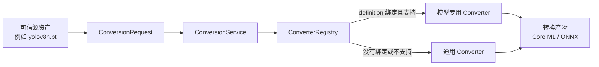

# 模型转换

状态：`Proposed`，第一版接口已实现。

## 目标

转换是 SDK 的独立模型资产流程：

模型 adapter 不负责转换。转换结果也是可校验、有 provenance 的模型资源，后续由 runtime adapter 加载。

## 核心契约

- `ConversionRequest`：源资源、source/target format、目标路径、模型 ID/revision、参数；
- `ModelConverter`：`supports(request)` 与 `convert(request)`；
- `ConverterRegistry`：注册、显式查找和自动选择；
- `ConversionService`：应用模型绑定、显式覆盖与通用回退；
- `ConversionResult`：路径、格式、摘要、大小、converter ID、源摘要和最终参数。

## 选择顺序

1. 调用方显式指定 `converter_id` 时只使用该 converter，不支持则报错；
2. 否则依次检查 `ModelDefinition.converter_ids`；
3. 没有可用模型专用 converter 时，从全部通用 converter 中按支持范围和 priority 选择；
4. 没有匹配项时返回 `UnsupportedRuntimeError`，不隐式改变目标格式。

专用 converter 适合补充固定 shape、特殊导出 op、NMS、tokenizer、模型拆分等逻辑。通用 converter
适合框架已经原生理解的标准模型，不应包含按模型 ID 分支的大量条件。

## YOLOv8n 首个配置

| 字段 | 值 |
|---|---|
| Model ID | `ultralytics/yolov8n` |
| Hugging Face repo | `Ultralytics/YOLOv8` |
| Revision | `8a9e1a5` |
| 文件 | `yolov8n.pt` |
| SHA-256 | `31e20dde3def09e2cf938c7be6fe23d9150bbbe503982af13345706515f2ef95` |
| 许可证 | `AGPL-3.0` |
| 专用 converter | `ultralytics.yolov8` |
| 通用 converter | `ultralytics.export` |
| 默认目标 | Core ML ML Program / FP16（`quantize=16`） |
| 输入 | 静态 `640×640`、batch 1 |
| NMS | 导出时包含 |
| Core ML compute units | `ALL`，在 runtime 加载时设置 |

`.pt` 是源资产和后续 PyTorch MPS 正确性基线，`.mlpackage` 是默认分发转换产物，本机可进一步编译并缓存
`.mlmodelc`。ONNX 使用同一个通用 Ultralytics converter，但不是 Apple Silicon 默认 runtime。

## 安全与复现

- 转换输入必须来自已经解析和校验的 `ResolvedResource`；
- 源 revision、源 digest、converter ID 和最终参数写入结果；
- 输出在 staging 中生成，完成后才移动到目标路径；
- `.pt` 可能执行 pickle 反序列化，只允许 manifest 中明确受信任且摘要固定的来源；
- 模型转换代码作为受信任 SDK 代码注册，manifest 本身不执行任意脚本；
- 转换产物在成为默认 runtime 资产前仍需 contract 和 golden sample 验证。
