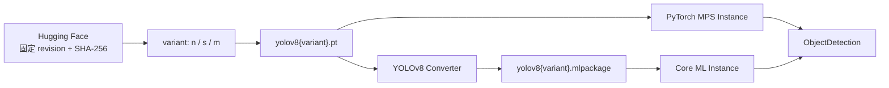

# YOLOv8 SDK

状态：首个可运行版本。

## 范围

内置定义以 `ultralytics/yolov8` 表示共享的检测结构和 `ObjectDetection` capability，并提供
`n`、`s`、`m` 三个可切换权重 variant：



PyTorch MPS 是源模型正确性 reference runtime；Core ML 是 Apple Silicon 默认高性能 runtime。

三者共享 capability、预处理、NMS 和输出 schema，仅权重规模不同：

| Variant | 源文件大小 | SHA-256 |
|---|---:|---|
| `n` | 6,534,387 B | `31e20dde3def09e2cf938c7be6fe23d9150bbbe503982af13345706515f2ef95` |
| `s` | 22,573,363 B | `268e5bb54c640c96c3510224833bc2eeacab4135c6deb41502156e39986b562d` |
| `m` | 52,117,635 B | `6c25b0b63b1a433843f06d821a9ac1deb8d5805f74f0f38772c7308c5adc55a5` |

## 公共输入输出

`DetectionRequest`：

- `ImageInput(path=...)` 或 `ImageInput(data=...)`，必须且只能提供一个；
- confidence，默认 `0.25`；
- IoU threshold，默认 `0.7`；
- max detections，默认 `300`；
- 可选 class ID 过滤。

`DetectionResponse`：

- model ID、instance ID；
- runtime 与实际 execution device；
- 原图宽高；
- detection tuple；
- 每个 detection 包含 `xyxy`、confidence、class ID、label；
- Ultralytics 提供的预处理、推理和后处理耗时。

公共 schema 不暴露 torch tensor、NumPy array、PIL image 或 Core ML feature。

## 资产解析

默认目录：

```text
<model-home>/ultralytics/yolov8/8a9e1a5/
├── n/
│   ├── source/yolov8n.pt
│   └── coreml/yolov8n.mlpackage/
├── s/
│   ├── source/yolov8s.pt
│   └── coreml/yolov8s.mlpackage/
└── m/
    ├── source/yolov8m.pt
    └── coreml/yolov8m.mlpackage/
```

加载 MPS 实例时：

1. 查找固定 `.pt`；
2. 已存在则重新计算 SHA-256；
3. 不存在则抛出 `ResourceNotFoundError`；
4. hash 不匹配立即失败，不自动下载或覆盖。

加载 Core ML 实例时：

1. 查找 `.mlpackage`；
2. 不存在则抛出 `ResourceNotFoundError`；
3. 不会隐式下载 `.pt` 或调用 converter；
4. 已存在时通过 Ultralytics Core ML backend 加载并推理。

下载与转换是独立的显式 SDK 操作：

```python
status = await sdk.resources.status(
    "ultralytics/yolov8",
    variant="s",
    options={"model_home": Path("models")},
)
await sdk.resources.download_source(
    "ultralytics/yolov8",
    variant="s",
    options={"model_home": Path("models")},
)
await sdk.resources.convert(
    "ultralytics/yolov8",
    ArtifactFormat.COREML,
    variant="s",
    options={"model_home": Path("models")},
)
```

App 可以把这些操作绑定到 API 或前端按钮；`acquire/load/detect` 永远不替用户发起网络或转换任务。

## Runtime 行为

### PyTorch MPS

- 默认 device 为 `mps`；
- MPS 不可用时默认报错；
- 只有显式 `allow_cpu_fallback=True` 才允许 CPU；
- unload 后释放模型引用并请求清理 MPS cache。

### Core ML

- 加载 `.mlpackage`；
- 使用 Core ML 默认 `ComputeUnit.ALL`；
- 不向 Core ML backend 传递 torch device；
- 第一版只支持 `compute_units="all"`，其他执行单元组合待直接 Core ML adapter 完成后开放。

当前使用 Ultralytics Core ML backend，是为了复用经过验证的 image preprocessing、输出解析和 NMS 协议。
未来如果改为直接调用 `coremltools.MLModel`，公共 capability 和 schema 不变。

## 使用

```python
models = ModelRegistry()
register_yolov8(models, ConverterRegistry())
instance = models.create_instance(
    "ultralytics/yolov8",
    variant="s",
    runtime="coreml",
    options={"model_home": Path("models")},
)

await instance.load()
detector = instance.require(ObjectDetection)
response = await detector.detect(
    DetectionRequest(image=ImageInput(path=Path("bus.jpg")))
)
await instance.unload()
```

也可以直接通过 definition 工厂构造：

```python
definition = models.get("ultralytics/yolov8")
instance = definition.create(
    variant="m",
    runtime="pytorch-mps",
    options={"model_home": Path("models")},
)
```

工厂会先根据 manifest 校验 runtime，再交给 YOLOv8 factory：

| runtime | 实例类型 |
|---|---|
| `pytorch-mps` | `PyTorchMpsYoloV8Instance` |
| `coreml` | `CoreMlYoloV8Instance` |

Manager 也可以安全替换现有未被 retain 的实例：

```python
replacement = await sdk.instances.switch_variant(
    str(instance.instance_id),
    "m",
)
```

替换实例加载失败时旧 variant 保持可用。共享实例复用键包含 variant，因此 `n`、`s`、`m` 不会互相复用。

## 实机 smoke test

在本项目开发机的 Apple Silicon 环境中，固定模型的下载 hash、MPS 推理、Core ML 转换与推理均已通过。
同一张 640×480 合成图的最近一次热身后结果：

| Runtime | 实际 device | inference |
|---|---|---:|
| PyTorch MPS | `mps` | 约 57.0 ms |
| Core ML | `all` | 约 9.9 ms |

这些数字不是正式 benchmark：样本是无目标合成图，未控制热状态，也没有统计分位数。它们只证明完整链路可运行，
并支持 Core ML 作为默认 runtime 的设计选择。正式性能结论必须进入评估 runner。

执行：

```bash
uv run --all-packages --extra yolo scripts/smoke_yolov8.py --download
uv run --all-packages --extra yolo scripts/smoke_yolov8.py \
  --runtime coreml --download --convert
```

## 当前限制

- 当前注册 YOLOv8 detection 的 `n/s/m` 三个 variant，尚未加入 `l/x`；
- 尚未加入 segment、pose、classification；
- Core ML 只开放 `ComputeUnit.ALL`；
- Core ML 转换必须在加载前显式执行；
- 许可证为 AGPL-3.0，商业分发前必须确认相应义务或取得 Enterprise license。
