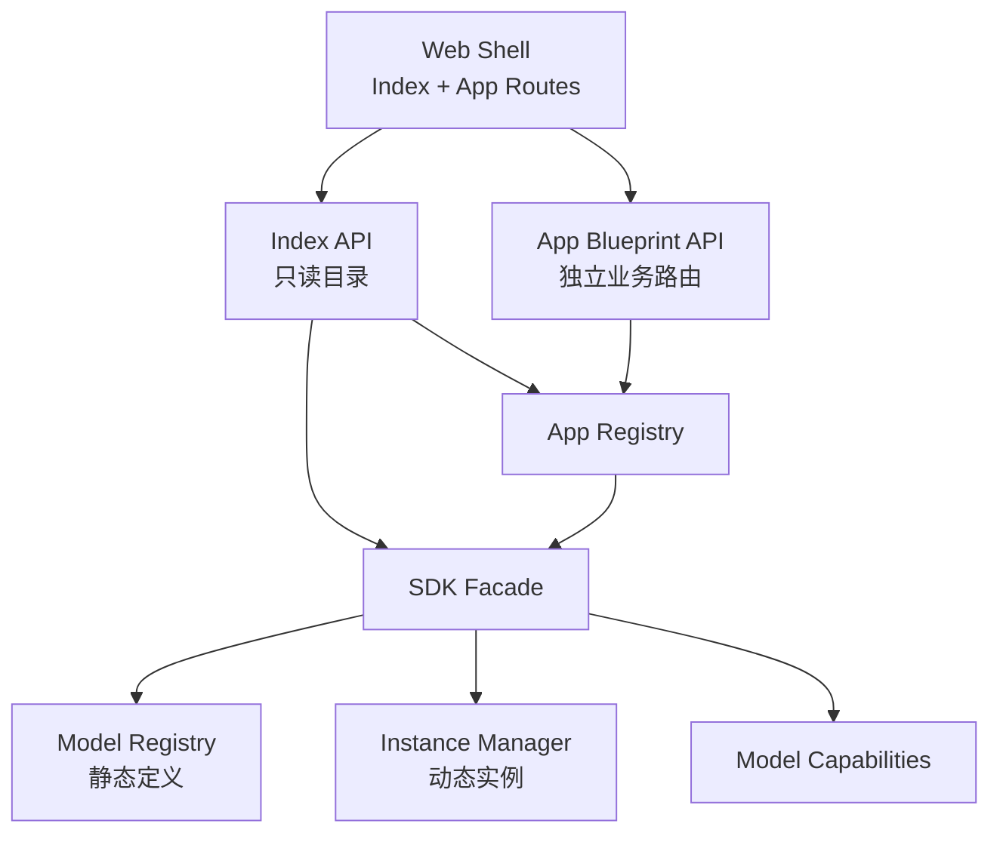
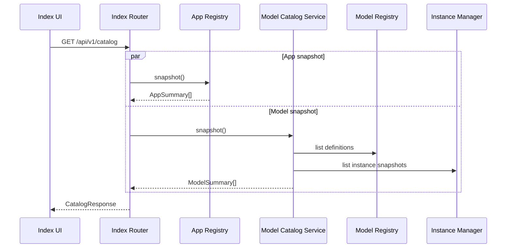

# Web 应用层与 Index

状态：`Implemented`。Platform Python 后端、Vue 首页和首个 Object Detection App 已实现。

## 目标

Web 应用层提供一个统一入口：

1. 展示模型 SDK 中所有已注册模型及其实例状态；
2. 展示基于模型构建的业务应用；
3. 进入具体 App 后，通过稳定 API 使用模型 capability；
4. 将 SDK 错误转换为前端可消费的统一错误响应。

Index 是平台主页，不是某个模型 Demo。列出模型不能触发下载、转换、实例创建或模型加载。

## 页面信息架构

```text
┌──────────────────────────────────────────────────────────────┐
│ hugging-mac                         系统状态 / 设置 / 搜索    │
├──────────────────────────────────────────────────────────────┤
│ Models                                                      │
│ ┌ YOLOv8 (n/s/m) ───┐ ┌ Future LLM ──────┐                  │
│ │ Object Detection  │ │ Chat             │                  │
│ │ Core ML · MPS     │ │ MLX              │                  │
│ │ 2 instances       │ │ Not instantiated │                  │
│ │ 1 ready / 1 idle  │ │                  │                  │
│ └───────────────────┘ └──────────────────┘                  │
├──────────────────────────────────────────────────────────────┤
│ Applications                                                 │
│ ┌ Object Detection ┐ ┌ Model Benchmark ┐                    │
│ │ vision · yolo    │ │ eval · compare  │                    │
│ │ YOLOv8 variants │ │ 2 models        │                    │
│ └──────────────────┘ └─────────────────┘                    │
└──────────────────────────────────────────────────────────────┘
```

模型卡片显示静态能力和动态实例状态；App 卡片显示业务用途、标签和模型依赖。两类对象不能混成一个目录：
模型是 SDK 能力，App 是能力的业务组合。

## 总体结构



Index API 读取 `AppRegistry` 和 SDK 只读快照。业务 App 通过 SDK facade 获取实例和 capability，
不直接访问 Index API，也不 import 具体 runtime adapter。

## SDK 需要暴露的模型信息

模型信息由两个来源聚合：

- `ModelRegistry`：名称、简介、标签、capability、支持的 runtime；
- `InstanceManager`：实例 ID、runtime、state、创建时间、引用数等动态信息。

建议在 SDK 中增加只读 `ModelCatalogService`，返回不可变 snapshot，而不是把 registry/manager 内部字典暴露给业务：

```python
snapshot = await sdk.catalog.snapshot()
```

### ModelSummary

至少包含：

| 字段 | 含义 |
|---|---|
| `model_id` | 稳定 ID，不是文件路径 |
| `revision` | 当前注册 revision |
| `name` | 展示名称 |
| `description` | 简介 |
| `tags` | 搜索与分组标签 |
| `capabilities` | `object-detection`、`chat` 等 |
| `runtimes` | runtime 静态声明与当前可用性 |
| `instantiated` | `instance_count > 0` 的派生值 |
| `instance_count` | 当前实例总数 |
| `ready_count` | READY 实例数 |
| `instances_by_state` | 各生命周期状态数量 |
| `instances_by_runtime` | 各 runtime 实例数量 |

“已实例化”与“已加载”不是同义词：

- `instantiated=false`：没有实例；
- `instantiated=true, ready_count=0`：存在 CREATED/LOADING/FAILED/UNLOADED 实例；
- `ready_count>0`：至少有一个可接受推理的 READY 实例。

Index 应显示精确信息，不能只用一个容易误解的布尔值。

### RuntimeSummary

每个 runtime 建议返回：

```json
{
  "name": "coreml",
  "declared": true,
  "available": true,
  "default": true,
  "devices": ["all"],
  "unavailable_reason": null,
  "instance_count": 1,
  "ready_count": 1
}
```

`available` 表示当前机器、OS 和可选依赖满足基本条件，不代表模型资产已经下载。可用性检查必须轻量，
不能因为 Index 刷新而编译模型。

### Manifest 扩展

当前 `ModelManifest` 已有 `display_name`、family、capability 和 runtime，但 Index 还需要增加：

- `description`；
- `tags`；
- 可选 `icon` 或受控 asset ID；
- `default_runtime`；
- 可选文档链接。

这些字段是模型静态元数据；实例数量永远不写入 manifest。

## 应用信息

App 通过自己的 manifest 注册：

| 字段 | 含义 |
|---|---|
| `app_id` | 稳定、URL-safe ID |
| `name` | 展示名称 |
| `description` | 简介 |
| `tags` | 例如 `vision`、`demo`、`evaluation` |
| `version` | App schema/实现版本 |
| `frontend_route` | 例如 `/apps/object-detection` |
| `api_prefix` | 例如 `/api/v1/apps/object-detection` |
| `required_models` | 引用的模型和 capability |
| `status` | available/degraded/unavailable |
| `unavailable_reason` | 缺少模型或配置时的可读原因 |

`required_models` 是声明，不在 App 注册阶段加载模型：

```yaml
required_models:
  - model_id: ultralytics/yolov8
    capabilities: [object-detection]
    preferred_runtime: coreml
    required: true
```

## Index API 草案

```text
GET /api/v1/catalog
GET /api/v1/catalog/models
GET /api/v1/catalog/models/{model_id}
GET /api/v1/catalog/apps
GET /api/v1/catalog/apps/{app_id}
```

`GET /catalog` 可在首屏一次返回模型和 App 两部分，独立 endpoint 支持刷新和详情页。

响应外壳：

```json
{
  "data": {
    "models": [],
    "apps": []
  },
  "meta": {
    "generated_at": "2026-07-27T00:00:00Z",
    "schema_version": "1"
  }
}
```

Index 第一版由前端并行请求 models/apps；后端同时提供 SSE catalog events 与 heartbeat，
供实例状态需要实时更新的页面按需订阅。

## Index 聚合流程



返回的是复制后的只读 snapshot；序列化期间 registry 或实例发生变化不会导致遍历错误。

## 前后端边界

- 前端只依赖 OpenAPI/JSON schema，不 import Python manifest；
- 后端不渲染业务 HTML 模板；
- 前端只使用 model ID、app ID、artifact ID，不接收本机绝对路径；
- Index 是 Web Shell 的系统路由，业务 App 是 `/apps/{app_id}` 下的模块路由；
- 前后端源码从 `apps/web/backend` 与 `apps/web/frontend` 顶层彻底分开；
- 两侧使用相同 `app_id` 目录名建立可追踪关系，不共享源文件；
- Vue 前端统一构建，App 页面通过 Vue Router 进入；
- App 前端不能直接调用 SDK，只能调用自己或平台的 API。

## 非目标

第一阶段不设计：

- App 市场或在线安装；
- 第三方不受信任代码动态加载；
- 多用户权限系统；
- 跨机器模型 worker；
- 每个 App 独立部署的微前端运行时。

这些能力可在 registry 和 blueprint 契约稳定后扩展。

## 已确认决策

1. 后端使用 FastAPI，以 `APIRouter` 实现 blueprint；
2. 前端使用 Vue + Vite；
3. Index 并行请求 models/apps；
4. Index API 返回实例聚合数据和实例明细；
5. runtime 默认值由机器级 policy 按环境变量动态选择，manifest 的默认值只作为候选顺序。
6. 前后端目录彻底分离，但后端与前端都以同名 App 目录组织私有代码。
