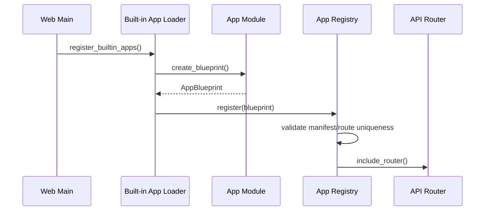
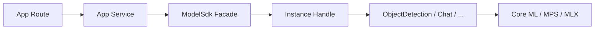
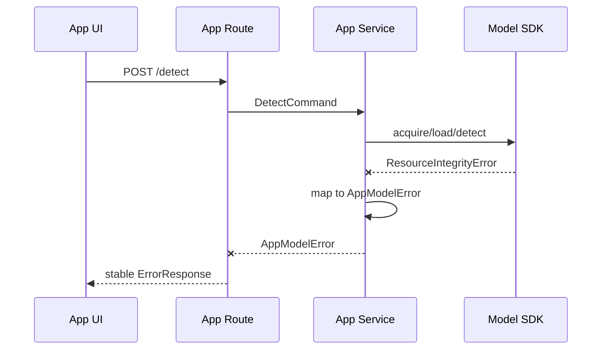

# App Blueprint 模块规范

状态：`Accepted`。前后端分离目录已落地，首个 `object_detection` App 已实现。

## 原则

前端和后端是两个完全独立的工程边界：

- 后端只提供 REST/SSE、业务编排和模型 SDK 调用，不保存或渲染 Vue 页面；
- 前端只依赖 HTTP API，不 import Python 配置或模型 SDK；
- 两侧分别按相同的 `app_id` 建立对应目录，便于定位；
- 平台级 Index、Models 等入口放在 App 目录同一级；
- App 私有代码留在自己的目录，公共代码才允许进入外层 shared/components。

前端 App 之间、后端 App 之间均禁止横向 import。可复用能力必须上移到各自的公共层或模型 SDK。

## 当前目录

```text
apps/
└── web/
    ├── backend/                           # Python 工程
    │   ├── pyproject.toml
    │   ├── src/hugging_mac_web/
    │   │   ├── main.py                    # FastAPI factory 与 router 装配
    │   │   ├── index.py                   # 首页/App catalog API
    │   │   ├── models.py                  # 模型 catalog/instance API
    │   │   ├── system.py                  # health 与机器信息 API
    │   │   ├── media.py                   # 平台级上传 API
    │   │   ├── app_blueprint.py
    │   │   ├── app_registry.py
    │   │   ├── dependencies.py
    │   │   ├── shared/                    # 仅后端跨 App 公共能力
    │   │   │   ├── cache/
    │   │   │   ├── storage/
    │   │   │   └── utils/
    │   │   ├── object_detection/          # 一个目录一个业务 App
    │   │   │   ├── __init__.py
    │   │   │   ├── manifest.py
    │   │   │   ├── routes.py
    │   │   │   ├── schemas.py
    │   │   │   ├── service.py
    │   │   │   ├── config.py
    │   │   │   └── utils.py
    │   │   └── model_benchmark/
    │   │       └── ...
    │   └── tests/
    │       ├── platform/
    │       ├── object_detection/
    │       └── model_benchmark/
    │
    └── frontend/                          # Vue + Vite 独立工程
        ├── package.json
        ├── vite.config.ts
        ├── index.html
        ├── src/
        │   ├── main.ts
        │   ├── App.vue                    # 全局 Shell
        │   ├── router.ts                  # 统一注册页面路由
        │   ├── index.vue                  # 平台首页
        │   ├── models.vue                 # 模型列表/实例页面
        │   ├── api/                       # 平台级 API client
        │   ├── components/                # 跨 App 公共组件
        │   ├── composables/               # 跨 App Vue composables
        │   ├── styles/                    # 主题和全局样式
        │   ├── object_detection/          # 与后端 app_id 对齐
        │   │   ├── index.vue              # App 路由页面
        │   │   ├── api.ts
        │   │   ├── types.ts
        │   │   ├── composables/
        │   │   └── components/            # App 私有组件
        │   └── model_benchmark/
        │       └── ...
        └── tests/
            ├── platform/
            ├── object_detection/
            └── model_benchmark/
```

这里不再使用 `modules/{app_id}/backend|frontend` 的共置结构。前后端从顶层就分开，但通过一致的
`app_id` 保持可发现性：

| 关注点 | 后端 | 前端 |
|---|---|---|
| 平台首页 | `index.py` | `index.vue` |
| 模型目录 | `models.py` | `models.vue` |
| Object Detection | `object_detection/` | `object_detection/` |
| 公共能力 | `shared/` | `components/`、`composables/`、`api/` |

整个前端只有一个 Vue/Vite 工程和一个构建产物；每个 App 不创建自己的 `package.json` 或 dev server。

## Blueprint 抽象

“Blueprint”是平台概念，不强绑定 Flask。若后端采用 FastAPI，可由 `APIRouter` 承载路由：

```python
class AppBlueprint(Protocol):
    @property
    def manifest(self) -> AppManifest: ...

    def create_router(self, context: AppContext) -> APIRouter: ...
```

每个 App 暴露一个无全局副作用的构造入口：

```python
def create_blueprint() -> AppBlueprint:
    ...
```

import 模块时不能：

- 下载或加载模型；
- 创建模型实例；
- 连接数据库；
- 启动后台任务；
- 读取用户输入文件。

这些动作只能在显式 startup hook 或请求用例中发生。

## App 注册



第一版使用显式 built-in 列表，不扫描任意目录、不执行 entry point plugin。这样启动顺序、信任边界和打包结果
都是确定的。

Registry 拒绝：

- 重复 `app_id`；
- 重复 API prefix 或 frontend route；
- manifest 缺少必填字段；
- required model/capability 在 SDK registry 中不存在；
- blueprint 暴露平台保留路径。

缺少模型文件不导致 App 注册失败。App 可保持 `available`，但应向用户展示资源尚未准备，并通过显式业务接口
调用 `sdk.resources.download_source()` 或 `sdk.resources.convert()`。模型 definition 或 capability 根本
不存在时，App 状态应为 `unavailable`。

## 配置

后端 App 目录中的 `manifest.py` 保存 typed 展示信息和静态依赖声明。前端不复制这份元数据，
而是从 Index API 获取：

```python
MANIFEST = AppManifest(
    app_id="object-detection",
    name="Object Detection",
    description="使用 YOLO 检测图片中的物体",
    tags={"vision", "detection", "demo"},
    frontend_route="/apps/object-detection",
    api_prefix="/api/v1/apps/object-detection",
    required_models=(...),
)
```

业务运行配置使用 App 自己的 typed settings；模型选择与推理默认值由 Model SDK 的 manifest 和 schema 管理：

```text
内置默认值
< app config file
< APP_<APP_NAME>_*
< 测试或启动时显式覆盖
```

密钥不进入 manifest。App config 只能配置自己的业务参数，不能覆盖模型内部参数，也不能直接传入任意本地模型路径绕过 SDK manifest。

## App 使用模型

平台向 blueprint 注入共享 `AppContext`：

```python
class AppContext:
    models: ModelSdk
    artifacts: ArtifactRepository
    settings: PlatformSettings
    logger: BoundLogger
```

推荐调用形状：

```python
async def detect(command: DetectCommand) -> DetectionView:
    try:
        handle = await context.models.acquire(
            model_id="ultralytics/yolov8",
            runtime=config.runtime,
            reuse="shared",
        )
        detector = handle.require(ObjectDetection)
        result = await detector.detect(command.to_sdk_request())
        return DetectionView.from_sdk(result)
    except HuggingMacSdkError as error:
        raise AppModelError.from_sdk(error) from error
```

`ModelSdk.acquire()` facade 已实现：内部组合 `ModelRegistry`、`InstanceManager`、load 和引用计数。
App 不应该重复实现以下逻辑：

- 模型是否已经有 READY 实例；
- shared/dedicated/reuse-if-ready；
- 并发 load 合并；
- 何时 unload；
- 资源预算和 lease；
- runtime fallback policy。

## App 与模型依赖关系



App 依赖 capability，不依赖具体实例类：

```python
# 允许
detector = handle.require(ObjectDetection)

# 禁止
isinstance(instance, YoloV8Instance)
instance._engine.infer(...)
```

App manifest 可以指定 preferred model/runtime，但业务 schema 不应包含 Core ML 或 PyTorch 专用字段。

## 路由与业务分层

一个 App 后端内部仍保持三层：

| 文件 | 责任 |
|---|---|
| `routes.py` | HTTP 参数、上传限制、状态码、调用 service |
| `schemas.py` | App API request/response，不直接复用 SDK schema |
| `service.py` | 业务用例、模型 capability、artifact 编排 |
| `config.py` | typed App settings |
| `utils.py` | 仅该 App 使用的纯工具 |

route 不直接调用模型。SDK schema 和 App API schema 分开，由 service 显式转换。

App API prefix 固定为：

```text
/api/v1/apps/{app_id}/...
```

前端路由固定为：

```text
/apps/{app_id}/...
```

## Vue 路由与组件边界

`frontend/src/router.ts` 显式注册平台页面和各 App 页面，不使用运行时目录扫描：

```ts
const routes = [
  { path: "/", component: () => import("./index.vue") },
  { path: "/models", component: () => import("./models.vue") },
  {
    path: "/apps/object-detection",
    component: () => import("./object_detection/index.vue"),
  },
]
```

组件归属按复用范围决定：

- 只服务 Object Detection 的预览框、检测结果层，放在
  `object_detection/components/`；
- 上传器、错误提示、模型状态标签等跨 App 组件，放在外层 `components/`；
- App 私有 API request/response 类型放在自己的 `types.ts`；
- 平台 catalog client 放在外层 `api/`，业务接口 client 放在 App 的 `api.ts`；
- App 目录不能 import 另一个 App 目录中的组件、类型或 composable。

前端 `app_id`、路由和后端 API prefix 由后端 catalog 返回；Vue Router 仍显式绑定页面组件，
避免后端元数据能够动态加载任意前端代码。

## 错误边界

SDK 负责抛出稳定的 `HuggingMacSdkError` 子类。App service 捕获并补充业务上下文，API 层输出统一格式：

```json
{
  "error": {
    "code": "model_resource_integrity_error",
    "message": "模型资源校验失败",
    "retryable": false,
    "trace_id": "01...",
    "details": {
      "model_id": "ultralytics/yolov8"
    }
  }
}
```



建议映射：

| SDK 错误 | HTTP | App code |
|---|---:|---|
| `ResourceNotFoundError` | 404 | `model_resource_not_found` |
| `ResourceIntegrityError` | 422 | `model_resource_integrity_error` |
| `UnsupportedCapabilityError` | 409 | `model_capability_unavailable` |
| `UnsupportedRuntimeError` | 409 | `model_runtime_unavailable` |
| `InsufficientResourceError` | 503 | `model_resource_exhausted` |
| `ModelLoadError` | 503 | `model_load_failed` |
| `InferenceError` | 500/422 | `model_inference_failed` |

`message` 面向用户，`details` 必须经过允许列表过滤，不能返回绝对路径、token、底层 traceback 或完整 prompt。
原始异常链只写服务端结构化日志。

## App 状态

App Registry 根据依赖生成状态：

- `available`：所有必需 definition/capability 存在；
- `degraded`：可选模型缺失，或 preferred runtime 不可用但有允许的替代；
- `unavailable`：必需模型/capability 未注册或 App 配置非法。

模型尚未下载、尚未实例化不等于 App unavailable；这是首次调用可恢复状态。

## 测试要求

每个 App 至少包含：

- manifest/config 校验；
- route → service schema contract；
- mock `ModelSdk` 的业务测试；
- SDK 错误到 App error 的映射测试；
- required capability 缺失测试；
- 前端 loading/error/retry 状态测试；
- 一个不访问网络的小型端到端 fixture。

真实模型测试进入 integration/performance lane，不放入 App 默认单元测试。

## 已确认与后续决策

- `ModelSdk.acquire()` 已实现，支持显式 runtime、shared/dedicated/reuse-if-ready；
- 平台统一处理 SDK 基础错误映射，App service 可增加业务语义；
- 第一版 Blueprint 使用 Python typed manifest 和显式注册；
- 前端确定使用 Vue + Vite，由根 `router.ts` 显式注册平台与 App 页面；
- App 可按用例选择 shared 或 dedicated，但默认使用 shared。

## 已确认边界

1. 后端采用扁平的“平台 `.py` 文件 + 同级 App 目录”，不再套一层 `apps/`；
2. 前端采用同样的扁平结构：`index.vue/models.vue` 与 App 目录同级；
3. App manifest 只在后端维护，前端通过 catalog API 获取展示信息；
4. 公共组件只有确认被两个及以上页面复用后，才从 App 目录上移到外层 `components/`。
