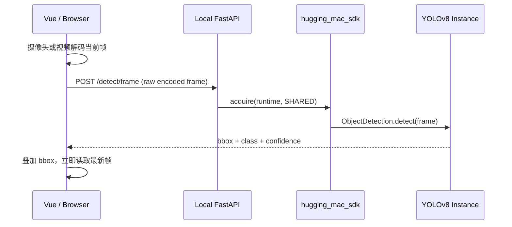

# Vue 前端与 Object Detection App

状态：`Implemented`，首版。

## 前端入口

前端是独立的 Vue 3 + Vite + TypeScript 工程：

```text
apps/web/frontend/
├── package.json
├── vite.config.ts
└── src/
    ├── main.ts
    ├── App.vue
    ├── router.ts
    ├── index.vue
    ├── models.vue
    ├── api/
    ├── components/
    ├── styles/
    └── object_detection/
        ├── index.vue
        ├── api.ts
        ├── frame.ts
        ├── types.ts
        └── components/
            ├── BoundingBoxLayer.vue
            ├── ImageDetectionTab.vue
            ├── CameraDetectionTab.vue
            └── VideoDetectionTab.vue
```

页面路由：

| 路径 | 页面 |
|---|---|
| `/` | 平台首页，并行加载模型和 App catalog |
| `/models` | 模型、runtime 与实例明细 |
| `/apps/object-detection` | YOLOv8 图片、摄像头和视频目标检测 |

开发服务器把 `/api` 代理到 `http://127.0.0.1:8000`。也可以通过
`VITE_API_BASE_URL` 指向其他 FastAPI 地址。

`/models` 也是模型实例控制面：

- 每个当前可用的 runtime 提供 `Load instance`，允许同一模型创建多个独立实例；
- 每个实例提供单独的 `Unload`，实例有活动 reference 时按钮禁用；
- 模型项显示本地总大小，每个 runtime 显示其所需文件或目录的合计大小；
- `Download` 获取源权重；源权重存在时显示 `Re-download` 并执行覆盖下载；
- `Delete weights` 在二次确认后删除该模型 revision 的完整本地权重目录；
- 实例显示 load 耗时、RSS 分配差值和操作后的进程 RSS；
- unload 完成后显示最近一次卸载耗时和 RSS 释放差值；
- 操作期间按钮进入 loading 状态，完成后重新获取 catalog，SDK 错误直接展示在页面错误区。

内存数字明确标记为进程 RSS 观测值。allocator cache、memory map、并发请求以及 GPU/ANE 分配可能导致
RSS 差值小于模型文件大小，甚至卸载后暂时没有下降。

模型存在任何受管实例时，覆盖下载和删除按钮禁用；后端也执行相同检查，防止并发请求绕过前端约束。
删除权重不删除模型 catalog 项，因此按钮会恢复为 `Download`，用户可以重新准备资源。

## Object Detection 后端

后端模块位于：

```text
apps/web/backend/src/hugging_mac_web/object_detection/
├── manifest.py
├── blueprint.py
├── routes.py
├── service.py
├── schemas.py
└── config.py
```

`routes.py` 只处理 multipart、参数校验和 HTTP 响应；`service.py` 通过
`ModelSdk.acquire()` 获取实例，再通过 `ObjectDetection` capability 调用模型。业务层不 import
YOLOv8 实例类、Ultralytics 或 Core ML。

检测接口：

```text
POST /api/v1/apps/object-detection/detect
Content-Type: multipart/form-data

file             JPEG / PNG / WebP
runtime          auto | coreml | pytorch-mps
confidence       0.0 .. 1.0
iou_threshold    0.0 .. 1.0
max_detections   1 .. 1000
cache_input      true | false
```

`runtime=auto` 使用平台机器级 runtime policy。图片经过大小和像素数限制后保存到
`object-detection-inputs` 内容寻址缓存；接口只返回 cache ID，不暴露本机文件路径。
普通图片检测使用默认的 `cache_input=true`。摄像头和视频帧使用 `cache_input=false`，避免长时间分析产生
无界的本地帧缓存。实时帧不走 multipart，而是以 JPEG/PNG/WebP 原始 body 调用：

```text
POST /api/v1/apps/object-detection/detect/frame
```

实时接口通过 query 传递 runtime 与阈值。后端只读取图片头部校验尺寸与像素上限，完整像素解码由 SDK
执行一次；普通图片接口仍执行完整文件校验。

模型资源接口：

```text
GET  /api/v1/catalog/models/{model_id}/resources
POST /api/v1/catalog/models/{model_id}/resources/download
POST /api/v1/catalog/models/{model_id}/resources/convert
DELETE /api/v1/catalog/models/{model_id}/resources

GET  /api/v1/apps/object-detection/resources
POST /api/v1/apps/object-detection/resources/source/download
POST /api/v1/apps/object-detection/resources/coreml/convert
```

Models 页面从通用资源状态中的 `conversion_targets` 动态生成转换按钮，并显示具体平台名。当前
YOLOv8 提供 PyTorch → Core ML；当 SDK 增加 ONNX 等转换目标时，页面无需新增硬编码按钮。
下载和转换只由明确的用户动作调用。检测接口及 `ModelSdk.acquire/load` 不会自动下载或转换。

## 三种检测模式

Object Detection 工作区通过 Tab 切换三个相互独立的组件：

| Tab | 输入 | 处理方式 |
|---|---|---|
| Image | JPEG、PNG、WebP | 单张图片检测，输入保留在本地内容缓存 |
| Camera | 浏览器 `getUserMedia` | MAX 最新帧或固定 1 / 2 / 5 FPS，不缓存帧 |
| Video | 浏览器可解码的本地视频 | MAX 丢帧实时分析，或按 1 / 2 / 5 FPS 穷举采样 |

三种模式共享 `BoundingBoxLayer`，按推理输入尺寸归一化坐标，在画面上显示 bbox、类别与置信度。
结果区显示类别明细、runtime 和各阶段耗时。



MAX 模式不维护帧队列，也不并行提交请求。一帧推理完成后：

- 摄像头立即捕获此刻最新画面；推理期间到达的帧自然被覆盖；
- 视频跟随正常播放时间轴，立即读取最新已解码画面；中间帧直接丢弃；
- 如果模型快于摄像头或视频解码，则等待下一张真正的新画面，避免重复推理同一帧。

前端在 canvas 端将实时帧按比例缩小到最长边 640，与当前 YOLOv8 `imgsz=640` 对齐，并以 JPEG 0.82
质量编码。这样减少浏览器编码、HTTP 传输和后端解码成本，不额外损失模型实际使用的输入分辨率。
界面显示包含编码、传输、后端与推理的端到端 pipeline FPS。

固定 FPS 模式仍用于需要确定采样率的场景；视频固定模式会定位并处理每个采样时间点，不丢采样帧。
切换 Tab、关闭摄像头或点击停止会中止当前请求，并释放摄像头的所有 `MediaStreamTrack`。视频文件由浏览器
本地解码，不会整段上传。

图片仅提交到本机 FastAPI，不发送到第三方服务。模型资产未准备时检测按钮不可用；用户必须先执行所需的
下载或转换操作。

摄像头 API 要求安全上下文；`http://localhost` 可直接使用。如果通过局域网 IP 从其他设备访问，需要为
前端启用 HTTPS，并在浏览器中授予摄像头权限。

## 启动

先启动后端：

```bash
uv run hugging-mac-web
```

再启动前端：

```bash
cd apps/web/frontend
npm install
npm run dev
```

访问 <http://127.0.0.1:5173/>。
