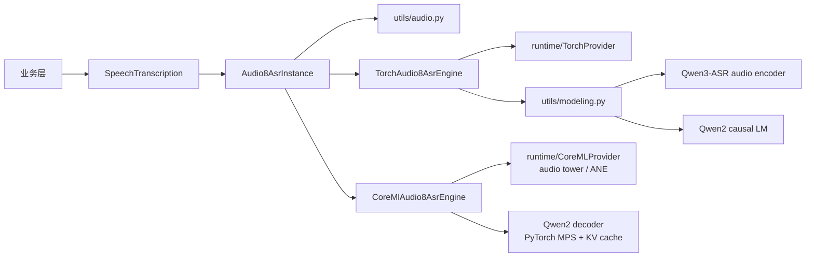

# Audio8-ASR 0.1B SDK

状态：`PyTorch MPS 与 Core ML/ANE 混合 runtime 已实现`

## 接入范围

模型来源固定为 `Audio8/Audio8-ASR-0.1B` 的 commit
`8487da63d581fa4fc9b5c60444cb57c3a523d7aa`。首版实现：

- `SpeechTranscription` capability；
- `base` variant；
- PyTorch MPS，并允许显式使用 CPU 或在 MPS 不可用时回退 CPU；
- Core ML 混合 runtime：音频编码塔运行在 Core ML/ANE，自回归 Qwen2 decoder 使用
  PyTorch MPS 与 KV cache；
- 16 kHz 单声道预处理，支持本地文件与编码音频 bytes；
- 最长 30 秒短音频、贪心自回归解码；
- 显式下载、状态统计、完整性校验和删除。

该模型权重采用 `CC-BY-NC-4.0`，不能因为 hugging-mac 仓库采用 MIT 就忽略模型自身的非商业限制。

## 模型包结构

```text
models/audio8_asr/
├── __init__.py
├── config.py
├── converter.py
├── coreml.py
├── definition.py
├── instance.py
├── model.yaml
├── resources.py
├── torch.py
└── utils/
    ├── __init__.py
    ├── audio.py
    ├── audio_encoder.py
    ├── coreml.py
    ├── modeling.py
    └── types.py
```

根目录文件遵循统一 model pack 约定。音频解码、Qwen3-ASR 兼容编码器、Audio8 投影结构和生成逻辑均为该
模型私有实现，因此留在 `utils/`。`torch.py` 只负责 PyTorch provider、device/dtype、tokenizer/feature
extractor 和模型会话的装配；`converter.py` 负责模型专用拆分、Core ML 转换和原子 artifact 提交；
`coreml.py` 负责混合 runtime 装配。公开 instance 与 `SpeechTranscription` capability 对两个 runtime
完全一致，不暴露 torch tensor 或 Core ML feature。



## 不执行远端代码

Hugging Face snapshot 只下载：

```text
model.safetensors
*.json
```

上游仓库中的 `configuration_arkasr.py`、`modeling_arkasr.py`、`processing_arkasr.py` 等 Python 文件不会
进入本地模型资源，也不会通过 `trust_remote_code=True` 执行。SDK 自己读取 JSON，构建音频编码器、
Qwen2 language model、MLP tower 与 projector。下载后会校验：

- 必需 JSON/tokenizer 文件完整；
- `model.safetensors` SHA-256；
- `config.json` 的 `model_type`。

## 安装与使用

安装 ASR 可选依赖：

```bash
uv sync --extra asr
```

注册、下载并加载：

```python
from pathlib import Path

from hugging_mac_sdk import AudioInput, ModelSdk, TranscriptionRequest
from hugging_mac_sdk.capabilities import SpeechTranscription
from hugging_mac_sdk.models.audio8_asr import register_audio8_asr

sdk = ModelSdk()
register_audio8_asr(sdk.registry)
options = {"model_home": Path("models")}

await sdk.resources.download_source(
    "audio8/audio8-asr",
    variant="0.1b",
    options=options,
)
handle = await sdk.load(
    "audio8/audio8-asr",
    variant="0.1b",
    runtime="pytorch-mps",
    options=options,
)
asr = handle.require(SpeechTranscription)
result = await asr.transcribe(
    TranscriptionRequest(audio=AudioInput(path=Path("sample.wav")))
)
print(result.text)
await handle.close()
```

`load()` 不会隐式下载模型。若资源缺失或校验失败，错误从 SDK 资源/加载层抛出，业务层只需要捕获稳定的
`HuggingMacSdkError` 层级。

## Core ML 转换与运行

Audio8-ASR 不是一次把整个自回归模型转换成无状态 Core ML 图。转换器采用模型专用拆分：

1. 音频 encoder 与 MLP tower 转成一个 multifunction ML Program，提供固定的
   `tower_5s`、`tower_10s`、`tower_30s` 三个 function；
2. 三个 function 共享权重，并默认将音频塔权重量化为 INT8；
3. projector 与 Qwen2 decoder 权重写入同一个受管 artifact；
4. runtime 按音频长度选择最小 bucket，Core ML 执行音频塔，projector 后处理后交给带 KV cache 的
   PyTorch MPS decoder。

这种边界与 Audio8 官方 iOS/ANE 方案一致：Core ML 加速音频塔，自回归 decoder 使用独立的缓存式
runtime；SDK 当前选择 MPS decoder，而不是官方示例中的 ONNX CPU decoder。这样不会把每生成一个 token
都重复计算完整序列的“伪 Core ML”实现包装成高性能 runtime。

显式转换并加载：

```python
from hugging_mac_sdk import ArtifactFormat

await sdk.resources.convert(
    "audio8/audio8-asr",
    ArtifactFormat.COREML,
    variant="0.1b",
    options=options,
    overwrite=True,
)
handle = await sdk.load(
    "audio8/audio8-asr",
    variant="0.1b",
    runtime="coreml",
    device="cpu-and-neural-engine",
    options=options,
)
```

转换产物位于：

```text
models/audio8/audio8-asr/<revision>/base/coreml/audio8-asr-coreml/
├── audio_tower.mlpackage
├── language_model.safetensors
├── projector.safetensors
├── conversion.json
└── tokenizer / processor JSON
```

Core ML artifact 最低部署目标是 macOS 15。转换过程使用 staging 目录，全部成功后才覆盖现有 artifact。

## 当前边界

- 模型用于短音频，超过 30 秒的输入会截断；
- 首版只返回整段文本，不声明词级时间戳或分段；
- 当前不提供 ONNX runtime；如后续接入，应使用独立 `onnx.py` 与受管 artifact，不能把 ONNX 推理塞进
  `torch.py` 或 `coreml.py`；
- 当前 Core ML runtime 是明确标注的混合 runtime，不宣称 Qwen2 decoder 在 ANE 上执行；完整 stateful
  Core ML decoder 可作为后续独立实现；
- `auto` dtype 在 MPS 使用 FP16，在 CPU 使用 FP32；调用方可显式选择 BF16、FP16 或 FP32。
- PyTorch MPS 暂不支持非整除尺寸的 `adaptive_avg_pool1d`。实现仅把音频编码后的少量特征送到 CPU 做
  等价 pooling，再立即返回 MPS；音频编码器和语言模型不会因此回退到 CPU。
