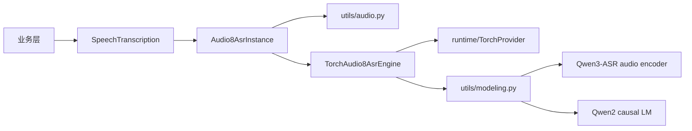

# Audio8-ASR 0.1B SDK

状态：`首版已实现`

## 接入范围

模型来源固定为 `Audio8/Audio8-ASR-0.1B` 的 commit
`8487da63d581fa4fc9b5c60444cb57c3a523d7aa`。首版实现：

- `SpeechTranscription` capability；
- `base` variant；
- PyTorch MPS，并允许显式使用 CPU 或在 MPS 不可用时回退 CPU；
- 16 kHz 单声道预处理，支持本地文件与编码音频 bytes；
- 最长 30 秒短音频、贪心自回归解码；
- 显式下载、状态统计、完整性校验和删除。

该模型权重采用 `CC-BY-NC-4.0`，不能因为 hugging-mac 仓库采用 MIT 就忽略模型自身的非商业限制。

## 模型包结构

```text
models/audio8_asr/
├── __init__.py
├── config.py
├── definition.py
├── instance.py
├── model.yaml
├── resources.py
├── torch.py
└── utils/
    ├── __init__.py
    ├── audio.py
    ├── audio_encoder.py
    ├── modeling.py
    └── types.py
```

根目录文件遵循统一 model pack 约定。音频解码、Qwen3-ASR 兼容编码器、Audio8 投影结构和生成逻辑均为该
模型私有实现，因此留在 `utils/`。`torch.py` 只负责 PyTorch provider、device/dtype、tokenizer/feature
extractor 和模型会话的装配；公开 instance 不暴露 torch tensor。



## 不执行远端代码

Hugging Face snapshot 只下载：

```text
model.safetensors
*.json
```

上游仓库中的 `configuration_arkasr.py`、`modeling_arkasr.py`、`processing_arkasr.py` 等 Python 文件不会
进入本地模型资源，也不会通过 `trust_remote_code=True` 执行。SDK 自己读取 JSON，构建音频编码器、
Qwen2 language model、MLP tower 与 projector。下载后会校验：

- 必需 JSON/tokenizer 文件完整；
- `model.safetensors` SHA-256；
- `config.json` 的 `model_type`。

## 安装与使用

安装 ASR 可选依赖：

```bash
uv sync --extra asr
```

注册、下载并加载：

```python
from pathlib import Path

from hugging_mac_sdk import AudioInput, ModelSdk, TranscriptionRequest
from hugging_mac_sdk.capabilities import SpeechTranscription
from hugging_mac_sdk.models.audio8_asr import register_audio8_asr

sdk = ModelSdk()
register_audio8_asr(sdk.registry)
options = {"model_home": Path("models")}

await sdk.resources.download_source(
    "audio8/audio8-asr-0.1b",
    variant="base",
    options=options,
)
handle = await sdk.load(
    "audio8/audio8-asr-0.1b",
    variant="base",
    runtime="pytorch-mps",
    options=options,
)
asr = handle.require(SpeechTranscription)
result = await asr.transcribe(
    TranscriptionRequest(audio=AudioInput(path=Path("sample.wav")))
)
print(result.text)
await handle.close()
```

`load()` 不会隐式下载模型。若资源缺失或校验失败，错误从 SDK 资源/加载层抛出，业务层只需要捕获稳定的
`HuggingMacSdkError` 层级。

## 当前边界

- 模型用于短音频，超过 30 秒的输入会截断；
- 首版只返回整段文本，不声明词级时间戳或分段；
- 当前不提供 Core ML/ONNX 转换；如后续接入官方 ONNX 图，应作为独立 runtime 实现和 artifact 管理，
  不能把 ONNX 推理塞进 `torch.py`；
- `auto` dtype 在 MPS 使用 FP16，在 CPU 使用 FP32；调用方可显式选择 BF16、FP16 或 FP32。
- PyTorch MPS 暂不支持非整除尺寸的 `adaptive_avg_pool1d`。实现仅把音频编码后的少量特征送到 CPU 做
  等价 pooling，再立即返回 MPS；音频编码器和语言模型不会因此回退到 CPU。
