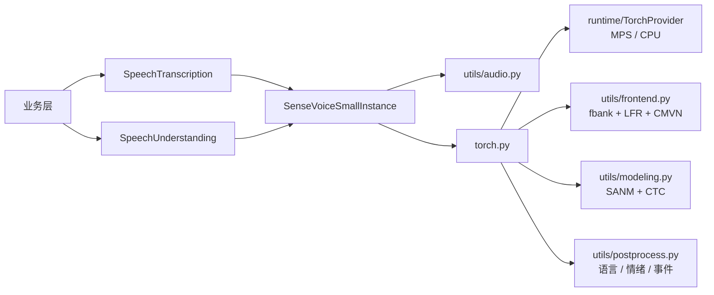

# SenseVoiceSmall SDK

状态：`PyTorch MPS runtime 已实现`

## 接入范围

模型来源固定为 `FunAudioLLM/SenseVoiceSmall` 的 commit
`3847d57b6bdf2dd8875cb1508d2af43d80a16bf7`。当前模型包提供：

- 通用 `SpeechTranscription` capability；
- 富语音理解 `SpeechUnderstanding` capability；
- `small` variant；
- PyTorch MPS，并允许显式使用 CPU 或在 MPS 不可用时回退 CPU；
- 语音转写、语种识别、情绪识别和音频事件识别；
- 16 kHz 单声道 Kaldi fbank、LFR 与 CMVN 前端；
- 最长 30 秒短音频、非自回归 SANM + CTC 推理；
- 显式下载、状态统计、SHA-256 完整性校验和删除。

上游说明模型训练覆盖 50 多种语言。当前公开请求中的语言提示限定为
`auto/zh/en/yue/ja/ko/nospeech`，这与原始 checkpoint 的查询 token 一致；使用 `auto` 时仍可识别训练
覆盖范围内的其他语言。

模型权重使用 `FunASR Model Open Source License Agreement 1.1`，不是 hugging-mac 仓库的 MIT
许可证。分发和使用模型时必须单独遵守模型许可，包括保留来源、作者和模型名称等要求。

## 模型包结构

```text
models/sensevoice_small/
├── __init__.py
├── config.py
├── definition.py
├── instance.py
├── model.yaml
├── resources.py
├── torch.py
└── utils/
    ├── __init__.py
    ├── audio.py
    ├── frontend.py
    ├── modeling.py
    ├── postprocess.py
    └── types.py
```

根目录文件遵循统一 model pack 约定。`torch.py` 只装配 PyTorch provider、device/dtype、tokenizer 和本地
模型实现；音频解码、特征前端、SANM 图、CTC 解码与富标记解析全部内聚在该模型的 `utils/` 中。模型不依赖
FunASR，也不执行 Hugging Face 仓库里的远端 Python。



## 资源与安全边界

Hugging Face snapshot 只下载：

```text
model.pt
config.yaml
configuration.json
am.mvn
chn_jpn_yue_eng_ko_spectok.bpe.model
```

加载前校验 `model.pt` 与 tokenizer 的 SHA-256、必需文件完整性和 framework 元数据。SDK 根据固定配置在
本地构造仅推理 SANM 网络，并用 checkpoint 的所有参数名做严格匹配；不会导入上游仓库 Python 文件，也不使用
`trust_remote_code=True`。

`model.pt` 是 PyTorch pickle 容器。它只允许来自固定 revision 和固定 hash 的已注册来源，不能把任意第三方
`.pt` 文件视为安全模型资源。

## 安装与使用

安装 ASR 可选依赖：

```bash
uv sync --extra asr
```

注册并显式下载：

```python
from pathlib import Path

from hugging_mac_sdk import ModelSdk
from hugging_mac_sdk.models.sensevoice_small import register_sensevoice_small

sdk = ModelSdk()
register_sensevoice_small(sdk.registry)
options = {"model_home": Path("models")}

await sdk.resources.download_source(
    "funaudiollm/sensevoice-small",
    variant="small",
    options=options,
)
```

作为普通 ASR 使用：

```python
from hugging_mac_sdk import AudioInput, TranscriptionRequest
from hugging_mac_sdk.capabilities import SpeechTranscription

handle = await sdk.load(
    "funaudiollm/sensevoice-small",
    variant="small",
    runtime="pytorch-mps",
    options=options,
)
asr = handle.require(SpeechTranscription)
result = await asr.transcribe(
    TranscriptionRequest(audio=AudioInput(path=Path("sample.wav")))
)
print(result.text)
await handle.close()
```

取得结构化语音理解结果：

```python
from hugging_mac_sdk import AudioInput, SpeechUnderstandingRequest
from hugging_mac_sdk.capabilities import SpeechUnderstanding

handle = await sdk.load(
    "funaudiollm/sensevoice-small",
    runtime="pytorch-mps",
    options=options,
)
understanding = handle.require(SpeechUnderstanding)
result = await understanding.understand_speech(
    SpeechUnderstandingRequest(
        audio=AudioInput(path=Path("sample.wav")),
        language="auto",
        use_itn=True,
    )
)
print(result.text)
print(result.languages, result.emotion, result.events)
print(result.raw_text)
await handle.close()
```

`text` 是移除控制 token 后的可读文本，可能包含情绪或事件 emoji；`raw_text` 保留模型原始富标记；
`languages`、`emotion` 和 `events` 提供业务层可直接消费的结构化值。通用 `SpeechTranscription` 只返回文本，
因此既有 ASR 应用不必理解 SenseVoice 的扩展字段。

## 当前边界

- 当前只有原始 PyTorch MPS runtime，没有声明 Core ML 或 ONNX 转换；
- 输入超过 30 秒时截断，长音频应由业务层先执行 VAD/切片；
- 当前不提供词级时间戳、说话人分离或流式增量解码；
- MPS 默认使用 FP16，CPU 默认使用 FP32；
- `fbank_dither` 默认设为 `0` 以保证 demo 与评估可复现，调用方可显式调整；
- 非自回归模型适合短音频低延迟识别，但业务层仍应限制并发实例数量和总内存。

## 上游资料

- [SenseVoiceSmall 模型页](https://huggingface.co/FunAudioLLM/SenseVoiceSmall)
- [FunASR Model Open Source License Agreement 1.1](https://github.com/modelscope/FunASR/blob/main/MODEL_LICENSE)
