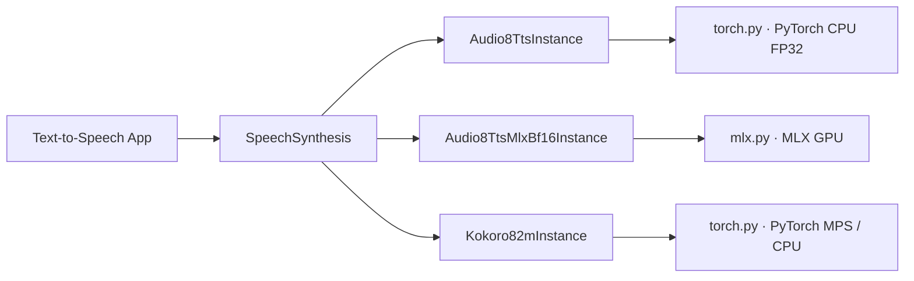

# TTS SDK 与 Text-to-Speech 应用

状态：`Audio8-TTS PyTorch CPU、Audio8-TTS MLX BF16、Kokoro PyTorch MPS 及本地 Web 应用已实现`

## 统一契约

三个模型包均通过 `SpeechSynthesis` capability 提供语音合成，而不是让应用层依赖具体模型类。公共请求
`SpeechSynthesisRequest` 包含文本、可选 voice、language、speed，以及仅在模型支持时使用的参考音频和
参考文本；响应统一返回小端 `f32le` 单声道 waveform、采样率、时长、生成 token 数和分阶段耗时。

这条边界意味着：业务层可在不接触 torch tensor、Core ML feature 或模型私有 processor 的条件下切换模型。
Kokoro 不支持参考音频克隆，会明确返回 `InferenceError`；Audio8-TTS 支持参考音频与参考文本配对的克隆。



## 模型包与职责

三个模型包均遵守 [模型 SDK](02-model-sdk.md) 的“一模型一目录”约定：根目录只保留 manifest、配置、
definition、runtime 无关 instance、实际支持的 runtime engine、converter 和资源管理；模型专属类型、
对齐、加载器及转换 wrapper 放在该模型自己的 `utils/`。三个包不相互导入，也不将 framework 对象泄露到
公共 schema。

```text
models/audio8_tts/
├── __init__.py      # 仅导出 definition、manifest、register_audio8_tts
├── model.yaml       # 固定 revision、来源、许可证、runtime、artifact
├── config.py        # variant/runtime/dtype/resource 配置
├── definition.py    # factory 与 registry 注册
├── instance.py      # SpeechSynthesis 生命周期和 engine 编排
├── resources.py     # 下载、SHA-256 校验、状态、删除
├── torch.py         # Audio8 的 PyTorch CPU FP32 engine
└── utils/types.py   # 私有 engine 输出

models/audio8_tts_mlx_bf16/
├── __init__.py      # 仅导出 definition、manifest、register_audio8_tts_mlx_bf16
├── model.yaml       # 固定 MLX Community revision、BF16 variant 与 artifact
├── config.py        # MLX GPU runtime、模型/音色资源配置
├── definition.py    # 独立 model ID、factory 与 registry 注册
├── instance.py      # SpeechSynthesis 生命周期和串行 engine 编排
├── resources.py     # MLX snapshot 校验、状态、下载和删除
├── mlx.py           # mlx-audio ArkTTS engine 与取消边界
└── utils/           # reference voice profile 与私有类型

models/kokoro_82m/
├── __init__.py      # 仅导出 definition、manifest、register_kokoro_82m
├── model.yaml       # 固定 revision、来源、许可证、两种 artifact
├── config.py        # runtime、Core ML compute unit、voice 默认值
├── definition.py    # runtime factory、converter 与 registry 注册
├── instance.py      # SpeechSynthesis 生命周期和 engine 编排
├── resources.py     # 下载、校验、转换、状态、删除
├── torch.py         # Kokoro 的 PyTorch MPS / CPU engine
└── utils/           # phonemizer、voice、私有类型
```

### Audio8 TTS Preview 0.6B

- model ID：`audio8/audio8-tts-preview-0.6b`；variant：`preview`；输出：44.1 kHz；
- 仅声明 PyTorch CPU FP32 runtime。MPS 会使自回归采样不稳定，可能无法生成 EOS、跑满 1024 frame
  上限（约 47.6 秒）并产生无效 codec 音频，因此 manifest 和配置层都会拒绝 MPS；
- `dtype="auto"` 固定解析为 FP32；不暴露 FP16/BF16 或 Core ML 转换入口；
- Transformers 5 的自定义模型快速初始化会跳过 ArkTTS 的非持久化 RoPE buffer，未修复时表现为始终
  跑满 frame 上限并输出低振幅噪声。SDK 在权重加载后按固定模型配置重建 Slow/Fast AR 的 RoPE buffer，
  并拒绝包含非有限值的结果；
- 模型为上游自定义 ArkTTS 架构，加载时使用 `trust_remote_code=True`。SDK 只下载固定 Hugging Face
  revision 的允许文件集合，并校验 `model.safetensors` 与 `codec.pth` 的 SHA-256；因此调用方仍应把本地
  snapshot 当作受信任模型资源，不可替换为任意目录。

### Kokoro 82M

- model ID：`mlx-community/kokoro-82m-bf16`；variant：`bf16`；MLX BF16；输出：24 kHz；
- 仅提供 MLX GPU runtime，使用仓库内置 safetensors voices，不提供 Core ML 或 PyTorch fallback；

### Qwen3-TTS 12Hz 0.6B Base MLX 4-bit

- model ID：`mlx-community/qwen3-tts-12hz-0.6b-base-4bit`；variant：`4bit`；输出：24 kHz；
- 使用 MLX 4-bit talker 和 12.5 Hz speech tokenizer；
- Base 模型支持普通文本合成，也支持同时传入 `reference_audio + reference_text` 进行声音克隆；
- 仅提供 Apple Silicon MLX GPU runtime，不执行本地格式转换；
- 固定 MLX Community revision `0d6bb6f`，资源清单包含根模型、BPE tokenizer 与独立 speech tokenizer。

### Audio8 TTS Preview 0.6B MLX BF16

- model ID：`mlx-community/audio8-tts-preview-0.6b-bf16`；variant：`bf16`；输出：44.1 kHz；
- 固定 MLX Community commit `f7be312aaaed724b6ecb8e916b21c9fd0842db02`；
- DualAR language model 使用 BF16，codec 使用 FP32，在 Apple Silicon GPU 和统一内存上执行；
- 合成需要 `reference_audio + reference_text`，或者 `voice` 指向此前由同一模型保存的 profile。请求同时提供
  reference 与 voice 时会保存并覆盖该名称的本地 profile；也支持不传参考音频时使用模型默认音色；
- 模型与 codec 权重约 2.55 GB，不再注册或支持原 ONNX INT4 CPU model pack。

## 安装、下载与调用

安装 TTS 可选依赖：

```bash
uv sync --package hugging-mac-sdk --extra tts
```

Audio8 的最小调用：

```python
from pathlib import Path

from hugging_mac_sdk import ModelSdk, SpeechSynthesisRequest
from hugging_mac_sdk.capabilities import SpeechSynthesis
from hugging_mac_sdk.models.audio8_tts import register_audio8_tts

sdk = ModelSdk()
register_audio8_tts(sdk.registry)
options = {"model_home": Path("models")}

await sdk.resources.download_source(
    "audio8/audio8-tts-preview-0.6b",
    variant="preview",
    options=options,
)
handle = await sdk.load(
    "audio8/audio8-tts-preview-0.6b",
    runtime="pytorch",
    options=options,
)
speech = await handle.require(SpeechSynthesis).synthesize(
    SpeechSynthesisRequest(text="Hello from Audio8.")
)
await handle.close()
```

Kokoro 直接以 PyTorch MPS 运行：

```python
from hugging_mac_sdk import ArtifactFormat
from hugging_mac_sdk.models.kokoro_82m import register_kokoro_82m

register_kokoro_82m(sdk.registry)
await sdk.resources.download_source("mlx-community/kokoro-82m-bf16", options=options)
```

Audio8 MLX BF16 使用独立注册项，并支持参考音频或已保存 voice profile：

```python
from hugging_mac_sdk.models.audio8_tts_mlx_bf16 import register_audio8_tts_mlx_bf16
from hugging_mac_sdk.schemas.transcription import AudioInput

register_audio8_tts_mlx_bf16(sdk.registry)
model_id = "mlx-community/audio8-tts-preview-0.6b-bf16"
await sdk.resources.download_source(model_id, variant="bf16", options=options)
handle = await sdk.load(model_id, runtime="mlx", options=options)
speech = await handle.require(SpeechSynthesis).synthesize(
    SpeechSynthesisRequest(
        text="你好，这是 MLX BF16 版本。",
        voice="speaker_a",
        reference_audio=AudioInput(path=Path("reference.wav")),
        reference_text="参考录音对应的准确原文。",
        max_new_tokens=256,
    )
)
await handle.close()
```

## Web 应用

`apps/web/backend/src/hugging_mac_web/text_to_speech/` 是独立 App blueprint，前端位于
`apps/web/frontend/src/text_to_speech/`。页面支持文本输入、Audio8 PyTorch / Audio8 MLX BF16 / Kokoro
切换、资源下载、加载和 WAV 播放。MLX 模式可上传参考音频、填写准确原文并命名 voice profile；
首次合成保存 profile，后续可直接选择 Saved Profile 复用。官方 artifact 已是 MLX，因此该模式只提供下载，
不显示转换步骤。
API 仅接收/返回 Web schema；服务层将 SDK 的 `f32le` waveform 编码为 WAV，浏览器
不需要理解模型格式。

Kokoro 页面始终使用 PyTorch MPS source artifact；Audio8 MLX 页面直接使用 MLX model artifact。

## 当前边界

- Audio8 的 Core ML runtime 和转换器尚未实现；
- Audio8 MLX BF16 使用 Apple GPU，不声明 Neural Engine 支持；
- Kokoro 不提供 Core ML 转换；
- 三个 engine 都对单个 instance 串行化合成；Audio8 的默认 CPU 推理优先正确性而非低延迟，并发请求应由
  应用层排队或创建受控实例；
- Web 应用目前输出 WAV 下载/播放，不持久化用户文本、参考音频或生成音频。

## 上游资料

- [Audio8 TTS Preview 0.6B](https://huggingface.co/Audio8/Audio8-TTS-Preview-0.6b)
- [Audio8 TTS Preview 0.6B MLX BF16](https://huggingface.co/mlx-community/Audio8-TTS-Preview-0.6b-bf16)
- [Kokoro 82M MLX BF16](https://huggingface.co/mlx-community/Kokoro-82M-bf16)
