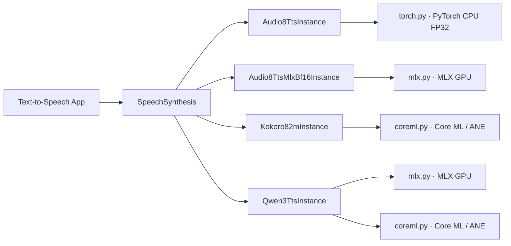

# TTS SDK 与 Text-to-Speech 应用

状态：`Audio8-TTS PyTorch/MLX、Kokoro Core ML、Qwen3-TTS MLX/Core ML 及本地 Web 应用已实现`

## 统一契约

三个模型包均通过 `SpeechSynthesis` capability 提供语音合成，而不是让应用层依赖具体模型类。公共请求
`SpeechSynthesisRequest` 包含文本、可选 voice、language、speed，以及仅在模型支持时使用的参考音频和
参考文本；响应统一返回小端 `f32le` 单声道 waveform、采样率、时长、生成 token 数和分阶段耗时。

这条边界意味着：业务层可在不接触 torch tensor、Core ML feature 或模型私有 processor 的条件下切换模型。
Kokoro 不支持参考音频克隆，会明确返回 `InferenceError`；Audio8-TTS 支持参考音频与参考文本配对的克隆。



## 模型包与职责

三个模型包均遵守 [模型 SDK](02-model-sdk.md) 的“一模型一目录”约定：根目录只保留 manifest、配置、
definition、runtime 无关 instance、实际支持的 runtime engine、converter 和资源管理；模型专属类型、
对齐、加载器及转换 wrapper 放在该模型自己的 `utils/`。三个包不相互导入，也不将 framework 对象泄露到
公共 schema。

```text
models/audio8_tts/
├── __init__.py      # 仅导出 definition、manifest、register_audio8_tts
├── model.yaml       # 固定 revision、来源、许可证、runtime、artifact
├── config.py        # variant/runtime/dtype/resource 配置
├── definition.py    # factory 与 registry 注册
├── instance.py      # SpeechSynthesis 生命周期和 engine 编排
├── resources.py     # 下载、SHA-256 校验、状态、删除
├── torch.py         # Audio8 的 PyTorch CPU FP32 engine
├── mlx.py           # Audio8 的 MLX engine
├── mlx_resources.py # MLX artifact 解析与校验
└── utils/types.py   # 私有 engine 输出

models/kokoro/
├── __init__.py      # 仅导出 definition、manifest、register_kokoro
├── model.yaml       # 固定 revision、来源、许可证、两种 artifact
├── config.py        # runtime、Core ML compute unit、voice 默认值
├── definition.py    # runtime factory 与 registry 注册
├── instance.py      # SpeechSynthesis 生命周期和 engine 编排
├── resources.py     # PyTorch/Core ML 下载、校验、状态、删除
├── coreml.py        # 预编译端到端 Core ML engine
├── torch.py         # Kokoro 的 PyTorch MPS / CPU engine
└── utils/           # phonemizer、voice、私有类型

models/qwen3_tts/
├── __init__.py      # 仅导出 definition、manifest、register_qwen3_tts
├── model.yaml       # MLX 与 aufklarer Core ML 的固定 revision
├── config.py        # runtime、资源路径和 Core ML compute unit
├── definition.py    # 两种 runtime factory 与 registry 注册
├── instance.py      # 统一 SpeechSynthesis 生命周期
├── resources.py     # 两种 runtime 共享 tokenizer 与 Core ML bundle
├── mlx.py           # MLX 4-bit 声音克隆 engine
├── coreml.py        # 六模型 MLState/ANE 合成 engine
└── utils/           # Core ML BPE tokenizer 与私有输出类型
```

### Audio8 TTS Preview 0.6B

- model ID：`audio8/audio8-tts-preview`；variant：`preview`；输出：44.1 kHz；
- 仅声明 PyTorch CPU FP32 runtime。MPS 会使自回归采样不稳定，可能无法生成 EOS、跑满 1024 frame
  上限（约 47.6 秒）并产生无效 codec 音频，因此 manifest 和配置层都会拒绝 MPS；
- `dtype="auto"` 固定解析为 FP32；不暴露 FP16/BF16 或 Core ML 转换入口；
- Transformers 5 的自定义模型快速初始化会跳过 ArkTTS 的非持久化 RoPE buffer，未修复时表现为始终
  跑满 frame 上限并输出低振幅噪声。SDK 在权重加载后按固定模型配置重建 Slow/Fast AR 的 RoPE buffer，
  并拒绝包含非有限值的结果；
- 模型为上游自定义 ArkTTS 架构，加载时使用 `trust_remote_code=True`。SDK 只下载固定 Hugging Face
  revision 的允许文件集合，并校验 `model.safetensors` 与 `codec.pth` 的 SHA-256；因此调用方仍应把本地
  snapshot 当作受信任模型资源，不可替换为任意目录。

### Kokoro 82M

- model ID：`hexgrad/kokoro`；variant：`v1.0`；输出：24 kHz；
- 默认下载并运行固定 revision 的 `aufklarer/Kokoro-82M-CoreML`，端到端模型每次最多处理 128 个
  phoneme 和 5 秒音频，长文本由 SDK 分段；官方 PyTorch MPS/CPU runtime 仍可选；

### Qwen3-TTS 12Hz 0.6B Base

- model ID：`qwen/qwen3-tts-12hz`；variant：`0.6b-base`；输出：24 kHz；
- MLX runtime 使用 4-bit talker 和 12.5 Hz speech tokenizer；Base 模型可通过
  `reference_audio + reference_text` 声音克隆；
- Core ML runtime 直接下载 `aufklarer/Qwen3-TTS-CoreML` revision
  `66ca03b95a684d45e020b1d2d5c3ab34a48356f9`，不执行本地转换；bundle 包含六个 `.mlmodelc`、
  BPE tokenizer、固定 speaker 与 TTS BOS/EOS/PAD embedding；
- 三个 embedding graph 固定走 CPU 以维持 FP32 累加，`CodeDecoder`、`MultiCodeDecoder` 和
  `SpeechDecoder` 默认走 CPU + Neural Engine；两个自回归 decoder 使用 Core ML `MLState` KV cache；
- Core ML 输出最长 125 codec 帧（约 10 秒），支持中、英、德、意、葡、西、日、韩、法、俄十种语言及
  bundle 默认音色，不支持参考音频克隆或 speed 调节，并要求 macOS 15+；
- MLX 固定 revision `0d6bb6f`，使用独立的 MLX-scoped BPE/speech tokenizer artifact。

### Audio8 TTS Preview 0.6B MLX BF16

- model ID：`audio8/audio8-tts-preview`；variant：`0.6b-preview`；runtime：`mlx`；输出：44.1 kHz；
- 固定 MLX Community commit `f7be312aaaed724b6ecb8e916b21c9fd0842db02`；
- DualAR language model 使用 BF16，codec 使用 FP32，在 Apple Silicon GPU 和统一内存上执行；
- 合成需要 `reference_audio + reference_text`，或者 `voice` 指向此前由同一模型保存的 profile。请求同时提供
  reference 与 voice 时会保存并覆盖该名称的本地 profile；也支持不传参考音频时使用模型默认音色；
- 模型与 codec 权重约 2.55 GB，不再注册或支持原 ONNX INT4 CPU model pack。

## 安装、下载与调用

安装 TTS 可选依赖：

```bash
uv sync --package hugging-mac-sdk --extra tts
```

Audio8 的最小调用：

```python
from pathlib import Path

from hugging_mac_sdk import ModelSdk, SpeechSynthesisRequest
from hugging_mac_sdk.capabilities import SpeechSynthesis
from hugging_mac_sdk.models.audio8_tts import register_audio8_tts

sdk = ModelSdk()
register_audio8_tts(sdk.registry)
options = {"model_home": Path("models")}

await sdk.resources.download_source(
    "audio8/audio8-tts-preview",
    variant="0.6b-preview",
    options=options,
)
handle = await sdk.load(
    "audio8/audio8-tts-preview",
    runtime="pytorch",
    options=options,
)
speech = await handle.require(SpeechSynthesis).synthesize(
    SpeechSynthesisRequest(text="Hello from Audio8.")
)
await handle.close()
```

Kokoro 下载并运行预编译 Core ML artifact：

```python
from hugging_mac_sdk.models.kokoro import register_kokoro

register_kokoro(sdk.registry)
await sdk.resources.download_source("hexgrad/kokoro", variant="v1.0", options=options)

handle = await sdk.load(
    "hexgrad/kokoro",
    runtime="coreml",
    options=options,
)
```

Kokoro Core ML 产物来自固定 revision 的 `aufklarer/Kokoro-82M-CoreML`，通过普通模型资源下载
获得，不再执行本地转换。PyTorch 与 Core ML runtime 仍可独立选择。

Audio8 MLX BF16 是同一 Audio8-TTS 模型的 runtime artifact，并支持参考音频或已保存 voice profile：

```python
from hugging_mac_sdk.models.audio8_tts import register_audio8_tts
from hugging_mac_sdk.schemas.transcription import AudioInput

register_audio8_tts(sdk.registry)
model_id = "audio8/audio8-tts-preview"
await sdk.resources.download_source(model_id, variant="0.6b-preview", options=options)
handle = await sdk.load(model_id, runtime="mlx", options=options)
speech = await handle.require(SpeechSynthesis).synthesize(
    SpeechSynthesisRequest(
        text="你好，这是 MLX BF16 版本。",
        voice="speaker_a",
        reference_audio=AudioInput(path=Path("reference.wav")),
        reference_text="参考录音对应的准确原文。",
        max_new_tokens=256,
    )
)
await handle.close()
```

Qwen3-TTS Core ML bundle 可直接下载并选择 Neural Engine runtime：

```python
from hugging_mac_sdk.models.qwen3_tts import register_qwen3_tts

register_qwen3_tts(sdk.registry)
model_id = "qwen/qwen3-tts-12hz"
coreml_options = options | {"runtime": "coreml"}
await sdk.resources.download_source(
    model_id,
    variant="0.6b-base",
    options=coreml_options,
)
handle = await sdk.load(
    model_id,
    variant="0.6b-base",
    runtime="coreml",
    options=options,
)
speech = await handle.require(SpeechSynthesis).synthesize(
    SpeechSynthesisRequest(text="Hello from the Neural Engine.", language="english")
)
await handle.close()
```

## Web 应用

`apps/web/backend/src/hugging_mac_web/text_to_speech/` 是独立 App blueprint，前端位于
`apps/web/frontend/src/text_to_speech/`。页面支持文本输入、Audio8、Kokoro、Qwen3-TTS 及其可用 runtime
切换、资源下载、加载和 WAV 播放。支持声音克隆的 MLX 模式可上传参考音频、填写准确原文并命名 voice profile；
首次合成保存 profile，后续可直接选择 Saved Profile 复用。官方 artifact 已是 MLX，因此该模式只提供下载，
不显示转换步骤。
API 仅接收/返回 Web schema；服务层将 SDK 的 `f32le` waveform 编码为 WAV，浏览器
不需要理解模型格式。

Kokoro 与 Qwen3-TTS Core ML 都使用可直接下载的预编译 artifact；Audio8 MLX 直接使用 MLX model artifact。

## 本机性能记录

以下数据记录于 2026-08-16，均来自同一台 Mac 上的本地 Web 应用，使用相同输入文本：

> Every voice carries a different texture. Today, the whole studio runs locally on this Mac.

“音频时长”是生成 WAV 的播放时长，“合成耗时”是页面显示的单次推理耗时。测试未记录 Mac 型号、
芯片、内存、系统版本、模型冷/热启动状态及 Audio8 自动选择的具体音色，因此这些数据仅用于本机同批次的
粗略对比，不作为跨设备基准。

| 模型 | Runtime | Voice | 运行序号 | 音频时长 | 合成耗时 |
| --- | --- | --- | ---: | ---: | ---: |
| Kokoro | PyTorch MPS | `af_heart` | 1 | 5.9 s | 409 ms |
| Kokoro | PyTorch MPS | `af_heart` | 2 | 5.9 s | 414 ms |
| Kokoro | Core ML | `af_heart` | 1 | 4.7 s | 198 ms |
| Kokoro | Core ML | `af_heart` | 2 | 4.7 s | 220 ms |
| Audio8 TTS | MLX | automatic voice | 1 | 5.7 s | 3,943 ms |
| Audio8 TTS | MLX | automatic voice | 2 | 5.8 s | 4,094 ms |
| Audio8 TTS | MLX | automatic voice | 3 | 5.3 s | 4,782 ms |
| Audio8 TTS | PyTorch | automatic voice | 1 | 5.9 s | 12,825 ms |
| Audio8 TTS | PyTorch | automatic voice | 2 | 6.0 s | 15,238 ms |

同批次算术平均值：

| 模型 | Runtime | 运行次数 | 平均音频时长 | 平均合成耗时 | 平均实时系数（RTF） |
| --- | --- | ---: | ---: | ---: | ---: |
| Kokoro | PyTorch MPS | 2 | 5.90 s | 411.5 ms | 0.070 |
| Kokoro | Core ML | 2 | 4.70 s | 209.0 ms | 0.044 |
| Audio8 TTS | MLX | 3 | 5.60 s | 4,273.0 ms | 0.763 |
| Audio8 TTS | PyTorch | 2 | 5.95 s | 14,031.5 ms | 2.358 |

RTF 按同组的 `平均合成耗时 / 平均音频时长` 计算；小于 1 表示生成速度快于实时播放。

## 当前边界

- Audio8 的 Core ML runtime 和转换器尚未实现；
- Audio8 MLX BF16 使用 Apple GPU，不声明 Neural Engine 支持；
- Kokoro 默认使用可直接下载的端到端 Core ML runtime，PyTorch MPS 保留为可选 runtime；
- 每个 engine 都对单个 instance 串行化合成；Audio8 的默认 CPU 推理优先正确性而非低延迟，并发请求应由
  应用层排队或创建受控实例；
- Web 应用目前输出 WAV 下载/播放，不持久化用户文本、参考音频或生成音频。

## 上游资料

- [Audio8 TTS Preview 0.6B](https://huggingface.co/Audio8/Audio8-TTS-Preview-0.6b)
- [Audio8 TTS Preview 0.6B MLX BF16](https://huggingface.co/mlx-community/Audio8-TTS-Preview-0.6b-bf16)
- [Kokoro 82M](https://huggingface.co/hexgrad/Kokoro-82M)
- [Kokoro 82M Core ML](https://huggingface.co/aufklarer/Kokoro-82M-CoreML)
- [Qwen3-TTS Core ML](https://huggingface.co/aufklarer/Qwen3-TTS-CoreML)
