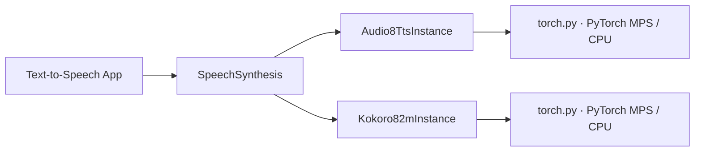

# TTS SDK 与 Text-to-Speech 应用

状态：`Audio8-TTS PyTorch、Kokoro PyTorch MPS 及本地 Web 应用已实现`

## 统一契约

两个模型均通过 `SpeechSynthesis` capability 提供语音合成，而不是让应用层依赖具体模型类。公共请求
`SpeechSynthesisRequest` 包含文本、可选 voice、language、speed，以及仅在模型支持时使用的参考音频和
参考文本；响应统一返回小端 `f32le` 单声道 waveform、采样率、时长、生成 token 数和分阶段耗时。

这条边界意味着：业务层可在不接触 torch tensor、Core ML feature 或模型私有 processor 的条件下切换模型。
Kokoro 不支持参考音频克隆，会明确返回 `InferenceError`；Audio8-TTS 支持参考音频与参考文本配对的克隆。



## 模型包与职责

两个模型包均遵守 [模型 SDK](02-model-sdk.md) 的“一模型一目录”约定：根目录只保留 manifest、配置、
definition、runtime 无关 instance、实际支持的 runtime engine、converter 和资源管理；模型专属类型、
对齐、加载器及转换 wrapper 放在该模型自己的 `utils/`。两个包不相互导入，也不将 framework 对象泄露到
公共 schema。

```text
models/audio8_tts/
├── __init__.py      # 仅导出 definition、manifest、register_audio8_tts
├── model.yaml       # 固定 revision、来源、许可证、runtime、artifact
├── config.py        # variant/runtime/dtype/resource 配置
├── definition.py    # factory 与 registry 注册
├── instance.py      # SpeechSynthesis 生命周期和 engine 编排
├── resources.py     # 下载、SHA-256 校验、状态、删除
├── torch.py         # Audio8 的 PyTorch MPS / CPU engine
└── utils/types.py   # 私有 engine 输出

models/kokoro_82m/
├── __init__.py      # 仅导出 definition、manifest、register_kokoro_82m
├── model.yaml       # 固定 revision、来源、许可证、两种 artifact
├── config.py        # runtime、Core ML compute unit、voice 默认值
├── definition.py    # runtime factory、converter 与 registry 注册
├── instance.py      # SpeechSynthesis 生命周期和 engine 编排
├── resources.py     # 下载、校验、转换、状态、删除
├── torch.py         # Kokoro 的 PyTorch MPS / CPU engine
└── utils/           # phonemizer、voice、私有类型
```

### Audio8 TTS Preview 0.6B

- model ID：`audio8/audio8-tts-preview-0.6b`；variant：`preview`；输出：44.1 kHz；
- 使用 PyTorch runtime，默认在 CPU FP32 上运行以保证生成稳定性；调用方可显式请求 MPS，但该路径当前是
  实验性的，不提供 Core ML 转换按钮；
- `dtype="auto"` 在 CPU 上使用 FP32，在显式 MPS 上使用 checkpoint 的 BF16；FP16 仅作为显式调试/资源
  选项，因为它会降低自回归采样稳定性，并可能导致模型未生成 EOS 而跑满 1024 frame 上限（约 47.6 秒）；
- 模型为上游自定义 ArkTTS 架构，加载时使用 `trust_remote_code=True`。SDK 只下载固定 Hugging Face
  revision 的允许文件集合，并校验 `model.safetensors` 与 `codec.pth` 的 SHA-256；因此调用方仍应把本地
  snapshot 当作受信任模型资源，不可替换为任意目录。

### Kokoro 82M

- model ID：`hexgrad/kokoro-82m`；variant：`v1.0`；输出：24 kHz；
- 仅提供 PyTorch MPS runtime；Core ML 转换曾因动态 predictor shape 导致不稳定的系统编译和进程退出，
  因此已移除，不再向用户暴露转换入口；

## 安装、下载与调用

安装 TTS 可选依赖：

```bash
uv sync --package hugging-mac-sdk --extra tts
```

Audio8 的最小调用：

```python
from pathlib import Path

from hugging_mac_sdk import ModelSdk, SpeechSynthesisRequest
from hugging_mac_sdk.capabilities import SpeechSynthesis
from hugging_mac_sdk.models.audio8_tts import register_audio8_tts

sdk = ModelSdk()
register_audio8_tts(sdk.registry)
options = {"model_home": Path("models")}

await sdk.resources.download_source(
    "audio8/audio8-tts-preview-0.6b",
    variant="preview",
    options=options,
)
handle = await sdk.load(
    "audio8/audio8-tts-preview-0.6b",
    runtime="pytorch-mps",
    options=options,
)
speech = await handle.require(SpeechSynthesis).synthesize(
    SpeechSynthesisRequest(text="Hello from Audio8.")
)
await handle.close()
```

Kokoro 直接以 PyTorch MPS 运行：

```python
from hugging_mac_sdk import ArtifactFormat
from hugging_mac_sdk.models.kokoro_82m import register_kokoro_82m

register_kokoro_82m(sdk.registry)
await sdk.resources.download_source("hexgrad/kokoro-82m", options=options)
```

## Web 应用

`apps/web/backend/src/hugging_mac_web/text_to_speech/` 是独立 App blueprint，前端位于
`apps/web/frontend/src/text_to_speech/`。页面支持文本输入、Audio8 / Kokoro 切换、资源下载、加载和 WAV 播放。
API 仅接收/返回 Web schema；服务层将 SDK 的 `f32le` waveform 编码为 WAV，浏览器
不需要理解模型格式。

Kokoro 页面始终使用 PyTorch MPS source artifact。

## 当前边界

- Audio8 的 Core ML runtime 和转换器尚未实现；
- Kokoro 不提供 Core ML 转换；
- 两个 engine 都对单个 instance 串行化合成；Audio8 的默认 CPU 推理优先正确性而非低延迟，并发请求应由
  应用层排队或创建受控实例；
- Web 应用目前输出 WAV 下载/播放，不持久化用户文本、参考音频或生成音频。

## 上游资料

- [Audio8 TTS Preview 0.6B](https://huggingface.co/Audio8/Audio8-TTS-Preview-0.6b)
- [Kokoro 82M](https://huggingface.co/hexgrad/Kokoro-82M)
