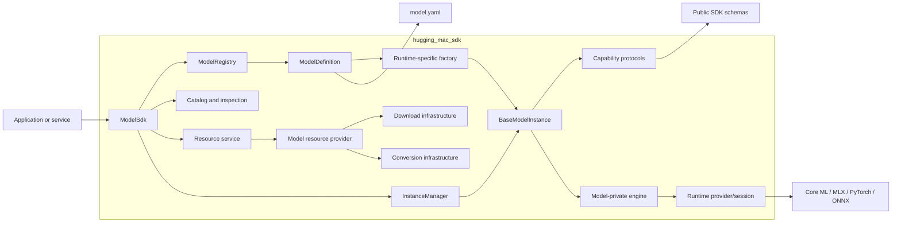
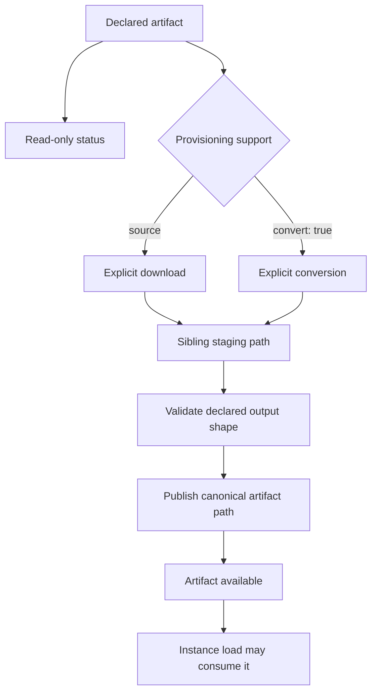
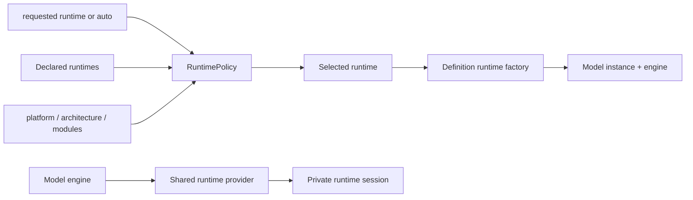
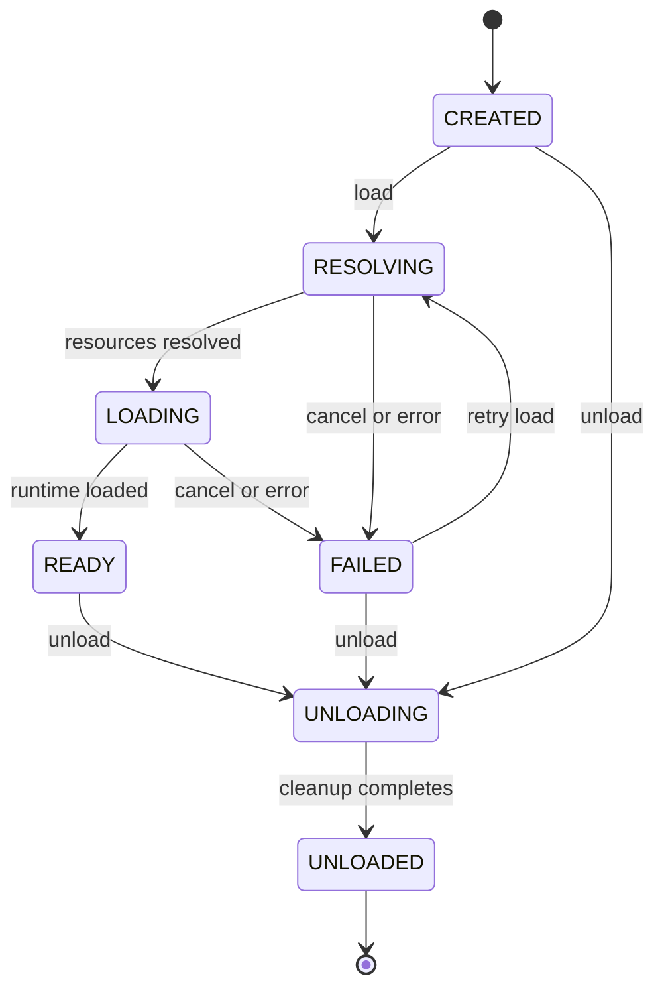
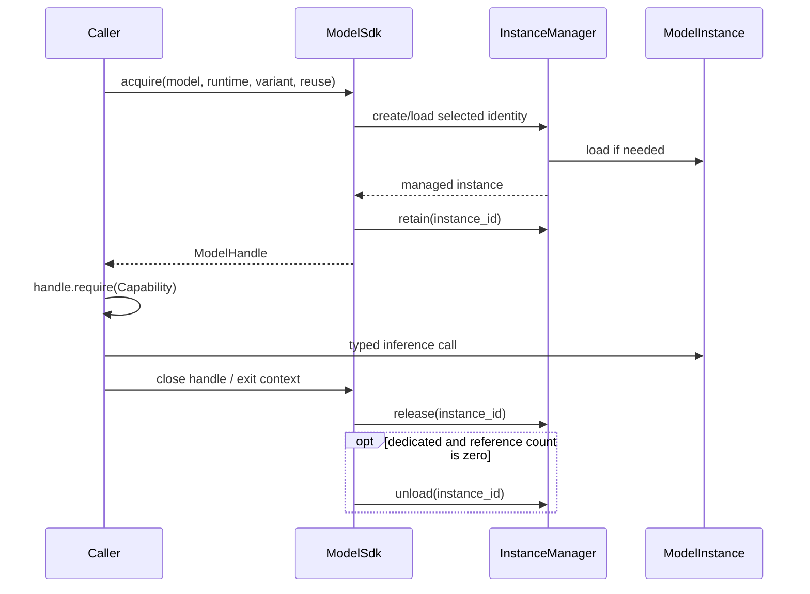
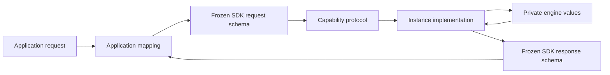
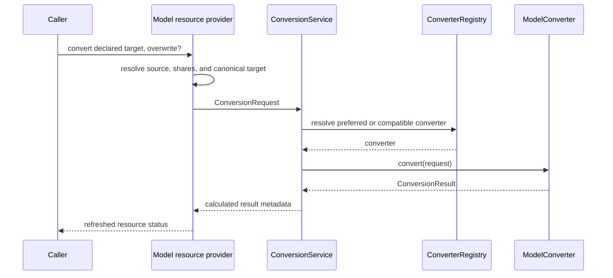

# Hugging Mac SDK Technical Architecture

## Summary

`hugging_mac_sdk` is the model integration, resource, lifecycle, and inference
layer of Hugging Mac. It provides one runtime-neutral contract over heterogeneous
Core ML, MLX, PyTorch, and ONNX model implementations.

The SDK is deliberately independent from the Web business layer. It knows model
identity, artifacts, runtime compatibility, instance state, and inference
capabilities. It does not know FastAPI routes, Vue components, App manifests,
browser sessions, application databases, or product workflows.

Public installation and calling examples belong in
[`docs/sdk`](../../docs/sdk/README.md). This document explains implementation
architecture, dependency direction, lifecycle, extension points, and review
invariants.



## Architectural goals and boundaries

The SDK exists to make model integration predictable without erasing meaningful
differences between models.

| Goal | Architectural consequence |
| --- | --- |
| Stable caller contract | Applications use typed capabilities and schemas rather than framework APIs. |
| Multiple runtime backends | Runtime selection and availability are separate from task semantics. |
| Explicit resource mutation | Catalog and load operations never silently download or convert artifacts. |
| Safe model reuse | Managed handles and reference counts separate ownership from instance identity. |
| Declarative model facts | Each package's `model.yaml` is the single source for model identity, variants, runtimes, and artifacts. |
| Optional heavy dependencies | Base imports and catalog discovery do not import or initialize every framework. |
| Inspectable state | Catalog, resource, structure, lifecycle, and health views are immutable snapshots. |
| Model-local specialization | Architecture-specific loading and inference stay inside the owning model package. |

The SDK does not provide a generic `predict(**kwargs)` abstraction. A task enters
the public surface only through a semantically named capability with typed input
and output. Framework tensors, processors, graph sessions, decoder caches, and
model-private paths remain below that boundary.

Dependency direction is one way:

```text
caller
  -> ModelSdk facade
    -> core registries/services/managers
      -> capability and schema contracts
      -> model definition
        -> model instance
          -> model-private engine
            -> shared runtime provider/session
```

Core modules never import application code. Runtime providers never import model
packages. A model package may use core, schema, capability, resource, converter,
and runtime infrastructure, but must not import another model package.

## Package architecture

```text
packages/hugging_mac_sdk/
├── README.md                         # This SDK-wide technical architecture
└── src/hugging_mac_sdk/
    ├── __init__.py                   # Curated public Python API
    ├── errors.py                     # Stable SDK error hierarchy
    ├── capabilities/                 # Task Protocol contracts
    ├── schemas/                      # Immutable public/infrastructure data
    ├── core/                         # Facade, definitions, lifecycle, catalog
    ├── resources/                    # Download, archive, hashing, safe staging
    ├── converters/                   # Converter contracts and selection
    ├── runtime/                      # Framework provider/session adapters
    └── models/                       # Canonical model integration packages
```

| Module | Owns | Does not own |
| --- | --- | --- |
| `core` | Registry, model definitions, runtime policy, resource dispatch, instances, handles, catalog, inspection | Model algorithms or HTTP behavior |
| `capabilities` | Stable task operations such as Chat, ASR, TTS, detection, pose, and segmentation | Lifecycle, resource preparation, transport |
| `schemas` | Frozen task, manifest, artifact, resource, catalog, and conversion contracts | Framework objects or application view models |
| `resources` | Source download, bounded streaming, safe extraction, staging, calculated metadata | Model-specific artifact selection or deletion policy |
| `converters` | Converter protocol, registration, selection, generic mechanics | Application conversion buttons or undeclared targets |
| `runtime` | Framework availability, device mapping, low-level session creation and inspection | Tokenization, task preprocessing, model IDs |
| `models` | Model composition, artifacts, engines, capabilities, model-specific conversion and inference | App routes, business profiles, frontend behavior |

Detailed module contracts are maintained beside their implementations:

| Area | Technical document |
| --- | --- |
| Core composition and lifecycle | [`core/readme.md`](src/hugging_mac_sdk/core/readme.md) |
| Capability contracts | [`capabilities/readme.md`](src/hugging_mac_sdk/capabilities/readme.md) |
| Public and infrastructure schemas | [`schemas/readme.md`](src/hugging_mac_sdk/schemas/readme.md) |
| Downloads and filesystem safety | [`resources/readme.md`](src/hugging_mac_sdk/resources/readme.md) |
| Conversion selection and publication | [`converters/readme.md`](src/hugging_mac_sdk/converters/readme.md) |
| Runtime providers and sessions | [`runtime/readme.md`](src/hugging_mac_sdk/runtime/readme.md) |
| Model package and `model.yaml` standard | [`models/readme.md`](src/hugging_mac_sdk/models/readme.md) |

## Central objects and ownership

| Object | Lifetime | Responsibility |
| --- | --- | --- |
| `ModelSdk` | Application/process scoped | Small facade composing registry, instance, resource, catalog, and inspection services |
| `ModelRegistry` | SDK scoped | Thread-safe store of immutable `ModelDefinition` objects keyed by model ID and revision |
| `ModelDefinition` | Registration scoped, immutable | Binds manifest/artifacts to runtime factories, resource provider, converter preferences, and inspectors |
| `RuntimePolicy` | SDK scoped | Ranks declared runtimes using caller preference and local machine availability |
| `ModelResourceService` | SDK scoped | Dispatches explicit resource operations and resolves required shared artifacts |
| `InstanceManager` | SDK scoped | Creates, reuses, loads, switches, retains, snapshots, and unloads instances |
| `BaseModelInstance` | Managed runtime lifetime | Guards lifecycle state and exposes registered capabilities |
| `ModelHandle` | Caller/request scoped | Retains a managed instance and releases ownership through an async context manager |
| Capability object | Instance scoped | Executes one typed task using that instance's engine and state |
| Runtime session | Engine/instance scoped | Wraps framework execution without task semantics |

`ModelSdk` intentionally exposes its composed services as explicit attributes:
`registry`, `runtime_policy`, `instances`, `resources`, `inspection`, and
`catalog`. The facade does not hide resource preparation behind `load()` or
combine unrelated control operations into a single magic workflow.

## Model declaration and registration

### Declarative and executable halves

A complete model integration has two halves:

```mermaid
flowchart LR
    YAML[model.yaml] --> Config[ModelPackageConfig]
    Config --> Manifest[ModelManifest]
    Config --> Artifacts[ModelArtifact set]

    Python[definition.py] --> Factories[Runtime factories]
    Python --> Provider[Resource provider]
    Python --> Inspectors[Artifact inspectors]
    Python --> ConverterIDs[Converter preferences]

    Manifest --> Definition[ModelDefinition]
    Artifacts --> Definition
    Factories --> Definition
    Provider --> Definition
    Inspectors --> Definition
    ConverterIDs --> Definition
    Definition --> Registry[ModelRegistry]
```

`model.yaml` owns static model facts. `definition.py` is the package composition
root that binds those facts to executable code. `config.py` contains only
instance-variable options; it is not a second model manifest.

`load_model_config()` parses YAML into frozen Pydantic schemas without importing
heavy runtimes. It validates canonical artifact paths, uniqueness, declared
shared dependencies, and schema shape. `ModelDefinition` then validates the
executable binding:

- implemented runtimes must be declared, and declared runtimes need factories;
- artifacts may reference only declared variants and runtimes;
- scoped artifact keys are unique;
- shared artifact IDs do not overlap scoped IDs;
- shared artifacts are directly downloadable, variant-independent, and owned by
  at least one scoped artifact through `required_shares`;
- artifact inspectors refer only to declared runtimes.

Registration stores the resulting immutable definition. It does not read model
weights, contact a remote source, create a framework session, or start background
work. Duplicate registration raises a stable conflict error unless replacement
is explicitly authorized.

### Identity and semantic selection

Callers select a model by stable model ID, optional variant, and optional runtime.
Artifact lookup uses semantic keys rather than YAML list order. When no variant
is supplied, the manifest default is resolved and validated. When more than one
artifact matches a runtime, callers must identify the artifact instead of
depending on declaration order.

The model integration standard defines canonical paths and the full YAML review
contract. This package-level README intentionally does not reproduce that field
ordering; [`models/readme.md`](src/hugging_mac_sdk/models/readme.md) is its sole
technical owner.

## Resource and artifact architecture

An artifact is a physical input to one runtime/variant combination, or a
variant-independent shared dependency. The SDK treats downloaded and converted
builds as alternative provisioning methods for a declared artifact, not as
different undeclared paths.



### Resource service versus model provider

`ModelResourceService` provides the model-neutral entry point. It resolves the
definition and variant, dispatches to the model's `ModelResourceProvider`, and
merges shared-artifact status into the result.

The model provider owns which scoped artifacts constitute source preparation,
conversion, deletion, and runtime readiness for that model. Generic download
infrastructure owns only moving bytes from a declared source to an exact target.

For an operation on a scoped artifact, the core service resolves only the
`required_shares` attached to the matching variant/runtime/artifact. This is a
many-to-many dependency relation: a runtime artifact can require several shares,
and a tokenizer or processor share can serve several artifacts.

### Download and publication rules

`ResourceDownloader` supports declared Hugging Face files/snapshots, HTTP files,
HTTP archives, and composite sources. It materializes content in a unique sibling
staging location and starts destination replacement only after the operation
succeeds. Archive extraction rejects unsafe members and traversal.

Overwrite is explicit. A failed operation removes its staging data and leaves no
partially published target. Calculated digest and size may be returned as
operation metadata, but the current model contract trusts the declared upstream
and uses complete required-file inventories rather than configured expected
hashes.

### Resource invariants

- Status and catalog inspection are read-only.
- `load()` never downloads or converts.
- A source exists only on its owning artifact declaration.
- Resource paths resolve below the configured model storage root.
- Shared artifacts have no variant or runtime ownership.
- Conversion output, download output, readiness checks, and runtime loading use
  the same canonical artifact path.
- Deletion belongs to the resource provider and must remain idempotent and
  confined to managed storage.
- Resource status exposes availability and size, not mutable provider objects.

## Runtime selection and execution boundary

The SDK separates three concepts often collapsed into one class:

| Concept | Responsibility |
| --- | --- |
| Runtime declaration | Static platform, architecture, module, device, dtype, and quantization support in the model manifest |
| Runtime policy | Machine-aware ordering and selection of declared runtimes |
| Runtime provider/session | Low-level framework import, device mapping, session creation, execution, close, and generic inspection |
| Model engine | Model-specific loading, input preparation, framework calls, decoding, and state management |



For `runtime=None` or `runtime="auto"`, policy candidates are deterministic:
caller-configured preferences, then the manifest default, then declaration order,
with duplicates removed and incompatible candidates skipped. Compatibility checks
platform, architecture, and required Python modules without loading weights.

During automatic loading, `InstanceManager` tries compatible candidates in that
order. A missing local artifact advances to the next runtime. Other failures are
not silently treated as fallback. If no candidate has local resources, the SDK
raises one `ResourceNotFoundError` describing attempted runtimes.

An explicitly requested runtime must be declared. Its model factory and engine
remain responsible for the eventual load result. Device selection is validated
against the chosen runtime's declared device names; backend-specific device
strings are preserved rather than normalized into a misleading universal enum.

Heavy frameworks are imported lazily inside selected providers or model engines.
Base SDK import, model registration, YAML parsing, and catalog discovery must
continue to work when unrelated optional runtimes are not installed.

## Instance lifecycle

### State machine

Every concrete instance derives from `BaseModelInstance` and follows one guarded
state machine:



Lifecycle methods are serialized by an instance-local `asyncio.Lock`.

- `load()` is idempotent in `READY`.
- Runtime resolution completes before the instance is published as ready.
- Cancellation is preserved as `CancelledError`; cleanup still runs and state
  becomes `FAILED`.
- Stable SDK failures retain their type; unexpected failures become
  `ModelLoadError` with the original cause.
- Failed-load cleanup suppresses cleanup errors so the primary load failure is
  preserved.
- `warmup()` requires `READY` and runs under the lifecycle lock.
- `unload()` is idempotent and always ends in `UNLOADED`, even if the private
  unload hook raises.

Capabilities are registered only in `CREATED`, so a serving instance cannot
change its public operation set while requests are active. Instance information
exposes stable identity and state; framework models and sessions remain private.

### Instance manager and reuse

`InstanceManager` owns process-local instance records. It resolves the canonical
variant/runtime/device, creates instances through the definition, records load
metrics, and serializes changes to manager metadata with an `asyncio.Lock`.

Equivalent shared instances are keyed by:

```text
model ID + revision + variant + runtime + recursively frozen options
```

Options are part of identity because device, storage root, compute policy, or
another model-specific input can change loaded state.

| `ReusePolicy` | Creation behavior | Handle close behavior |
| --- | --- | --- |
| `DEDICATED` | Always create a new instance | Release the reference and unload when it reaches zero |
| `SHARED` | Reuse an equivalent managed instance, regardless of whether loading is already in progress | Release the reference; the shared instance remains managed |
| `REUSE_IF_READY` | Reuse only an equivalent `READY` instance, otherwise create another managed instance | Release the reference; no automatic unload |
| `MODEL_SINGLETON` | Keep one managed instance per model ID; equivalent requests reuse it and configuration changes replace it | Release the reference; no automatic unload |

`MODEL_SINGLETON` serializes replacement requests per model ID. A replacement
is loaded before the previous unreferenced instance is removed, so a failed load
keeps the previous instance available. Replacement is rejected while a
conflicting instance has active references.

`ModelHandle` increments the manager reference count and is an async context
manager. `close()` is idempotent. Normal unload and runtime/variant switching are
rejected while references remain; forced unload is reserved for explicit process
or platform shutdown behavior.



The manager lock protects registries, records, reuse maps, and reference counts;
it does not serialize model inference. Each model instance or engine must add its
own inference lock when its runtime session, decoder cache, or mutable state is
not safe for concurrent use.

## Capability and schema boundary

Capabilities are structural `Protocol` contracts. They describe task meaning,
not framework implementation. Current concrete task boundaries include chat,
object/face/hand detection, pose estimation, instance segmentation, speech
transcription, streaming transcription, speech understanding, voice activity
detection, speech enhancement, and speech synthesis.



Capability rules:

- a protocol represents one stable operation and uses dedicated request/response
  schemas;
- streaming behavior is expressed as typed async events or an explicit session
  contract;
- models register the actual implementation before loading;
- `supports()` is discovery and `require()` either returns the typed capability
  or raises `UnsupportedCapabilityError`;
- task schemas contain serializable values or controlled media references, never
  runtime tensors or sessions;
- manifest capability declarations, instance registrations, and contract tests
  must agree.

Generic embedding protocols remain typed over request/response parameters until
a stable shared schema exists. This is preferable to prematurely standardizing
an underspecified tensor contract.

## Catalog, status, health, and inspection

Read-only services expose different observations and must not be conflated:

| View | Source | Meaning |
| --- | --- | --- |
| Model catalog | Registry + runtime policy + instance snapshots | Declared models, machine-compatible runtimes, variants, capabilities, and live instance counts |
| Resource status | Model resource provider + declared artifacts | Whether files required by a selected variant/runtime are locally available |
| Instance snapshot | Instance manager record | Identity, state, references, creation time, and process-level lifecycle metrics |
| Instance health | Base instance state | Healthy when ready, unhealthy after failure, degraded during other lifecycle states |
| Model structure | Installed artifact + runtime/model inspector | Read-only component/layer/tensor metadata when inspection is supported |

Catalog discovery remains available even when no declared runtime can execute on
the current machine; the model summary then has no selected default runtime and
reports runtime availability reasons. Catalog snapshots do not prove artifacts
are installed.

Structure inspection resolves a declared installed artifact without creating an
inference instance. Model definitions may supply architecture-aware inspectors;
otherwise the service dispatches to generic Core ML, ONNX, MLX/safetensors, or
PyTorch inspectors. Unsupported formats raise a capability error instead of
loading the model as a fallback.

Lifecycle memory metrics use process RSS before and after load/unload. They are
useful operational observations, not exclusive model memory or exact GPU/ANE
allocation measurements.

## Conversion architecture

Conversion is an explicit resource operation. It does not mutate model
definitions or create a ready instance.

`ConverterRegistry` stores trusted converter objects by stable ID. Selection
first checks converter IDs preferred by the model definition, then compatible
generic candidates ordered by priority and ID. Every converter must confirm
`supports(request)` before execution.



Model-specific converters own graph semantics, input/output naming, stateful
export policy, and model-specific validation. Generic converter infrastructure
owns selection and reusable framework mechanics. The target must match the same
declared artifact path and file contract used by downloads, status, inspection,
and runtime loading.

## Errors, cancellation, and trust boundaries

All caller-facing SDK failures derive from `HuggingMacSdkError` and expose a
stable `code`, `message`, retryability flag, structured details, and optional
cause. The hierarchy distinguishes manifest/registration errors, missing
resources, unsupported runtime/capability, download/integrity failures,
insufficient resources, model load failures, and inference failures.

Boundary rules:

- preserve `asyncio.CancelledError` rather than converting it into a normal SDK
  error;
- wrap unexpected framework load failures in `ModelLoadError` and unexpected
  inference failures in `InferenceError` at the model boundary;
- keep secrets, framework objects, raw media, prompts, and unsafe local paths out
  of public error details;
- delay executable or remote-code trust decisions to the owning model package;
- treat pickle-like weights and custom remote code as executable inputs even
  when the source is trusted;
- validate relative artifact/archive paths before filesystem publication or
  deletion;
- never use catalog inspection as authorization to mutate local storage.

The SDK calculates file metadata where useful but does not claim cryptographic
authenticity for trusted upstream model repositories. Source trust and loader
trust are separate concerns documented by each model integration.

## Concurrency model

| Scope | Synchronization | Protected state |
| --- | --- | --- |
| Model and converter registries | `threading.RLock` | Registration, lookup, replacement, sorted snapshots |
| Instance manager | `asyncio.Lock` | Instance maps, reuse identities, records, reference counts |
| Model instance lifecycle | Instance-local `asyncio.Lock` | Resolve/load/warmup/unload transitions |
| Model inference | Model-specific async/thread lock when required | Runtime session, mutable caches, decoder state |
| Downloader | Unique sibling staging paths | Partial file publication and concurrent destinations |

Manager locks are not held across expensive model loading or unloading. Metadata
is captured or updated inside the lock, while runtime work executes outside it.
Runtime/variant switching uses an ownership recheck before replacing the old
instance, preventing a concurrent retain from being ignored.

Stateful capabilities must isolate state per request, session, or instance as
their contract requires. The SDK does not impose a global inference lock because
that would serialize independent models and runtime sessions.

## Key design patterns

| Pattern | Location | Purpose |
| --- | --- | --- |
| Facade | `ModelSdk` | Gives applications one composition entry while keeping control services explicit |
| Registry | Models, runtimes, converters | Provides deterministic discovery and conflict handling without directory/plugin scanning |
| Declarative Configuration | `model.yaml` and frozen schemas | Makes static model/artifact facts reviewable and machine-validated |
| Composition Root | Each model's `definition.py` | Injects manifest/artifacts into factories, providers, engines, converters, and inspectors |
| Abstract Factory | Runtime factory map in `ModelDefinition` | Creates the correct instance implementation for a selected runtime |
| Strategy | `RuntimePolicy`, providers, converters | Selects machine/runtime/conversion behavior behind stable contracts |
| Ports and Adapters | Capability protocols, engines, runtime sessions | Separates task semantics from framework execution |
| State Machine | `BaseModelInstance` | Makes lifecycle validity, cleanup, and health observable |
| Unit of Ownership / RAII | `ModelHandle` async context manager | Couples retain/release to caller scope and protects active instances |
| Flyweight-like shared reuse | `InstanceManager` shared identity key | Reuses expensive equivalent loaded state without hiding ownership |
| Service Layer | Resource, catalog, inspection, conversion services | Centralizes cross-model operations without moving model-specific rules into core |
| Immutable Snapshot | Catalog/resource/instance schemas | Prevents callers from mutating manager and registry internals |
| Staging and Controlled Publication | Downloader and converters | Prevents partially materialized artifacts from appearing ready |
| Lazy Import | Runtime providers and inspectors | Keeps optional frameworks out of base import and unrelated workflows |

These patterns enforce dependency direction. For example, a capability protocol
ceases to be a useful port if callers inspect its concrete engine, and shared
reuse becomes unsafe if handles are not closed on cancellation paths.

## Public API and import discipline

`src/hugging_mac_sdk/__init__.py` is the curated application-facing export
boundary. New exports require a stable cross-model use case, typed behavior, and
tests. Internal convenience is not sufficient reason to expose a model engine or
provider object.

Importing `hugging_mac_sdk` must not:

- load or inspect model files;
- contact Hugging Face or another network source;
- import every optional heavy framework;
- create a runtime session or model instance;
- create application storage or start background tasks.

Model package `__init__.py` files export only the definition, parsed manifest,
and registration function. Applications that need inference import capability
and schema contracts from the SDK public surface, then obtain implementations
through `ModelHandle`.

## Adding a model integration

The normal implementation order is:

1. Define or reuse public capability and schema contracts.
2. Create a canonical model package and declare its identity, variants, runtimes,
   artifacts, sources, required files/modules, and shared relations in
   `model.yaml`.
3. Define frozen instance/resource options in `config.py` without duplicating
   static manifest facts.
4. Implement the runtime-neutral instance and register real capability objects in
   `CREATED` state.
5. Implement runtime engines/factories and lazy framework loading.
6. Implement resource status/download/delete and optional conversion using the
   injected manifest/artifacts.
7. Compose the package in `definition.py` and expose a side-effect-free
   registration function.
8. Add schema, registration, resource, lifecycle, capability, inference,
   conversion, path-safety, and cancellation tests as applicable.
9. Register the definition only in the consuming application's composition root.

The full package layout, YAML field order, canonical artifact paths, shared
artifact rules, and per-model review checklist are defined exclusively in
[`models/readme.md`](src/hugging_mac_sdk/models/readme.md).

## Testing and review invariants

Default unit and contract tests must not download model files, access the network,
or require every Apple/runtime framework. Real-model and framework-dependent
checks belong in explicit smoke/integration lanes.

SDK review should verify:

1. Registration, YAML parsing, catalog, and status remain side-effect free.
2. Static facts have one declarative owner and are not copied into Python or App
   code.
3. Every declared runtime has an implemented factory and complete artifact
   contract.
4. Every declared capability is registered and exercised through its protocol.
5. Automatic runtime fallback occurs only for missing local artifacts, not
   arbitrary load or inference failures.
6. Downloads and conversions use explicit overwrite and safe staging/publication.
7. Shared dependencies are selected through the consuming artifact's
   `required_shares`, not global or variant-level assumptions.
8. Dedicated/shared handles release references correctly on success, failure,
   cancellation, and warmup errors.
9. Lifecycle and inference locks protect only their owning mutable state and do
   not serialize unrelated models.
10. Public schemas/errors contain no framework objects, secrets, unsafe paths, or
    application-specific transport concerns.
11. Runtime and model packages remain lazily importable without unrelated
    optional dependencies.
12. Model storage, inspection, conversion, and deletion all resolve the same
    declared canonical artifact paths.

Typical repository checks are:

```bash
uv run pytest tests/sdk
uv run ruff check packages/hugging_mac_sdk/src tests/sdk
uv run mypy packages/hugging_mac_sdk/src apps/web/backend/src
git diff --check
```

The SDK and Web architecture meet at public capability, schema, catalog,
resource, and instance APIs. The cross-layer rules are documented in
[`apps/web/README.md`](../../apps/web/README.md); business behavior must not leak
back into this package.
