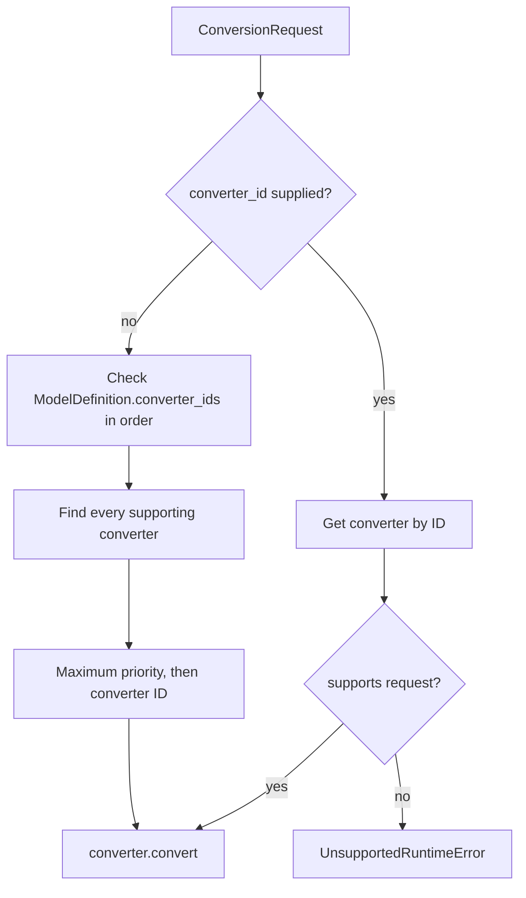
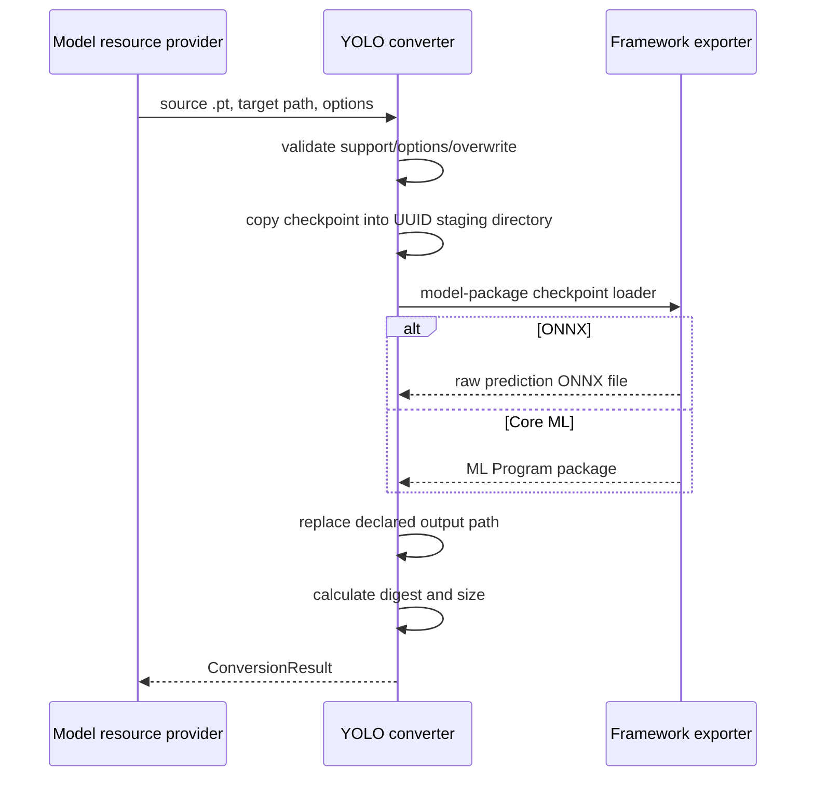

# Converter Module

## Purpose

`converters` selects and executes explicit artifact conversions. It contains the
converter contract, a thread-safe registry, a selection service, and shared
YOLOv8 PyTorch-to-ONNX/Core ML export mechanics.

Conversion does not register a model, download source files, update resource
status, or load the converted result.

## Files

| File | Responsibility |
| --- | --- |
| `base.py` | Abstract `ModelConverter` contract. |
| `registry.py` | Converter registration, resolution, and `ConversionService`. |
| `yolov8.py` | Shared native YOLOv8 export pipeline and validated export options. |
| `__init__.py` | Public converter exports. |

## Converter contract

Every converter provides:

- a stable `converter_id`;
- an integer `priority` used for generic selection;
- `supports(ConversionRequest)` without mutating resources;
- asynchronous `convert()` returning `ConversionResult`.

`ConversionRequest` contains an already resolved source, source/target formats,
the exact output path, model identity, variant, validated option payload, and
overwrite flag. `ConversionResult` reports the published path, format, calculated
digest/size, converter ID, source digest, model identity, variant, and effective
options.

## Registration and selection

`ConverterRegistry` stores converters under a `threading.RLock`. Duplicate IDs
raise `RegistrationConflictError` unless `replace=True`.

`ConversionService` uses an explicit converter when requested. Otherwise it
checks model-preferred IDs in order, then chooses the maximum
`(priority, converter_id)` from all supporting converters. An empty candidate set
raises `UnsupportedRuntimeError`.

## YOLOv8 export implementation

`YoloV8ExportConverter` supports a `.pt` file with source format `pytorch` and
target format `onnx` or `coreml`. It is an abstract shared implementation: each
YOLO model package supplies `converter_id` and its checkpoint loader.

`YoloV8ExportOptions` validates image size, batch size, dynamic shapes, FP16,
optional 8/16-bit Core ML precision, NMS flag, device, simplification flag, and
ONNX opset. The current native exporter rejects `nms=True`; model SDK
postprocessing owns NMS.

ONNX export uses opset 17 by default, constant folding, one `images` input, and
raw `predictions`; segmentation adds `prototypes`. Dynamic axes are added when
requested.

Core ML export traces the model, creates an ML Program, uses an image input
scaled by `1/255`, and emits the same raw task outputs. FP16 controls conversion
precision. Eight-bit conversion applies Core ML weight palettization. Task type
is derived from the staged checkpoint filename (`detect`, `pose`, or `segment`)
and stored with input size/raw-output metadata.

The converter deletes its staging directory in `finally`. Overwrite removes the
existing target immediately before `os.replace`. Framework import/export errors
are reported as `UnsupportedRuntimeError` with the original cause.

## Boundaries

- Model packages construct requests from their injected artifact declarations.
- The request output path is the canonical target consumed by resource status
  and runtime loading.
- Architecture-sensitive checkpoint loading belongs to the model package.
- Converter selection is not performed by application code.
- Conversion never runs implicitly during `ModelSdk.load()`.
