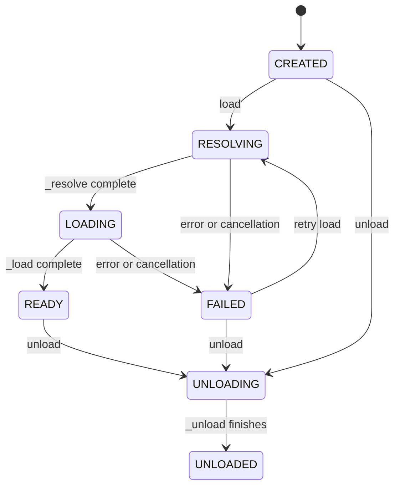
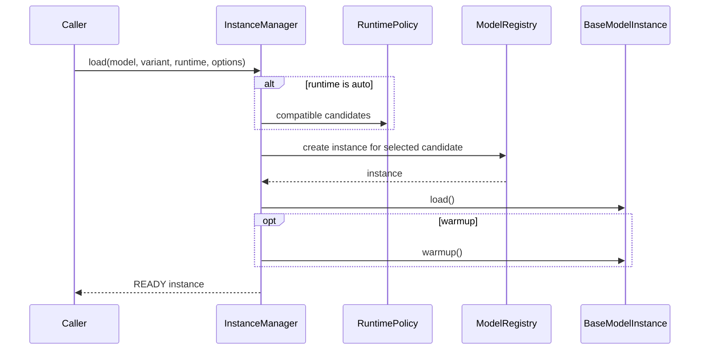

# Core Module

## Purpose

`core` composes model definitions, runtime selection, resources, instances,
catalog views, and structure inspection. It contains no model preprocessing,
inference algorithm, framework session implementation, or application transport.

## Files

| File | Responsibility |
| --- | --- |
| `facade.py` | `ModelSdk` service composition and reference-counted `ModelHandle`. |
| `registry.py` | Immutable `ModelDefinition`, semantic artifact lookup, and thread-safe model registration. |
| `config.py` | Parse and validate `model.yaml` as `ModelPackageConfig`. |
| `runtime_policy.py` | Machine-aware runtime and device selection. |
| `instance.py` | Instance state machine, capability registration, health, and lifecycle hooks. |
| `manager.py` | Instance creation, reuse, loading, switching, references, snapshots, and unloading. |
| `resources.py` | Model-neutral resource dispatch and shared-artifact aggregation. |
| `catalog.py` | Read-only model/runtime/variant/instance summaries. |
| `inspection.py` | Read-only installed-artifact structure inspection. |
| `__init__.py` | Empty internal package marker; public exports are curated at SDK root. |

## Facade composition

`ModelSdk` creates or accepts a `ModelRegistry`, `RuntimePolicy`, and
`InstanceManager`, then constructs the resource, inspection, and catalog
services over the same registry/manager state.

```text
ModelSdk
├── registry: ModelRegistry
├── runtime_policy: RuntimePolicy
├── instances: InstanceManager
├── resources: ModelResourceService
├── inspection: ModelInspectionService
└── catalog: ModelCatalogService
```

`acquire()` creates or loads an instance, retains its manager record, and returns
a `ModelHandle`. `load()` is the application-facing alias with optional warmup.
If warmup fails, the newly retained handle is closed before the error propagates.

`ModelHandle` exposes instance state/info plus `supports()` and `require()`. Its
`close()` is idempotent. It releases one reference; a dedicated instance is also
unloaded when the count reaches zero. Shared instances remain managed after the
handle closes.

## Package configuration

`load_model_config()` reads YAML and validates it into a frozen
`ModelPackageConfig` containing:

- one `ModelManifest`;
- a tuple of `ModelArtifact` declarations;
- optional JSON-compatible `extensions`.

Unknown top-level fields are rejected. For every artifact,
`ModelPackageConfig` validates the compact canonical path, unique
`(variant, runtime, artifact_id)` key, and existence of each referenced shared
artifact ID.

`get_artifacts()` returns scoped artifacts by semantic variant/runtime filters
and can append only the shares those scoped artifacts require. `get_artifact()`
requires exactly one match and raises `ResourceNotFoundError` for zero or
ambiguous matches. Neither method depends on YAML order.

## Model definition and registry

`ModelDefinition` binds declarative package data to executable integration
objects:

```text
ModelManifest
ModelArtifact tuple
runtime factory map (or legacy single factory)
optional ModelResourceProvider
preferred converter IDs
optional runtime artifact inspectors
```

Construction validates runtime/variant references, runtime factory coverage,
artifact key uniqueness, inspector runtime names, and shared-artifact ownership.
A shared artifact must have a source, cannot be a conversion target, cannot
overlap a scoped artifact ID, and must be referenced by at least one scoped
artifact.

`create()` merges caller options with explicit/default variant and runtime
selection. Conflicting values supplied both as parameters and options are
rejected. The selected variant/runtime is written back to the options passed to
the runtime factory. `runtime="auto"` is rejected here because automatic policy
resolution belongs to `InstanceManager`.

`ModelRegistry` stores definitions under `(model_id, revision)` using an
`RLock`. Without an explicit revision, lookup returns the only registered
definition or the single `main` definition; otherwise an ambiguous lookup is
rejected. Registry list operations can filter by manifest capability or runtime
and return a sorted immutable tuple.

The registry's storage root defaults to the platform cache directory under
`hugging-mac/models`. Artifact path resolution delegates to the declaration's
`resolve()` method.

## Runtime policy

`RuntimePolicy` normalizes the alias `mps` to `pytorch-mps` and builds candidates
in this order:

1. caller-configured preferences;
2. manifest default runtime;
3. manifest declaration order.

Duplicates and undeclared names are removed. A candidate is available only when
its declared platform and architecture match and every `required_module` can be
found. Known runtime module defaults are used when a runtime omits
`required_modules`.

`resolve()` selects automatically for `None`/`auto` or validates that an explicit
runtime is declared. Explicit selection does not run the automatic availability
filter; the selected model factory/provider reports eventual dependency or load
failure.

Device selection returns the first declared device for `None`/`auto`, validates
an explicit device, and rejects device input for a runtime that declares no
devices.

## Instance state and capability registry

`BaseModelInstance` owns one UUID, stable model/runtime identity, an instance
lifecycle lock, registered capabilities, runtime context, and the most recent
failure.



`load()` is idempotent in `READY` and rejects `UNLOADING`/`UNLOADED`. SDK errors
retain their type. Unexpected exceptions are wrapped in `ModelLoadError`.
Cancellation is preserved. Every failed load calls `_unload()` through a
suppressed cleanup path while keeping state `FAILED`.

`warmup()` is allowed only in `READY`. `unload()` is idempotent and sets
`UNLOADED` in `finally`. `health()` maps `READY` to healthy, `FAILED` to
unhealthy, and every other state to degraded.

Capabilities can be registered only in `CREATED`; duplicate protocol keys are
rejected. `require()` raises `UnsupportedCapabilityError` when no implementation
is registered.

## Instance manager

`InstanceManager` owns instance objects, immutable identity records, shared
lookup keys, reference counts, and lifecycle measurements. Its `asyncio.Lock`
protects manager metadata; model load/unload hooks run outside that lock.

Creation resolves manifest revision, variant, runtime, and optional device. The
shared identity key contains model ID, revision, variant, runtime, and a
recursively frozen/sorted option mapping.

| Policy | Reuse rule |
| --- | --- |
| `DEDICATED` | Always create a new instance. |
| `SHARED` | Return an equivalent managed instance in any state. |
| `REUSE_IF_READY` | Return an equivalent instance only when it is `READY`; otherwise create another. |

### Load flow



Automatic load tries runtime candidates in policy order. Only
`ResourceNotFoundError` advances to the next candidate. If every candidate lacks
local resources, the final error records attempted runtimes and their failures.
Any failed selected load removes and unloads the manager record before
propagating.

`ensure_loaded()` records first-load duration and process RSS deltas. An already
ready instance can be warmed without replacing its original load metrics.

### References, switching, and unload

`retain()` and `release()` update a non-negative reference count. Normal unload
is rejected while references remain. Forced unload bypasses the reference guard.

Runtime and variant switching are replace operations, not in-place mutation. The
manager requires zero references, loads a replacement using inherited options,
rechecks ownership under the lock, then unloads the original. If ownership
changed while the replacement loaded, the replacement is unloaded and the
switch fails.

`unload_with_metrics()` removes the record/shared keys before invoking the
instance hook and returns process-level release metrics. `unload_all()` continues
after individual failures and raises an `ExceptionGroup` containing them.

Snapshots copy record state into frozen schemas and never expose manager maps.

## Resource service

`ModelResourceProvider` is the model-specific protocol for status, source
download, conversion, and deletion. `ModelResourceService` resolves the
definition/default variant and dispatches to that provider.

Before source download, it installs all shares required by the matching variant.
Before conversion, it installs shares required by the matching target format.
Direct shared download addresses one declared shared artifact by ID. Hub tokens
and model storage overrides come from the per-operation options mapping.

After a provider returns scoped artifact status, the service:

1. removes provider-supplied duplicate shared entries;
2. attaches declared `required_shares` to matching scoped statuses;
3. includes only shares required by those scoped artifacts;
4. returns a new `ModelResourceStatus`, which derives runtime availability and
   sizes in its schema validator.

`artifact_available()` treats file artifacts as available when the file exists.
A Hugging Face directory source verifies its selected `allow_patterns` after
removing `strip_prefix`; glob patterns require at least one match. Other directory
source types are available when their directory exists. Model providers perform
any stricter required-file validation they own.

Resource methods are explicit. Instance creation and loading never call source
download or conversion.

## Catalog and inspection

`ModelCatalogService.snapshot()` combines each registered manifest with runtime
availability and current instance snapshots. It reports variant/runtime counts,
ready counts, state counts, defaults, capabilities, and presentation metadata.
When no runtime is compatible with the machine, the model remains in the catalog
with `default_runtime=None`.

The catalog does not query artifact readiness. Resource status remains a
separate operation.

`ModelInspectionService.structure()` resolves one declared installed artifact.
It runs a definition-supplied inspector when present; otherwise it dispatches by
runtime/format to Core ML, ONNX, MLX/SafeTensors, or PyTorch inspection. Blocking
inspection runs in a worker thread. Missing artifacts and unsupported formats do
not trigger model loading.

## Concurrency and boundaries

| State | Synchronization |
| --- | --- |
| Definition registry | `threading.RLock` |
| Instance maps and references | `asyncio.Lock` |
| One instance lifecycle | Instance-local `asyncio.Lock` |
| Inference state | Model instance/engine-owned lock when required |

Core does not serialize inference globally. It does not import application code,
model-private engines, or heavy framework modules during normal registration and
catalog operations.
