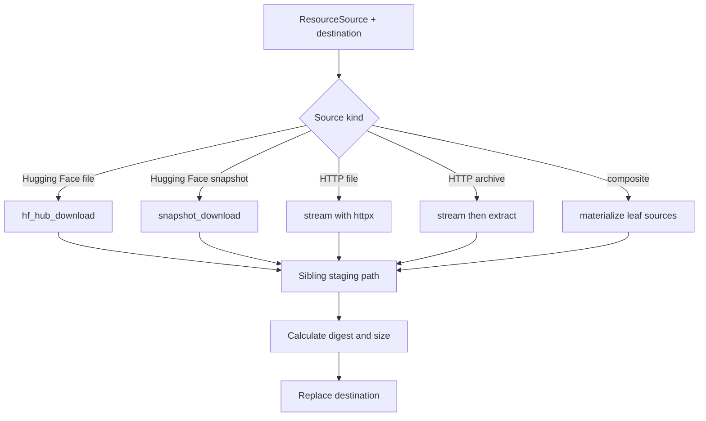

# Resource Module

## Purpose

`resources` materializes declared resource sources at exact filesystem
destinations. It provides download, archive extraction, calculated digest/size,
and temporary merged-directory utilities. Model-specific artifact selection,
status, conversion, and deletion remain in core and model resource providers.

## Files

| File | Responsibility |
| --- | --- |
| `downloader.py` | Dispatch source types, download into staging, publish destinations, and report metadata. |
| `archives.py` | Detect and safely extract ZIP/TAR archives. |
| `hashing.py` | Calculate SHA-256 and directory sizes for operation metadata. |
| `views.py` | Compose scoped and shared directories as a temporary symlink view. |
| `__init__.py` | Export `ResourceDownloader` and progress types. |

## Download dispatch

`ResourceDownloader.download()` resolves the destination, creates its parent,
checks overwrite policy, and dispatches by the discriminated source schema. Hub
operations and archive extraction use worker threads. HTTP bodies are streamed
asynchronously and optionally report
`DownloadProgress(downloaded_bytes, total_bytes)`.

## Source behavior

| Source | Materialization |
| --- | --- |
| `HuggingFaceSource.filename` | Download from the Hub cache, then copy to a staged file. |
| Hugging Face snapshot | Download selected patterns into staging and remove `.cache/huggingface` metadata. |
| Snapshot with `strip_prefix` | Move the selected prefix directory out of the snapshot before publication. |
| `UrlFileSource` | Stream bytes directly to a new staged file. |
| `UrlArchiveSource` | Stream the archive, extract into a second staged directory, then publish the directory. |
| `CompositeSource` | Create a staged directory and recursively materialize each leaf at its declared relative path. |

The downloader passes the source's Hub revision and optional token to
`huggingface_hub`. URL downloads follow redirects and use the configured timeout.
A `404` becomes `ResourceNotFoundError`; other HTTP and materialization failures
become `DownloadError`.

## Staging and overwrite

Staging paths are unique siblings named with a UUID. They are removed in
`finally` after success or failure. Publication uses `os.replace` after all
source work and metadata calculation complete.

When the destination exists:

- `overwrite=False` raises `FileExistsError` before downloading;
- `overwrite=True` removes the existing file/directory immediately before
  replacing it with the staged result.

The implementation prevents a partially downloaded staging object from being
reported at the destination. It does not coordinate two callers writing the same
destination; higher-level resource operations serialize or reject conflicting
mutations.

## Archive safety

`extract_archive()` supports ZIP and TAR. In `auto` mode it inspects the archive
contents. Member names are normalized as POSIX paths and reject absolute paths or
`..` before component stripping.

ZIP symbolic links are rejected. TAR symbolic links, hard links, devices, and
other non-file/non-directory members are rejected. Files are copied explicitly;
the standard library's direct archive extraction methods are not used.

`strip_components` omits the requested number of leading path components.
Members with no remaining path are skipped.

## Calculated metadata

`file_sha256()` reads files in 1 MiB chunks. `directory_sha256()` sorts all files,
then hashes each relative path and file digest. `directory_size()` sums regular
file sizes recursively.

These values describe the resolved operation result. They are not compared with
configured expected hashes.

## Merged directory views

`merged_directory_view(primary, overlays)` creates a temporary directory of
symlinks for loaders that require weights and shared tokenizer/processor files
in one directory.

All input roots must exist as directories. Entries are linked in order; an
overlay entry replaces an earlier link with the same name. Installed artifact
directories are never modified or copied. The temporary view and links are
removed when the context manager exits, so lazy loaders must materialize required
data before exit.

## Boundaries

- Source and relative-path validation is defined by `schemas.resources`.
- Artifact-to-source ownership and canonical paths are defined by model packages.
- Shared dependency selection is handled by `core.ModelResourceService`.
- Conversion is handled by `converters` and model resource providers.
- Deletion is not implemented in this module.
