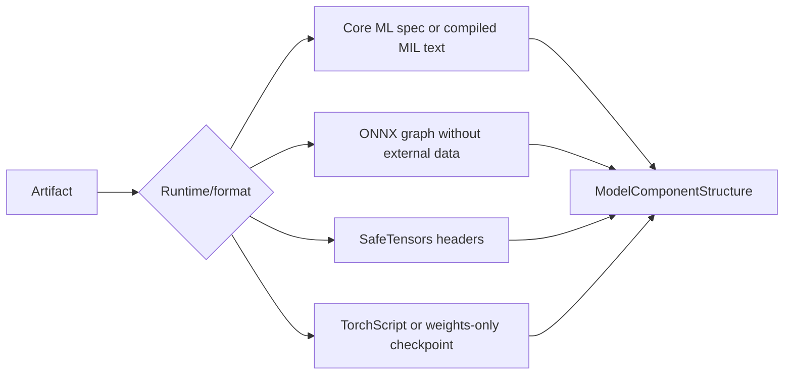

# Runtime Module

## Purpose

`runtime` wraps low-level execution frameworks and artifact structure
inspection. Providers create framework sessions from a concrete artifact path,
device request, and option mapping. They do not implement model task semantics,
tokenization, preprocessing, or response schemas.

## Files

| File | Responsibility |
| --- | --- |
| `base.py` | `RuntimeSession`, `RuntimeBackend`, and `RuntimeAdapter` contracts. |
| `registry.py` | Thread-safe runtime backend registry and default provider composition. |
| `device.py` | Runtime-neutral `DeviceKind` and `DeviceInfo` descriptors. |
| `coreml.py` | Core ML loading, compute-unit mapping, stateful prediction, and structure inspection. |
| `mlx.py` | MLX loader/runner session, materialization, cache cleanup, and SafeTensors inspection. |
| `onnx.py` | ONNX Runtime provider selection/session and ONNX graph inspection. |
| `torch.py` | PyTorch loader/session, MPS/CPU selection, cleanup, and checkpoint inspection. |
| `__init__.py` | Public runtime exports. |

## Contracts

`RuntimeBackend` exposes `name`, `is_available()`, optional device discovery, and
`create_session()`. `RuntimeSession` exposes resolved `device`, synchronous
`run(inputs)`, and asynchronous `close()`.

`RuntimeAdapter` is a higher-level abstract contract that can create a
`BaseModelInstance` from a manifest and resolved resources. Current model
packages primarily bind runtime-specific factories directly in
`ModelDefinition`.

Sessions accept and return mappings of framework-private values. Model engines
adapt between those mappings and public capability schemas.

## Registry

`RuntimeRegistry` stores backends by name under a `threading.RLock`. Duplicate
names raise `RegistrationConflictError` unless replacement is explicit. Unknown
names raise `UnsupportedRuntimeError`.

`create_default_runtime_registry()` registers Core ML, MLX, ONNX Runtime, and
PyTorch providers. Provider modules delay heavy framework imports until
availability checks, session creation, or inspection.

## Providers

### Core ML

`CoreMLProvider` maps aliases to `ALL`, `CPU_ONLY`, `CPU_AND_GPU`, or
`CPU_AND_NE`. It loads `.mlmodelc` with `CompiledMLModel`; other paths use
`MLModel`. Loading runs in an executor and can select a named Core ML function.

`CoreMLSession` filters inputs to declared feature names, runs `predict`, and
copies copyable outputs away from Core ML-owned storage. It retains up to eight
recent input/output provider pairs; `retained_predictions` is configurable from
0 to 8. Stateful models use `make_state()` and `run_with_state()`.

### MLX

`MlxProvider` accepts `auto`, `gpu`, or `metal`, imports `mlx.core`, and requires
a callable `model_loader`. A callable generic `runner` is optional because many
MLX models expose model-specific inference methods.

`MlxSession.value` exposes the loaded value to the owning model engine. Generic
`run()` is available only when a runner was supplied. Close drops the value,
runs garbage collection, and calls `mlx.clear_cache()` when present.
`materialize_mlx()` evaluates lazy parameters before a temporary artifact view
is removed.

### ONNX Runtime

`OnnxRuntimeProvider` reports installed execution providers. Automatic selection
prefers `CoreMLExecutionProvider`, then `CPUExecutionProvider`. String aliases
`coreml` and `cpu` are supported; a requested provider list is filtered against
installed providers. Session construction occurs in a worker thread.

`OnnxRuntimeSession.run()` requests all graph outputs and returns a name-to-value
mapping. Close releases the Python session reference.

### PyTorch

`TorchProvider` reports MPS when available and always includes CPU when PyTorch
is installed. Device resolution defaults to MPS and may fall back to CPU when
`allow_cpu_fallback` is true.

Session creation requires a model loader and accepts an optional output adapter.
The loaded model is put in evaluation mode and moved to the resolved device.
`TorchSession.run()` expects the input mapping key `input`, moves tensor-like
values to the device, and executes under `torch.inference_mode()`. Close drops
the model, runs garbage collection, and clears the MPS cache when applicable.

## Structure inspection

- Core ML inspection reads package/model specs without loading execution state;
  compiled `.mlmodelc` directories use `model.mil` when present.
- ONNX inspection loads graph metadata with external tensor data disabled.
- MLX inspection reads SafeTensors JSON headers directly and limits the header
  size to 100 MB.
- PyTorch inspection first attempts TorchScript, then a `weights_only=True`
  checkpoint. Model packages can provide a constrained loader for custom
  checkpoints.

Inspectors return normalized components, tensors, layers, operator counts, node
counts, and parameter counts when available. They do not run inference.

## Lifecycle and concurrency

Provider loading uses `asyncio.to_thread()` or an executor for blocking framework
work. Session `run()` is synchronous; the owning model engine decides whether to
call it in a worker and whether inference needs a lock. Session `close()` is
idempotent with respect to the stored model/session reference.

Runtime availability does not prove a model artifact is installed or that a
specific model can load. Those checks belong to core runtime policy, resource
status, and the model instance.

## Boundaries

- Providers do not select model variants or artifact IDs.
- Providers do not expose sessions through capability responses.
- Model-specific input/output mapping remains in model engines.
- Framework exceptions are translated at the model lifecycle or inference
  boundary unless the provider raises `UnsupportedRuntimeError` for configuration
  or availability.
